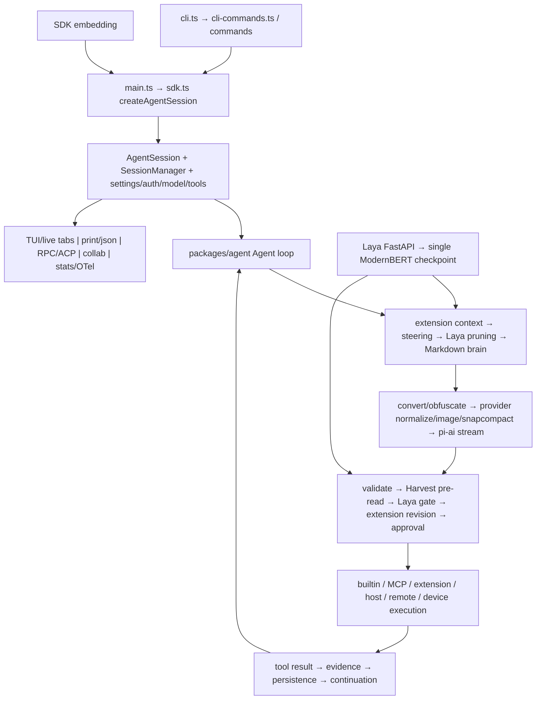
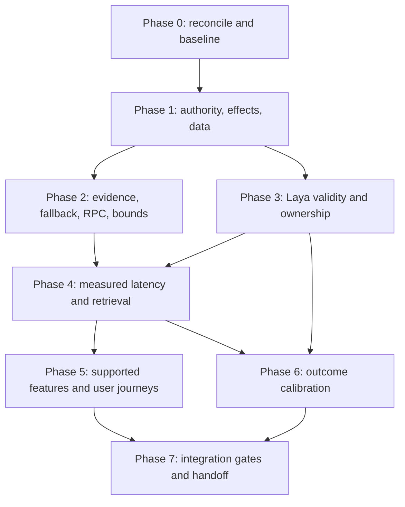

# Codebase Audit Report

## Executive Summary

1. **Critical — I01:** Collaboration transcript/control authorization uses the process-global registry rather than the shared root.
2. **High — I02:** MCP reconnect can replay a mutation whose remote effect already committed.
3. **High — Q01:** Competing writable owners can overwrite session history during a stale whole-file rewrite.
4. **High — F03:** Verification grounding records a successful shell command before execution, so failed/blocked checks can count as success.
5. **High — I05:** The pending MMR repair leaves other native vector/clustering callers vulnerable to null fallback results.
6. **High — L01:** Sidecar queue/deadline handling can retain abandoned work and release capacity before actual inference stops.
7. **High — L02/L06:** Permanent positional pruning decisions and first-request goals can discard context needed by a changed task.
8. **High — Q05/P01:** Code search combines unjailed cache writes with synchronous, potentially repeated workspace scans.
9. **High — I06/I07:** Metaharness and Robomp authentication does not consistently protect private read/diagnostic endpoints.
10. **High/Medium — L03/L13/P03/P04:** Laya needs validated decision contracts, outcome-based calibration and a shared budget before latency tuning or broader autonomous routing.

### Audit identity, scope and evidence

- **Repository root:** `C:/Users/sanid/Desktop/harvest-2.0/harvest`.
- **Review date:** 2026-09-30; HEAD observed throughout: `ab4cc6fecf9b1157b4cbe16148d50a0ad5aa6001`.
- **Scope:** All workspace package/entry/integration surfaces were inventoried. Production traces concentrated on the coding-agent, agent loop, Laya, providers, memory, collaboration, RPC, statistics and Python/harness boundaries. This is not a claim that every line, every provider wire variant, or every possible human behavior was exhaustively exercised. The appendix identifies the exact remaining boundaries.
- **Allowed mutation:** The user explicitly authorized creating **only AUDIT_REPORT.md**. This audit performed source reads/searches and Git status/diff inspection; it did not fix code, run setup/builds, launch services, make external actions, install dependencies or execute tests that create files.
- **Concurrent checkout:** Another process/agent was changing MMR, collaboration guest departure, RPC framing/dispatch/correlation, MCP HTTP body limits, and stats JSON/authentication during review. Those changes were reread and incorporated. Their test files were visible but their test results are not claimed here. Recheck the final working tree before implementing.
- **Evidence grades:** “Source-confirmed” means the cited executable path was traced. “Historical controlled reproduction” refers to earlier real-component probes reported in this conversation/previous local audit, with relevant current predicates rechecked; it is not a new run at this HEAD. “Proposed feature” describes a product/control improvement rather than an existing contract failure. **[NEEDS VERIFICATION]** marks effects or acceptance requiring runtime evidence.
- **Severity:** Critical = major authorization/privacy boundary failure; High = correctness, destructive/duplicate-effect, availability or data-loss risk; Medium = meaningful integration/quality/latency gap; Low = limited fidelity/feedback/maintainability issue. Severity describes impact if reached, not proof of live exploitation.
- **Effort:** S = local bounded change; M = several coordinated modules/contracts; L = architecture, datasets or multi-platform validation. Estimates exclude unknown deployment constraints.
- Each location below links to an **absolute file path with a one-based line**, and names the function. Secondary paths are repository-relative to the root above. Line numbers are review anchors; function names and snippets identify code if concurrent edits move them.
- This document stands alone. Older audit files are background only; do not copy their unresolved status without checking the current source.

### Three-pass methodology and structural map

**Pass 1 — Map:** Read the root package/Cargo configuration, workspace manifests, CLI command registry, coding-agent DEVELOPMENT.md, tool registry, API registry and catalog descriptors. Locate all external boundaries and supporting Python/native/web packages.

**Pass 2 — Audit:** Trace task admission → session/runtime → context transforms → provider streaming → tool validation/preflight/approval → execution → persistence/continuation/output. Review access scope, uncertain delivery, cancellation, batch/queue/body limits, current settings ownership, native fallback, feature callers and real consumer contracts.

**Pass 3 — Reflect:** Ask **“What did I not look at?”** Recheck the changing checkout and earlier findings, then explicitly inventory hardware, credentials, native/platform, full UI, packaging, training, deployment and third-party boundaries in the appendix. The audit found source fixes during this pass; they are not presented as still-broken original paths.



**Ordering evidence:** `agent-loop.ts:1648` awaits transformContext before convertToLlm; `sdk.ts:3423-3443` awaits extension context, pruning and brain in sequence; `AgentSession.#beforeToolCall:3914` runs pre-read/gating before extension revisions; `agent-loop.ts:2329` prepares tool calls before execution. Provider streaming, owned job cancellation, approval policy, obfuscation, protected tool blocks, append-only context and multiple recovery layers already exist; recommendations below extend these contracts rather than assume they are absent.

### Workspace/package coverage map

| Package or runtime | Entry / processing / output | Reviewed boundary | Remaining boundary |
| --- | --- | --- | --- |
| packages/coding-agent | src/cli.ts → main.ts → sdk.ts → session/agent-session.ts → modes/tools | Main lifecycle, feature callers, settings, tools, tabs, approvals, integrations | Every individual tool branch and full interactive/device execution |
| packages/agent | src/index.ts → agent.ts/agent-loop.ts → events/tool results | Provider preparation, preflight ordering, interrupt ownership, telemetry | Full retry/recovery combinations under real streaming |
| packages/ai | src/stream.ts + api-registry.ts → providers → streamed messages | 14 API families, auth boundaries, selected compatibility metadata/logging | Live wire/auth/usage for every deployment |
| packages/catalog | src/models.ts / provider-models/descriptors.ts / compat rules → resolved model facts | Descriptor inventory, KDL policy ownership, provider discovery map | Upstream discovery drift and all precedence combinations |
| packages/tui | src/index.ts → render/input/components → terminal | Shared render/sanitization/output contract and UI ownership map | Unicode/ANSI/hardware accessibility and every renderer path |
| packages/natives | native/index.js → loader-state.js → platform addon/fallback | Generic fallback and memory kernel consumers | Every native export/platform addon contract |
| crates/pi-* | Cargo.toml → pi-natives → AST/edit/shell/VCS/walker/iso/voice/diff | Workspace membership, selected path/cancellation/build contract source | Comprehensive unsafe/FFI, filesystem races and platform execution |
| packages/mnemopi | src/index.ts → core/beam + SQLite/vector/MMR/SHMR → recall/reflection | Native/vector boundaries, pending MMR change, coding-agent tool connection | Large-store migration/privacy/quality/load benchmarks |
| packages/omptype | src/type.ts → interpreter/lazy JIT compile.ts → validation result | JIT threshold 3, new Function boundary, WeakMap cache architecture | Semantic differential fuzzing, all recursive/morph schemas |
| packages/utils | src/index.ts → central streams/locks/fetch/logger/archive/render helpers | Reuse contracts, unbounded line helper, retries and logging | Every archive/media parser and adversarial fixture |
| packages/wire | src/index.ts → shared protocol types → agent/collab consumers | Shared ownership/type boundary map | All versioned compatibility/security payloads |
| packages/collab-web | browser React client + scripts/local-relay.ts → encrypted room events | Host authorization, disconnect lifecycle, local relay binding | Public relay backend, actual multi-browser/TUI round trip |
| packages/browser-relay | extension/background.ts ↔ coding-agent/tools/browser/relay/server.ts | Loopback server, Origin/token guards, reconnect architecture | Browser installation, permissions, CDP target lifecycle |
| packages/stats | src/index.ts → SQLite sync/aggregation → server.ts/client | Concurrent JSON/auth fixes, server reuse and browser auth gap | Live dashboard load, security-mode reuse, cost accuracy |
| packages/metaharness | runner.ts / server.ts / tb → job/store/session services → REST/SSE/web | Auth reads, SSE backlog, runner/adapter/integration inventory | Docker/Harbor/VM execution, evaluator integrity and load |
| packages/typescript-edit-benchmark | src/tasks.ts/shared.ts/verify.ts → transform verification/eval | Package/dependency/verification pipeline map | Dataset correctness, mutation metric bias and experiment runs |
| packages/snapcompact | src/snapcompact.ts → native PNG frames → provider images | Model facts, provider image policy, runtime transform location | Vision fidelity, frame cost/context limits on live models |
| decision-sidecar | server.py → validation/language/queue → typed checkpoint decisions | Client/server/calibration/setup contracts and all decision callers | Actual installed Laya, CPU/GPU inference, data/eval quality |
| python/omp-rpc | src/omp_rpc/client.py/protocol.py → subprocess JSONL → host/result APIs | Protocol package and command/consumer map | Full Python client cancellation/large-frame/error matrix |
| python/robomp + web | src/server.py → HMAC webhooks/SQLite queue/worker → GitHub via backend/proxy | Route auth/body boundaries and automation architecture | External issue/PR writes, sandbox escapes, retry/release lifecycle |
| scripts / packaging / release / docs | setup/build/install smoke/release.yml → bundles/addons/installers | Executable gate inventory, worker host contract, doc drift | Clean installs, signature/checksum provenance, release dry runs |

**Workspace authority:** root `package.json` discovers `packages/*` plus `python/robomp/web`; there are 16 package manifests under packages. Root `Cargo.toml:6-17` explicitly lists ten pi-* crates plus vendored brush-core. Directories named harvest-memory, harvest-schema, harvest-* crates and Python harvest-* mirrors had no authored files from the inspected `rg --files` inventory and no active manifests in those locations. They must not be counted as separately implemented packages solely because AGENTS.md mentions them. **[NEEDS VERIFICATION]** Ignored/generated remnants may exist locally; review active manifests, not surviving empty directories.

### Current changes that supersede earlier findings

| Earlier item | Current source evidence | Audit status |
| --- | --- | --- |
| Tabs abort/reload despite live registry | selector-controller.ts:2080 calls live resume; SessionFocusController.selectMainSession:42 retargets the owner; live registry/factory are wired | Earlier missing-wiring claim superseded; Q03/Q04 and full journey checks remain |
| Malformed gating/pruning numeric answers accepted | gating.ts:144 checks finite noul/confidence ranges; pruning.ts:500 checks every candidate score | Numeric defect addressed; L13 covers remaining envelope/type semantics |
| Managed sidecar token rotation stale | client resolves managed token per call | Earlier token-rotation claim not carried forward |
| Last writable guest departure hangs remote UI | collab/host.ts:527 settles pending UI unavailable when no writable peers remain | Concurrent source fix present; not rerun here |
| Unknown RPC command loses ID | rpc-frame.ts correlationIdForCommand + rpc-mode.ts default error response | Concurrent source fix present; not rerun here |
| RPC abort waits behind serial work | immediate commands now include abort/abort_retry/abort_bash | U02 records addressed status and required verification |
| RPC physical line buffer unbounded | rpc-input.ts readBoundedRpcLines caps content at 1 MiB | Original issue addressed; U03 covers delayed error notification |
| RPC serial admission unbounded | MAX_RPC_SERIAL_QUEUE=64 | Original serial count gap addressed; U04 covers collectors/immediate work |
| Stats JSON stdout polluted | emitSyncSummary directs summary to stderr in JSON mode | Concurrent source fix present; not rerun here |
| Stats remote binds lack auth | startServer now rejects non-loopback without token and gates /api/ reads | Original issue addressed in source; U05/I11 remain |
| MCP main HTTP/JSON/SSE responses unbounded | Concurrent http.ts helpers cap body bytes and classify oversized_response non-retryable | Main paths addressed; finish residual resume-path review and non-MCP adapters I04 |
| MMR null native fallback crashes | concurrent tryNativeMmr uses a real TS fallback | Original crash addressed in source; I05 covers other kernels |
| Markdown-brain test fixture misses isError | current fixture at test/markdown-brain.test.ts:132 has isError:false | Earlier typecheck failure not a current gate claim |

## 1. Feature Findings

### 1.0 Implemented feature map: entry → execution → output

The factory registry is `packages/coding-agent/src/tools/index.ts:461-497`; availability is filtered by createIf/settings/runtime policy. Exported tools and mounted Eval/device surfaces are not automatically standalone tools. “Implemented” below means a production entry and execution path exist, not that every branch has passed an end-to-end test in this audit.

| Feature / entry | Execution path | Output / persistence | Audit result |
| --- | --- | --- | --- |
| Root CLI, launch daemon, profiles, workers | cli.ts runCli → cli-commands.ts → commands/launch/main.ts; worker selectors before command load | TUI/print/RPC process, worker messages/logs | Entry registry exists; clean packaged startup not run |
| read / write / edit | tools/read.ts / tools/write.ts / edit/index.ts through runtime wrappers | Bounded text/image/artifact previews, mutations/diffs/results | Main write/LSP jail improvements present; pre-read evidence gap F04 |
| ast_grep / ast_edit / glob / grep | tool classes → natives AST/walker/search helpers | Matches, locations, edit diffs | Factories present; all language/path cases not exercised |
| search_code | tools/search-code.ts → CodeIndex + KnowledgeRetriever | Symbol signatures, docs snippets and on-disk cache | F05/F06/Q05/P01/P02/P07 |
| bash / remote shell | tools/bash.ts → exec/jobs/SSH backends | Streamed/capped result, exit status, background jobs | Existing job ownership/cancellation present; evidence tracking F03 |
| eval (JS/Python/browser/notebook) | tools/eval.ts → eval/js worker, eval/py kernel, mounted libraries/device operations | REPL values, artifacts, bridge/tool results | Execution backends exist; every mounted mutator/trust path not assessed |
| ask / debug / lsp | tools/ask.ts / tools/debug.ts / lsp/tool.ts → UI/DAP/JSON-RPC | Human answers, debugger state, diagnostics/applyEdit results | Factories gated by runtime; full device/server journeys pending |
| github / web_search / fetch | tools/gh.ts; web/search/index.ts; tools/fetch.ts and scraper dispatch | GitHub operation results, citations/sources, page content | Search/source constraints and body caps I04/I10/P05 |
| checkpoint / rewind | tools/checkpoint.ts → workspace/VCS session state | Snapshot IDs, restoration results/history | Implemented; branch interaction with locks L02 |
| task / hub | task tool → structured-subagent/workpool; hub → registry/IRC | Live child events, messages, completion/interrupts | Explicit subagents work; Laya shadow/routing gaps F01/L05/L18 |
| todo | tools/todo.ts and slash helper/controller | Persisted phases, imports/exports/TUI board | Present; concurrent ownership/formatter cases not exercised |
| memory_edit / retain / recall / reflect | memory tools → memory-backend resolve/runtime → Mnemopi/Hindsight | SQLite or remote memory, recalled context/reflection | Native kernels I05; backend-by-backend privacy/migration pending |
| learn / manage_skill | tools/learn.ts/manage-skill.ts → autolearn/capability/skill storage | Managed skill files/audit and discovery | Present; full approval/provenance/conflict lifecycle pending |
| security_scan | tools/security-scan.ts → security coordinator/adapters/SARIF/cloud/import | Findings/provenance/remediation artifacts | Present; actual external scanner and publish/review actions not run |
| hidden think / yield / goal | HIDDEN_TOOLS → tools/think.ts/yield.ts and goals/tools/goal-tool.ts | Reasoning/terminal yield, queued completions, goal state | Hidden runtime features exist; budget/recovery combinations pending |
| Additional browser/computer/image_gen/tts/review/vibe/xdev/report issue surfaces | tools barrel + resolve/Eval/device configuration | CDP/device actions, generated media/audio, review/remote results | Exports/config surfaces inventoried; not assumed always enabled |
| Settings/provider/model/auth configuration | config/settings.ts + model-registry.ts → catalog/ai auth storage | Effective config/model roster, OAuth/key credentials | Rich implementation exists; Q03/Q06 and per-provider validation limits |
| Extensions, hooks, skills, plugins, MCP discovery | extensibility/capability/discovery + mcp manager/tool bridge | Registered commands/tools, context/event hooks, process/network services | Correctness depends on final args/owner; I02/I03/Q08 |
| Sessions: create/resume/fork/tree/compact/recover/export/share | session manager + AgentSession maintenance/turn recovery | JSONL tree, compaction/archive/artifacts, exported/shared views | Q01/L02; full multiple-writer/platform lifecycle pending |
| Live tabs / background turns / approvals | interactive-mode + live-session-registry/factory + focus/extension UI controllers | Session-specific transcript, draft/scroll, unread state, queued approvals | Wiring exists now; Q03/Q04 integration checks pending |
| Agent reasoning/model roles and routing | config model role resolution + auto-thinking/tiny + ai providers | Effective model/effort and streamed generation | Existing heuristics work; Laya route helpers lack production callers |
| Harvest pre-read/grounding/freshness hooks | core/agent-session.ts → AgentSession before/after/stop hooks | Mutation/verification state and nudges | F03/F04/F07; prototype mutation facades have narrower wiring |
| Markdown brain / skills / graph expansion | sdk.ts transformContext → brain.refresh/retrieve/transform | Ephemeral latest-user context; bounded pages/scopes | Implemented; P04/U06 and decision semantics |
| Unexpected-stop/auto retry/compaction/TTSR/advisor | AgentSession post-prompt tasks/recovery + classifier | Continuation, summaries, diagnostics/events | Already present; L12 and full interaction matrix pending |
| Interactive TUI / print JSON / RPC / ACP / SDK | modes interactive/print/rpc/acp + src/index.ts exports | Terminal components, structured frames, protocol notifications | U01/U03/U04; current RPC concurrent fixes reflected |
| Collaboration / browser guest | collab host/socket/link + collab-web wire UI | Encrypted room/snapshot/transcript/live events | I01/I08; departure fix present |
| Stats / telemetry / usage | session/agent OTel + stats sync/db/server/client | Traces, logs, cost dashboards and usage | Q02/I11/U05; live accounting/exporters not verified |
| Voice / local tiny models | stt/tts worker clients + sherpa/native/tiny subprocess downloads | Text transcription, speech, local decisions/titles | Hardware/download/device paths not run |
| Benchmark / robotic GitHub lifecycle | metaharness + TS edit benchmark; python/robomp worker/RPC/proxy | Jobs, experiment scores, issue/PR state | I06/I07/P06; external side effects not executed |
| Install/update/commit/export/maintenance CLI | cli-commands metadata → command-specific adapters | Packages/binaries, VCS changes, exports/config/status | Inventoried; unsafe/destructive operations never invoked |

**Complete CLI metadata names inspected:** launch, acp, auth-broker, auth-gateway, agents, bench, browser-relay, cleanse, commit, completions, __complete, compress, config, dry-balance, gc, grep, gallery, git, grievances, images, if-bench, install, join, laya, models, plugin, ps, say, share, setup, shell, read, render, ssh, stats, update, usage, tiny-models, token, ttsr, worktree, search. Source: `cli-commands.ts:23-227`. Hidden worker selectors are dispatch infrastructure, not user features.

**Missing-feature distinction:** Findings F01/F02/F07 identify unsupported or incomplete wiring. F05/F06 identify partial fidelity. U06, strict search mode in I10, a shared decision scheduler in L19 and request-correlated completion in U01 are concrete controls absent at the cited boundary. Their proposed behavior must be agreed at the contract level; do not implement an arbitrary new feature just because it sounds useful.

### F01. Documented Laya model and specialist routing has no production caller

**Severity:** Medium · **Effort:** M

**Location:** [packages/coding-agent/src/core/harvest/laya-routing.ts:33](<C:/Users/sanid/Desktop/harvest-2.0/harvest/packages/coding-agent/src/core/harvest/laya-routing.ts:33>) — routeModelWithLaya / routeSpecialistRoleWithLaya.

**Status:** Source-confirmed.

**Evidence:** Production search for both names returns only their definitions (lines 33 and 123). docs/decision-layer.md:34 describes model routing; the function comment says it feeds existing selection.

```typescript
export async function routeModelWithLaya(
	prompt: string,
	options: {
		client?: LayaClient;
		defaultRole?: ModelTierRole;
```

**Impact / user scenario:** The documented decision point does not affect CLI turns. This is missing wiring, not a broken existing automatic router.

**Recommendation:** Choose an explicit supported contract. If enabled, call once at task admission through the existing role resolver, honor explicit user model/agent choices, credential availability and cost limits, and expose the effective reason. Otherwise remove the active-feature claim and mark the exports experimental.

**Acceptance / verification:** A CLI task with auto routing changes the resolved role; explicit /model selection never changes silently. Exercise missing credentials, invalid choice and timeout.

### F02. Several Harvest facades exist without integration into the real lifecycle

**Severity:** Medium · **Effort:** M

**Location:** [packages/coding-agent/src/core/system-prompt.ts:43](<C:/Users/sanid/Desktop/harvest-2.0/harvest/packages/coding-agent/src/core/system-prompt.ts:43>) — assembleHarvestSystemPrompt.

**Status:** Source-confirmed.

**Evidence:** The only source occurrence of assembleHarvestSystemPrompt is its definition. HarvestSubagentCoordinator is defined in core/harvest/subagent.ts:158 and constructed by a same-file wrapper; source searches find no consumer outside that module. HarvestContextCompactor is used by the dormant prompt assembler, while the runtime imports session/compaction plumbing.

```typescript
export function assembleHarvestSystemPrompt(options: HarvestPromptOptions): AssembledHarvestPrompt {
	if (options.localMemory || options.graph || (options.taskQuery && !options.skillsPrompt && !options.knowledgePrompt)) {
		const res = assembleHarvestPrompt(options);
		return {
			prompt: res.prompt,
```

**Impact / user scenario:** These exported graph/scoped-delegation/prompt-budget helpers and their isolated tests do not establish equivalent behavior in createAgentSession. Other production memory, subagent and compaction implementations already exist.

**Recommendation:** Publish a supported-vs-experimental API inventory. Trace each promised facade through sdk.ts/task/session; integrate only missing contracts into the existing subsystem, or remove unsupported claims/exports. Avoid creating a second memory/compaction engine.

**Acceptance / verification:** A contract test must enter createAgentSession or the real task tool and observe bounded role context or preserved verification records; direct constructor tests are insufficient.

### F03. Grounding records successful verification before the command executes

**Severity:** High · **Effort:** M

**Location:** [packages/coding-agent/src/core/agent-session.ts:104](<C:/Users/sanid/Desktop/harvest-2.0/harvest/packages/coding-agent/src/core/agent-session.ts:104>) — interceptSessionToolCall.

**Status:** Source-confirmed.

**Evidence:** Before execution: hooks.groundingEngine.recordCommandExecution(cmd, 0). grounding.ts:81 accepts exitCode === 0 with no diagnostic failures. The real after-hook at session/agent-session.ts:3883 derives exitCode from ctx.isError but appends another record and only reads output when ctx.result is a string.

```typescript
		if (cmd) {
			hooks.groundingEngine.recordCommandExecution(cmd, 0);
		}
	}
```

**Impact / user scenario:** A failed, denied, cancelled or merely queued test command can leave a synthetic successful record. The engine chooses the latest successful record even when a later record fails, so Verify-Before-Done can consider mutations verified without a successful run.

**Recommendation:** Record execution only after a terminal tool result, using actual exit code, structured text blocks and timeout/cancel/background status. Store run identity and workspace/change generation. Failed/background/blocked attempts must never create success evidence; supersede attempts by ID.

**Acceptance / verification:** Mutate a file then run a failing test, deny approval, abort, or background it: each remains unverified. A completed successful relevant check can clear the correct generation.

### F04. Pre-read eligibility is recorded before a read succeeds

**Severity:** Medium · **Effort:** M

**Location:** [packages/coding-agent/src/core/harvest/loop-policy.ts:131](<C:/Users/sanid/Desktop/harvest-2.0/harvest/packages/coding-agent/src/core/harvest/loop-policy.ts:131>) — PreReadEnforcement.interceptToolCall.

**Status:** Source-confirmed.

**Evidence:** For read/view_file/read_file: this.recordRead(rawPath); return { allowed: true }. This runs inside AgentSession.#beforeToolCall, before actual read or approval. core/agent-session.ts:90 also hashes the file before reading its result.

```typescript
		if (name === "read" || name === "view_file" || name === "read_file") {
			this.recordRead(rawPath);
			return { allowed: true };
		}
```

**Impact / user scenario:** An unreadable, denied or failed read can satisfy this layer's 'inspected via read tool' invariant; an offset read is treated as full-file inspection. Existing edit-specific freshness guards may still reject some edits.

**Recommendation:** Update inspection records from successful read results with canonical identity, version and inspected ranges. Keep attempted reads separate. Preserve existing edit/hashline safeguards and avoid treating this layer as stronger evidence than the delivered content.

**Acceptance / verification:** A denied/failed read followed by overwrite is rejected; successfully inspected relevant ranges authorize the documented operation. Check URI, partial and large-file reads.

### F05. Symbol search can return stale or deleted code indefinitely

**Severity:** Medium · **Effort:** M

**Location:** [packages/coding-agent/src/tools/search-code.ts:63](<C:/Users/sanid/Desktop/harvest-2.0/harvest/packages/coding-agent/src/tools/search-code.ts:63>) — SearchCodeTool.execute.

**Status:** Source-confirmed.

**Evidence:** let symbols = this.#codeIndex.searchSymbols(query, limit); if (symbols.length === 0) { ... updateIndex(entries) }. code-index.ts:226 searches persisted files without stat checks; updateIndex only adds/updates supplied files and never removes missing ones.

```typescript
			let symbols = this.#codeIndex.searchSymbols(query, limit);
			if (symbols.length === 0) {
				// Scan workspace files on initial query
				try {
					const entries = fs.readdirSync(this.#workspaceRoot, { recursive: true }) as string[];
```

**Impact / user scenario:** A cached positive result prevents refresh, so edits/deletions can keep producing old signatures and line numbers. A cache miss repeatedly scans even after the entire workspace was indexed.

**Recommendation:** Track index readiness and a workspace generation. Refresh changed files asynchronously and evict deletions; validate cache version/schema and key identities by canonical path. Do not use query success as freshness or initialization state.

**Acceptance / verification:** After renaming/deleting an indexed symbol, search returns current declarations and locations without restarting. Corrupt/old cache degrades to a rebuild.

### F06. Search Code advertises AST and language breadth beyond its parser

**Severity:** Low · **Effort:** M

**Location:** [packages/coding-agent/src/core/harvest/code-index.ts:72](<C:/Users/sanid/Desktop/harvest-2.0/harvest/packages/coding-agent/src/core/harvest/code-index.ts:72>) — DECLARATION_REGEXES / extractSymbolsFromContent.

**Status:** Source-confirmed.

**Evidence:** SUPPORTED_EXTENSIONS includes .java, .cpp, .cs, .rb, .php, .swift, .kt, .scala, .sh, .sql; extraction at line 126 skips every indented line and uses function/fn/func/def/class/interface/type/struct/enum regexes. tools/search-code.ts:2 calls it a column-0 AST declaration index.

```typescript
	// Functions (TS/JS, Go, Rust, Python, Kotlin, Swift, PHP)
	{
		kind: "function" as const,
		re: /^(?:export\s+)?(?:async\s+)?(?:public\s+|private\s+|protected\s+|static\s+)?function\s+([a-zA-Z_$][a-zA-Z0-9_$]*)/m,
	},
```

**Impact / user scenario:** Common methods, arrow functions, async Python definitions and several advertised languages have no matching declaration form. This is a limited regex index, not AST parsing.

**Recommendation:** State the supported declaration subset in tool docs/UI, or reuse native AST/parser support for supported languages and add explicit language adapters. Preserve lexical fallback with clear provenance.

**Acceptance / verification:** Fixtures for TS arrow functions, Python async def, nested/class methods and Java/Kotlin declarations establish which symbols are available and which intentionally fall back.

### F07. Production Harvest role is initialized without the task and remains fixed

**Severity:** Medium · **Effort:** M

**Location:** [packages/coding-agent/src/session/agent-session.ts:1381](<C:/Users/sanid/Desktop/harvest-2.0/harvest/packages/coding-agent/src/session/agent-session.ts:1381>) — AgentSession constructor / createHarvestSession.

**Status:** Source-confirmed initialization gap.

**Evidence:** Constructor calls createHarvestSession(cwd) without promptText. core/agent-session.ts:38 uses promptText ? routeRole(promptText) : routeRole("") and stores readonly activeRole/routingResult. Production search finds activeRole consumed by grounding at line 1439, with no task-specific reassignment.

```typescript
		this.#harvestHooks = createHarvestSession(this.sessionManager.getCwd() ?? process.cwd());
		// Resolve the wire service-tier per request so the Fireworks Priority
		// toggle scopes priority to Fireworks alone, without mutating the shared
		// session `serviceTier` that drives `/fast` and OpenAI/Anthropic priority.
		this.agent.serviceTierResolver = model => this.#models.effectiveServiceTier(model);
```

**Impact / user scenario:** The facade advertises entropy-gated task role routing, but this owner starts from the empty-input role. A changing user task does not establish new routing facts for these hooks. This is separate from working named subagents and modelRoles.

**Recommendation:** Resolve role from current task admission/explicit role policy, version it with the task generation and update only where required. Honor user-selected roles; avoid deriving role in hot tool preflight. Remove the active routing claim if the hooks intentionally use a static role.

**Acceptance / verification:** Distinct task types and explicit role selections produce the intended effective role; task changes preserve durable constraints while resetting only task-owned evidence.

## 2. Integration Findings

### 2.0 Inventory and control assessment

“Static” means source control ownership identified; it does not certify a real service. There is no blanket claim that all integrations have retries, caps, credentials or live compatibility. Where adapter/credential/hardware checks are incomplete, the row and appendix say so.

| External/local boundary | Source of config/auth | Error / deadline / retry / rate controls observed | Failure mode / remaining verification |
| --- | --- | --- | --- |
| LLM provider deployments | catalog descriptors + compat/rules/auth/*.kdl; ai/auth-storage.ts, registry/oauth, auth-retry | Streaming adapters, shared auth resolution and retry helpers; model policy compiled from KDL | 73 deployments and 14 wire families inventoried below; live credentials, rotation, quotas and every adapter timeout not tested |
| Custom provider APIs | ai/api-registry.ts:77 registerCustomApi / sourceId cleanup | Process-global registry; built-in names reserved | [NEEDS VERIFICATION] two tabs sharing extension sourceId may overwrite/remove registrations; inspect unload/reload ownership before treating as a defect |
| Auth broker/gateway/OAuth | ai/auth-broker/server.ts/client.ts/refresher.ts; auth-gateway/server.ts; registry/oauth callback/device/PKCE | Tokens/loopback policy and credential singleflight architecture exist | Real refresh/revocation/pool/reserve/CORS routes not all exercised; preserve existing fixes |
| Laya typed checkpoint / Hugging Face / torch installer | laya-service/self-healing/calibration/client + decision-sidecar | Authenticated decide, loopback enforcement, timeouts, semantic compute caps, bounded rotating logs, setup remedies | L01-L20; fresh setup/GPU/checkpoint compatibility not run |
| MCP stdio / HTTP / SSE / OAuth | mcp config/manager/transports/tool-bridge | Abort/reconnect/request errors, negotiated transport/session, tool approval; concurrent bounded HTTP body helpers | I02/I03/I04; independent live servers/rate/auth challenge tests pending |
| Web search (23 selectors) | web/search/provider.ts + authStorage passed through SearchParams | Per-provider deadlines, availability/failover, cancel propagation; Exa pacing exists | I04/I10/P05; don't assume every provider honors all query options or quotas |
| Fetch/scrapers/domain APIs | tools/fetch.ts + web/scrapers/index.ts + handler registry | Central dispatch with domain-specific parsers/fallbacks | Domain list below; every redirect/SSRF/body/token/API semantic not assessed |
| GitHub tool / issues / PRs / share / update | tools/gh.ts/github-cache.ts, internal URL handlers, CLI command adapters | Central Git helpers/auth and tool policy | External actions, private-repo scope, rate/etag/release integrity not executed |
| Hindsight remote memory | hindsight/client.ts/config/state + memory-backend | Bearer auth; operation-specific request/recall/retain/reflect deadlines and AbortSignal | I04; server retry/deduplication/privacy/retention and large-bank behavior pending |
| Mnemopi SQLite / embedding/model providers | mnemopi core + coding-agent backend/tools | Local memory/vector/cache/MMR pathways and model resolver | I05; migrations/embedding dimensional changes/deletion/index rebuilding pending |
| SSH / sshfs / remote transfer | ssh config/connection-manager/file-transfer + exec | Helper timeouts, cached host info, remote shell detection | Live host-key/auth/transfer/disconnect/jail cases pending; cache-only sync interfaces are intentional |
| LSP / DAP servers | lsp client/edits/mux; debug/dap config | JSON-RPC, spawned process lifecycle; applyEdit uses jailed resolved paths | All server startup/request timeouts/backlog/diagnostics and trusted project executables not verified |
| Browser CDP / extension relay / Puppeteer | browser relay/server + browser-relay extension | Server explicitly 127.0.0.1; browser Origin rejection; optional extension token; reconnect delay cap | All target permissions/races/disconnect states/extension installation pending |
| Computer/device Eval / native media | tools/computer/supervisor, mounted Eval/device adapters | Approval/controller/worker infrastructure | OS/device permissions, action replay, every native local:// mutation not fully assessed |
| Voice / tiny model downloads | stt/tts models/downloader/runtime and tiny workers | Local worker lifecycle/models and install/setup controls | Actual model downloads, microphones/audio, offline/GPU/macOS/Windows use pending |
| Collaboration encrypted relay | collab host/socket + wire + collab-web | Room write-token and encryption; snapshots chunked; departure fix present | I01/I08; production public relay service is external to this checkout |
| Stats / OpenTelemetry export | agent/telemetry + coding-agent exporter + stats server/client | Logger/trace persistence; stats remote auth now present in concurrent work | Q02/I11/U05; collector auth/export retries/redaction/cost correctness not all assessed |
| Metaharness / Harbor / Docker / VM / Vibemon datasets | metaharness runner/tb/adapters/server/store | Jobs/timeouts/adapters, non-loopback token admission, REST/SSE | I06/P06; cloud/container credentials, dataset integrity, sandbox and job cancellation pending |
| Robomp GitHub webhook / proxy / RPC subprocess | python/robomp server/worker/github_backend/proxy + omp-rpc | Webhook HMAC, durable queue/delivery dedup, maintainer/rate admission, task timeouts; proxy streams body with hard cap and authenticates routes | I07; webhook server buffers request.body before HMAC at server.py:375; deployment/rate/retry/sandbox/end-to-end mutations pending |
| npm/git plugin marketplaces + release/update artifacts | extensibility/plugins/marketplace/fetcher.ts; scripts setup/install/release; release.yml | Source classification and executable packaging/smoke gates | Network supply-chain checks/signing/subdir jail/offline installs not comprehensively exercised |
| Security scanner/cloud/SARIF importers | coding-agent/security coordinator/cloud/auth/provenance/store + tools/security-scan | Typed contracts, import/provenance/publication paths exist | Real service ownership/authorization/results, all scanner binaries and untrusted SARIF limits pending |

#### Provider inventory (every descriptor, not a live certification)

Source of truth is `packages/catalog/src/provider-models/descriptors.ts`; each listed provider also has a source auth rule file at `packages/catalog/src/compat/rules/auth/<id>.kdl`. Those declarative files establish configuration ownership, not proof that a configured credential or remote endpoint works. Model/API routing must be read from resolved KDL facts, not guessed from the provider's name.

Wire adapters registered in `packages/ai/src/api-registry.ts:20-35`: **openai-completions, openai-responses, openrouter, openai-codex-responses, azure-openai-responses, anthropic-messages, bedrock-converse-stream, google-generative-ai, google-gemini-cli, google-vertex, ollama-chat, cursor-agent, gitlab-duo-agent, devin-agent**. Provider families reuse these adapters, with separate deployment policy/auth overrides. Compatibility loss is documented in I09. Provider diagnostics are documented in Q02.

For **each provider below**, auth/config declaration presence and discovery metadata were located; real auth/refresh, wire correctness, response limits, timeouts, retry-after/rate quotas and degraded/fallback behavior remain **[NEEDS VERIFICATION]** with a credentialed contract fixture plus upstream canary. Do not report these as individually “passed.” The implementing agent can group shared-adapter tests but must test provider-specific overrides separately.

| Provider ID | Descriptor anchor | Auth/config ownership | Assessment |
| --- | --- | --- | --- |
| abliteration | [76](<C:/Users/sanid/Desktop/harvest-2.0/harvest/packages/catalog/src/provider-models/descriptors.ts:76>) | [abliteration.kdl](<C:/Users/sanid/Desktop/harvest-2.0/harvest/packages/catalog/src/compat/rules/auth/abliteration.kdl:1>) | Static inventory; deployment contract needs verification |
| aiand | [84](<C:/Users/sanid/Desktop/harvest-2.0/harvest/packages/catalog/src/provider-models/descriptors.ts:84>) | [aiand.kdl](<C:/Users/sanid/Desktop/harvest-2.0/harvest/packages/catalog/src/compat/rules/auth/aiand.kdl:1>) | Static inventory; deployment contract needs verification |
| aimlapi | [92](<C:/Users/sanid/Desktop/harvest-2.0/harvest/packages/catalog/src/provider-models/descriptors.ts:92>) | [aimlapi.kdl](<C:/Users/sanid/Desktop/harvest-2.0/harvest/packages/catalog/src/compat/rules/auth/aimlapi.kdl:1>) | Static inventory; deployment contract needs verification |
| alibaba-coding-plan | [100](<C:/Users/sanid/Desktop/harvest-2.0/harvest/packages/catalog/src/provider-models/descriptors.ts:100>) | [alibaba-coding-plan.kdl](<C:/Users/sanid/Desktop/harvest-2.0/harvest/packages/catalog/src/compat/rules/auth/alibaba-coding-plan.kdl:1>) | Static inventory; deployment contract needs verification |
| alibaba-token-plan | [107](<C:/Users/sanid/Desktop/harvest-2.0/harvest/packages/catalog/src/provider-models/descriptors.ts:107>) | [alibaba-token-plan.kdl](<C:/Users/sanid/Desktop/harvest-2.0/harvest/packages/catalog/src/compat/rules/auth/alibaba-token-plan.kdl:1>) | Static inventory; deployment contract needs verification |
| baseten | [115](<C:/Users/sanid/Desktop/harvest-2.0/harvest/packages/catalog/src/provider-models/descriptors.ts:115>) | [baseten.kdl](<C:/Users/sanid/Desktop/harvest-2.0/harvest/packages/catalog/src/compat/rules/auth/baseten.kdl:1>) | Static inventory; deployment contract needs verification |
| amazon-bedrock | [123](<C:/Users/sanid/Desktop/harvest-2.0/harvest/packages/catalog/src/provider-models/descriptors.ts:123>) | [amazon-bedrock.kdl](<C:/Users/sanid/Desktop/harvest-2.0/harvest/packages/catalog/src/compat/rules/auth/amazon-bedrock.kdl:1>) | Static inventory; deployment contract needs verification |
| bedrock-mantle | [127](<C:/Users/sanid/Desktop/harvest-2.0/harvest/packages/catalog/src/provider-models/descriptors.ts:127>) | [bedrock-mantle.kdl](<C:/Users/sanid/Desktop/harvest-2.0/harvest/packages/catalog/src/compat/rules/auth/bedrock-mantle.kdl:1>) | Static inventory; deployment contract needs verification |
| anthropic | [134](<C:/Users/sanid/Desktop/harvest-2.0/harvest/packages/catalog/src/provider-models/descriptors.ts:134>) | [anthropic.kdl](<C:/Users/sanid/Desktop/harvest-2.0/harvest/packages/catalog/src/compat/rules/auth/anthropic.kdl:1>) | Static inventory; deployment contract needs verification |
| azure | [141](<C:/Users/sanid/Desktop/harvest-2.0/harvest/packages/catalog/src/provider-models/descriptors.ts:141>) | [azure.kdl](<C:/Users/sanid/Desktop/harvest-2.0/harvest/packages/catalog/src/compat/rules/auth/azure.kdl:1>) | Static inventory; deployment contract needs verification |
| cerebras | [146](<C:/Users/sanid/Desktop/harvest-2.0/harvest/packages/catalog/src/provider-models/descriptors.ts:146>) | [cerebras.kdl](<C:/Users/sanid/Desktop/harvest-2.0/harvest/packages/catalog/src/compat/rules/auth/cerebras.kdl:1>) | Static inventory; deployment contract needs verification |
| cloudflare-ai-gateway | [153](<C:/Users/sanid/Desktop/harvest-2.0/harvest/packages/catalog/src/provider-models/descriptors.ts:153>) | [cloudflare-ai-gateway.kdl](<C:/Users/sanid/Desktop/harvest-2.0/harvest/packages/catalog/src/compat/rules/auth/cloudflare-ai-gateway.kdl:1>) | Static inventory; deployment contract needs verification |
| cursor | [160](<C:/Users/sanid/Desktop/harvest-2.0/harvest/packages/catalog/src/provider-models/descriptors.ts:160>) | [cursor.kdl](<C:/Users/sanid/Desktop/harvest-2.0/harvest/packages/catalog/src/compat/rules/auth/cursor.kdl:1>) | Static inventory; deployment contract needs verification |
| deepinfra | [167](<C:/Users/sanid/Desktop/harvest-2.0/harvest/packages/catalog/src/provider-models/descriptors.ts:167>) | [deepinfra.kdl](<C:/Users/sanid/Desktop/harvest-2.0/harvest/packages/catalog/src/compat/rules/auth/deepinfra.kdl:1>) | Static inventory; deployment contract needs verification |
| deepseek | [175](<C:/Users/sanid/Desktop/harvest-2.0/harvest/packages/catalog/src/provider-models/descriptors.ts:175>) | [deepseek.kdl](<C:/Users/sanid/Desktop/harvest-2.0/harvest/packages/catalog/src/compat/rules/auth/deepseek.kdl:1>) | Static inventory; deployment contract needs verification |
| devin | [182](<C:/Users/sanid/Desktop/harvest-2.0/harvest/packages/catalog/src/provider-models/descriptors.ts:182>) | [devin.kdl](<C:/Users/sanid/Desktop/harvest-2.0/harvest/packages/catalog/src/compat/rules/auth/devin.kdl:1>) | Static inventory; deployment contract needs verification |
| cline-pass | [190](<C:/Users/sanid/Desktop/harvest-2.0/harvest/packages/catalog/src/provider-models/descriptors.ts:190>) | [cline-pass.kdl](<C:/Users/sanid/Desktop/harvest-2.0/harvest/packages/catalog/src/compat/rules/auth/cline-pass.kdl:1>) | Static inventory; deployment contract needs verification |
| firepass | [198](<C:/Users/sanid/Desktop/harvest-2.0/harvest/packages/catalog/src/provider-models/descriptors.ts:198>) | [firepass.kdl](<C:/Users/sanid/Desktop/harvest-2.0/harvest/packages/catalog/src/compat/rules/auth/firepass.kdl:1>) | Static inventory; deployment contract needs verification |
| fireworks | [204](<C:/Users/sanid/Desktop/harvest-2.0/harvest/packages/catalog/src/provider-models/descriptors.ts:204>) | [fireworks.kdl](<C:/Users/sanid/Desktop/harvest-2.0/harvest/packages/catalog/src/compat/rules/auth/fireworks.kdl:1>) | Static inventory; deployment contract needs verification |
| github-copilot | [211](<C:/Users/sanid/Desktop/harvest-2.0/harvest/packages/catalog/src/provider-models/descriptors.ts:211>) | [github-copilot.kdl](<C:/Users/sanid/Desktop/harvest-2.0/harvest/packages/catalog/src/compat/rules/auth/github-copilot.kdl:1>) | Static inventory; deployment contract needs verification |
| gitlab-duo | [217](<C:/Users/sanid/Desktop/harvest-2.0/harvest/packages/catalog/src/provider-models/descriptors.ts:217>) | [gitlab-duo.kdl](<C:/Users/sanid/Desktop/harvest-2.0/harvest/packages/catalog/src/compat/rules/auth/gitlab-duo.kdl:1>) | Static inventory; deployment contract needs verification |
| gitlab-duo-agent | [222](<C:/Users/sanid/Desktop/harvest-2.0/harvest/packages/catalog/src/provider-models/descriptors.ts:222>) | [gitlab-duo-agent.kdl](<C:/Users/sanid/Desktop/harvest-2.0/harvest/packages/catalog/src/compat/rules/auth/gitlab-duo-agent.kdl:1>) | Static inventory; deployment contract needs verification |
| gmi-cloud | [229](<C:/Users/sanid/Desktop/harvest-2.0/harvest/packages/catalog/src/provider-models/descriptors.ts:229>) | [gmi-cloud.kdl](<C:/Users/sanid/Desktop/harvest-2.0/harvest/packages/catalog/src/compat/rules/auth/gmi-cloud.kdl:1>) | Static inventory; deployment contract needs verification |
| google | [237](<C:/Users/sanid/Desktop/harvest-2.0/harvest/packages/catalog/src/provider-models/descriptors.ts:237>) | [google.kdl](<C:/Users/sanid/Desktop/harvest-2.0/harvest/packages/catalog/src/compat/rules/auth/google.kdl:1>) | Static inventory; deployment contract needs verification |
| google-antigravity | [243](<C:/Users/sanid/Desktop/harvest-2.0/harvest/packages/catalog/src/provider-models/descriptors.ts:243>) | [google-antigravity.kdl](<C:/Users/sanid/Desktop/harvest-2.0/harvest/packages/catalog/src/compat/rules/auth/google-antigravity.kdl:1>) | Static inventory; deployment contract needs verification |
| google-gemini-cli | [248](<C:/Users/sanid/Desktop/harvest-2.0/harvest/packages/catalog/src/provider-models/descriptors.ts:248>) | [google-gemini-cli.kdl](<C:/Users/sanid/Desktop/harvest-2.0/harvest/packages/catalog/src/compat/rules/auth/google-gemini-cli.kdl:1>) | Static inventory; deployment contract needs verification |
| google-vertex | [253](<C:/Users/sanid/Desktop/harvest-2.0/harvest/packages/catalog/src/provider-models/descriptors.ts:253>) | [google-vertex.kdl](<C:/Users/sanid/Desktop/harvest-2.0/harvest/packages/catalog/src/compat/rules/auth/google-vertex.kdl:1>) | Static inventory; deployment contract needs verification |
| groq | [259](<C:/Users/sanid/Desktop/harvest-2.0/harvest/packages/catalog/src/provider-models/descriptors.ts:259>) | [groq.kdl](<C:/Users/sanid/Desktop/harvest-2.0/harvest/packages/catalog/src/compat/rules/auth/groq.kdl:1>) | Static inventory; deployment contract needs verification |
| huggingface | [265](<C:/Users/sanid/Desktop/harvest-2.0/harvest/packages/catalog/src/provider-models/descriptors.ts:265>) | [huggingface.kdl](<C:/Users/sanid/Desktop/harvest-2.0/harvest/packages/catalog/src/compat/rules/auth/huggingface.kdl:1>) | Static inventory; deployment contract needs verification |
| kilo | [272](<C:/Users/sanid/Desktop/harvest-2.0/harvest/packages/catalog/src/provider-models/descriptors.ts:272>) | [kilo.kdl](<C:/Users/sanid/Desktop/harvest-2.0/harvest/packages/catalog/src/compat/rules/auth/kilo.kdl:1>) | Static inventory; deployment contract needs verification |
| kimi-code | [279](<C:/Users/sanid/Desktop/harvest-2.0/harvest/packages/catalog/src/provider-models/descriptors.ts:279>) | [kimi-code.kdl](<C:/Users/sanid/Desktop/harvest-2.0/harvest/packages/catalog/src/compat/rules/auth/kimi-code.kdl:1>) | Static inventory; deployment contract needs verification |
| litellm | [285](<C:/Users/sanid/Desktop/harvest-2.0/harvest/packages/catalog/src/provider-models/descriptors.ts:285>) | [litellm.kdl](<C:/Users/sanid/Desktop/harvest-2.0/harvest/packages/catalog/src/compat/rules/auth/litellm.kdl:1>) | Static inventory; deployment contract needs verification |
| lm-studio | [292](<C:/Users/sanid/Desktop/harvest-2.0/harvest/packages/catalog/src/provider-models/descriptors.ts:292>) | [lm-studio.kdl](<C:/Users/sanid/Desktop/harvest-2.0/harvest/packages/catalog/src/compat/rules/auth/lm-studio.kdl:1>) | Static inventory; deployment contract needs verification |
| minimax | [299](<C:/Users/sanid/Desktop/harvest-2.0/harvest/packages/catalog/src/provider-models/descriptors.ts:299>) | [minimax.kdl](<C:/Users/sanid/Desktop/harvest-2.0/harvest/packages/catalog/src/compat/rules/auth/minimax.kdl:1>) | Static inventory; deployment contract needs verification |
| minimax-code | [304](<C:/Users/sanid/Desktop/harvest-2.0/harvest/packages/catalog/src/provider-models/descriptors.ts:304>) | [minimax-code.kdl](<C:/Users/sanid/Desktop/harvest-2.0/harvest/packages/catalog/src/compat/rules/auth/minimax-code.kdl:1>) | Static inventory; deployment contract needs verification |
| minimax-code-cn | [309](<C:/Users/sanid/Desktop/harvest-2.0/harvest/packages/catalog/src/provider-models/descriptors.ts:309>) | [minimax-code-cn.kdl](<C:/Users/sanid/Desktop/harvest-2.0/harvest/packages/catalog/src/compat/rules/auth/minimax-code-cn.kdl:1>) | Static inventory; deployment contract needs verification |
| mistral | [314](<C:/Users/sanid/Desktop/harvest-2.0/harvest/packages/catalog/src/provider-models/descriptors.ts:314>) | [mistral.kdl](<C:/Users/sanid/Desktop/harvest-2.0/harvest/packages/catalog/src/compat/rules/auth/mistral.kdl:1>) | Static inventory; deployment contract needs verification |
| muse-code | [320](<C:/Users/sanid/Desktop/harvest-2.0/harvest/packages/catalog/src/provider-models/descriptors.ts:320>) | [muse-code.kdl](<C:/Users/sanid/Desktop/harvest-2.0/harvest/packages/catalog/src/compat/rules/auth/muse-code.kdl:1>) | Static inventory; deployment contract needs verification |
| meta | [326](<C:/Users/sanid/Desktop/harvest-2.0/harvest/packages/catalog/src/provider-models/descriptors.ts:326>) | [meta.kdl](<C:/Users/sanid/Desktop/harvest-2.0/harvest/packages/catalog/src/compat/rules/auth/meta.kdl:1>) | Static inventory; deployment contract needs verification |
| moonshot | [333](<C:/Users/sanid/Desktop/harvest-2.0/harvest/packages/catalog/src/provider-models/descriptors.ts:333>) | [moonshot.kdl](<C:/Users/sanid/Desktop/harvest-2.0/harvest/packages/catalog/src/compat/rules/auth/moonshot.kdl:1>) | Static inventory; deployment contract needs verification |
| nanogpt | [342](<C:/Users/sanid/Desktop/harvest-2.0/harvest/packages/catalog/src/provider-models/descriptors.ts:342>) | [nanogpt.kdl](<C:/Users/sanid/Desktop/harvest-2.0/harvest/packages/catalog/src/compat/rules/auth/nanogpt.kdl:1>) | Static inventory; deployment contract needs verification |
| nvidia | [349](<C:/Users/sanid/Desktop/harvest-2.0/harvest/packages/catalog/src/provider-models/descriptors.ts:349>) | [nvidia.kdl](<C:/Users/sanid/Desktop/harvest-2.0/harvest/packages/catalog/src/compat/rules/auth/nvidia.kdl:1>) | Static inventory; deployment contract needs verification |
| novita | [356](<C:/Users/sanid/Desktop/harvest-2.0/harvest/packages/catalog/src/provider-models/descriptors.ts:356>) | [novita.kdl](<C:/Users/sanid/Desktop/harvest-2.0/harvest/packages/catalog/src/compat/rules/auth/novita.kdl:1>) | Static inventory; deployment contract needs verification |
| ollama | [364](<C:/Users/sanid/Desktop/harvest-2.0/harvest/packages/catalog/src/provider-models/descriptors.ts:364>) | [ollama.kdl](<C:/Users/sanid/Desktop/harvest-2.0/harvest/packages/catalog/src/compat/rules/auth/ollama.kdl:1>) | Static inventory; deployment contract needs verification |
| ollama-cloud | [371](<C:/Users/sanid/Desktop/harvest-2.0/harvest/packages/catalog/src/provider-models/descriptors.ts:371>) | [ollama-cloud.kdl](<C:/Users/sanid/Desktop/harvest-2.0/harvest/packages/catalog/src/compat/rules/auth/ollama-cloud.kdl:1>) | Static inventory; deployment contract needs verification |
| openai | [378](<C:/Users/sanid/Desktop/harvest-2.0/harvest/packages/catalog/src/provider-models/descriptors.ts:378>) | [openai.kdl](<C:/Users/sanid/Desktop/harvest-2.0/harvest/packages/catalog/src/compat/rules/auth/openai.kdl:1>) | Static inventory; deployment contract needs verification |
| openai-codex | [384](<C:/Users/sanid/Desktop/harvest-2.0/harvest/packages/catalog/src/provider-models/descriptors.ts:384>) | [openai-codex.kdl](<C:/Users/sanid/Desktop/harvest-2.0/harvest/packages/catalog/src/compat/rules/auth/openai-codex.kdl:1>) | Static inventory; deployment contract needs verification |
| opencode-go | [390](<C:/Users/sanid/Desktop/harvest-2.0/harvest/packages/catalog/src/provider-models/descriptors.ts:390>) | [opencode-go.kdl](<C:/Users/sanid/Desktop/harvest-2.0/harvest/packages/catalog/src/compat/rules/auth/opencode-go.kdl:1>) | Static inventory; deployment contract needs verification |
| opencode-zen | [397](<C:/Users/sanid/Desktop/harvest-2.0/harvest/packages/catalog/src/provider-models/descriptors.ts:397>) | [opencode-zen.kdl](<C:/Users/sanid/Desktop/harvest-2.0/harvest/packages/catalog/src/compat/rules/auth/opencode-zen.kdl:1>) | Static inventory; deployment contract needs verification |
| openrouter | [404](<C:/Users/sanid/Desktop/harvest-2.0/harvest/packages/catalog/src/provider-models/descriptors.ts:404>) | [openrouter.kdl](<C:/Users/sanid/Desktop/harvest-2.0/harvest/packages/catalog/src/compat/rules/auth/openrouter.kdl:1>) | Static inventory; deployment contract needs verification |
| qianfan | [411](<C:/Users/sanid/Desktop/harvest-2.0/harvest/packages/catalog/src/provider-models/descriptors.ts:411>) | [qianfan.kdl](<C:/Users/sanid/Desktop/harvest-2.0/harvest/packages/catalog/src/compat/rules/auth/qianfan.kdl:1>) | Static inventory; deployment contract needs verification |
| qwen-portal | [418](<C:/Users/sanid/Desktop/harvest-2.0/harvest/packages/catalog/src/provider-models/descriptors.ts:418>) | [qwen-portal.kdl](<C:/Users/sanid/Desktop/harvest-2.0/harvest/packages/catalog/src/compat/rules/auth/qwen-portal.kdl:1>) | Static inventory; deployment contract needs verification |
| sakana | [428](<C:/Users/sanid/Desktop/harvest-2.0/harvest/packages/catalog/src/provider-models/descriptors.ts:428>) | [sakana.kdl](<C:/Users/sanid/Desktop/harvest-2.0/harvest/packages/catalog/src/compat/rules/auth/sakana.kdl:1>) | Static inventory; deployment contract needs verification |
| siliconflow | [436](<C:/Users/sanid/Desktop/harvest-2.0/harvest/packages/catalog/src/provider-models/descriptors.ts:436>) | [siliconflow.kdl](<C:/Users/sanid/Desktop/harvest-2.0/harvest/packages/catalog/src/compat/rules/auth/siliconflow.kdl:1>) | Static inventory; deployment contract needs verification |
| siliconflow-cn | [443](<C:/Users/sanid/Desktop/harvest-2.0/harvest/packages/catalog/src/provider-models/descriptors.ts:443>) | [siliconflow-cn.kdl](<C:/Users/sanid/Desktop/harvest-2.0/harvest/packages/catalog/src/compat/rules/auth/siliconflow-cn.kdl:1>) | Static inventory; deployment contract needs verification |
| synthetic | [450](<C:/Users/sanid/Desktop/harvest-2.0/harvest/packages/catalog/src/provider-models/descriptors.ts:450>) | [synthetic.kdl](<C:/Users/sanid/Desktop/harvest-2.0/harvest/packages/catalog/src/compat/rules/auth/synthetic.kdl:1>) | Static inventory; deployment contract needs verification |
| together | [458](<C:/Users/sanid/Desktop/harvest-2.0/harvest/packages/catalog/src/provider-models/descriptors.ts:458>) | [together.kdl](<C:/Users/sanid/Desktop/harvest-2.0/harvest/packages/catalog/src/compat/rules/auth/together.kdl:1>) | Static inventory; deployment contract needs verification |
| umans | [465](<C:/Users/sanid/Desktop/harvest-2.0/harvest/packages/catalog/src/provider-models/descriptors.ts:465>) | [umans.kdl](<C:/Users/sanid/Desktop/harvest-2.0/harvest/packages/catalog/src/compat/rules/auth/umans.kdl:1>) | Static inventory; deployment contract needs verification |
| venice | [473](<C:/Users/sanid/Desktop/harvest-2.0/harvest/packages/catalog/src/provider-models/descriptors.ts:473>) | [venice.kdl](<C:/Users/sanid/Desktop/harvest-2.0/harvest/packages/catalog/src/compat/rules/auth/venice.kdl:1>) | Static inventory; deployment contract needs verification |
| vercel-ai-gateway | [480](<C:/Users/sanid/Desktop/harvest-2.0/harvest/packages/catalog/src/provider-models/descriptors.ts:480>) | [vercel-ai-gateway.kdl](<C:/Users/sanid/Desktop/harvest-2.0/harvest/packages/catalog/src/compat/rules/auth/vercel-ai-gateway.kdl:1>) | Static inventory; deployment contract needs verification |
| vllm | [491](<C:/Users/sanid/Desktop/harvest-2.0/harvest/packages/catalog/src/provider-models/descriptors.ts:491>) | [vllm.kdl](<C:/Users/sanid/Desktop/harvest-2.0/harvest/packages/catalog/src/compat/rules/auth/vllm.kdl:1>) | Static inventory; deployment contract needs verification |
| wafer-serverless | [498](<C:/Users/sanid/Desktop/harvest-2.0/harvest/packages/catalog/src/provider-models/descriptors.ts:498>) | [wafer-serverless.kdl](<C:/Users/sanid/Desktop/harvest-2.0/harvest/packages/catalog/src/compat/rules/auth/wafer-serverless.kdl:1>) | Static inventory; deployment contract needs verification |
| coreweave | [508](<C:/Users/sanid/Desktop/harvest-2.0/harvest/packages/catalog/src/provider-models/descriptors.ts:508>) | [coreweave.kdl](<C:/Users/sanid/Desktop/harvest-2.0/harvest/packages/catalog/src/compat/rules/auth/coreweave.kdl:1>) | Static inventory; deployment contract needs verification |
| xai | [516](<C:/Users/sanid/Desktop/harvest-2.0/harvest/packages/catalog/src/provider-models/descriptors.ts:516>) | [xai.kdl](<C:/Users/sanid/Desktop/harvest-2.0/harvest/packages/catalog/src/compat/rules/auth/xai.kdl:1>) | Static inventory; deployment contract needs verification |
| xai-oauth | [522](<C:/Users/sanid/Desktop/harvest-2.0/harvest/packages/catalog/src/provider-models/descriptors.ts:522>) | [xai-oauth.kdl](<C:/Users/sanid/Desktop/harvest-2.0/harvest/packages/catalog/src/compat/rules/auth/xai-oauth.kdl:1>) | Static inventory; deployment contract needs verification |
| xiaomi | [532](<C:/Users/sanid/Desktop/harvest-2.0/harvest/packages/catalog/src/provider-models/descriptors.ts:532>) | [xiaomi.kdl](<C:/Users/sanid/Desktop/harvest-2.0/harvest/packages/catalog/src/compat/rules/auth/xiaomi.kdl:1>) | Static inventory; deployment contract needs verification |
| xiaomi-token-plan-ams | [539](<C:/Users/sanid/Desktop/harvest-2.0/harvest/packages/catalog/src/provider-models/descriptors.ts:539>) | [xiaomi-token-plan-ams.kdl](<C:/Users/sanid/Desktop/harvest-2.0/harvest/packages/catalog/src/compat/rules/auth/xiaomi-token-plan-ams.kdl:1>) | Static inventory; deployment contract needs verification |
| xiaomi-token-plan-cn | [546](<C:/Users/sanid/Desktop/harvest-2.0/harvest/packages/catalog/src/provider-models/descriptors.ts:546>) | [xiaomi-token-plan-cn.kdl](<C:/Users/sanid/Desktop/harvest-2.0/harvest/packages/catalog/src/compat/rules/auth/xiaomi-token-plan-cn.kdl:1>) | Static inventory; deployment contract needs verification |
| xiaomi-token-plan-sgp | [553](<C:/Users/sanid/Desktop/harvest-2.0/harvest/packages/catalog/src/provider-models/descriptors.ts:553>) | [xiaomi-token-plan-sgp.kdl](<C:/Users/sanid/Desktop/harvest-2.0/harvest/packages/catalog/src/compat/rules/auth/xiaomi-token-plan-sgp.kdl:1>) | Static inventory; deployment contract needs verification |
| yolo-auto | [560](<C:/Users/sanid/Desktop/harvest-2.0/harvest/packages/catalog/src/provider-models/descriptors.ts:560>) | [yolo-auto.kdl](<C:/Users/sanid/Desktop/harvest-2.0/harvest/packages/catalog/src/compat/rules/auth/yolo-auto.kdl:1>) | Static inventory; deployment contract needs verification |
| zai | [568](<C:/Users/sanid/Desktop/harvest-2.0/harvest/packages/catalog/src/provider-models/descriptors.ts:568>) | [zai.kdl](<C:/Users/sanid/Desktop/harvest-2.0/harvest/packages/catalog/src/compat/rules/auth/zai.kdl:1>) | Static inventory; deployment contract needs verification |
| zenmux | [575](<C:/Users/sanid/Desktop/harvest-2.0/harvest/packages/catalog/src/provider-models/descriptors.ts:575>) | [zenmux.kdl](<C:/Users/sanid/Desktop/harvest-2.0/harvest/packages/catalog/src/compat/rules/auth/zenmux.kdl:1>) | Static inventory; deployment contract needs verification |
| zhipu-coding-plan | [583](<C:/Users/sanid/Desktop/harvest-2.0/harvest/packages/catalog/src/provider-models/descriptors.ts:583>) | [zhipu-coding-plan.kdl](<C:/Users/sanid/Desktop/harvest-2.0/harvest/packages/catalog/src/compat/rules/auth/zhipu-coding-plan.kdl:1>) | Static inventory; deployment contract needs verification |

#### Search and domain adapters

**All 23 registered search selector implementations:** `anthropic`, `brave`, `codex`, `duckduckgo`, `ecosia`, `exa`, `firecrawl`, `gemini`, `google`, `jina`, `kagi`, `kimi`, `mojeek`, `parallel`, `perplexity`, `public`, `searxng`, `startpage`, `synthetic`, `tavily`, `tinyfish`, `xai`, `zai`. Source registry: [packages/coding-agent/src/web/search/provider.ts:25](<C:/Users/sanid/Desktop/harvest-2.0/harvest/packages/coding-agent/src/web/search/provider.ts:25>). Browser-header/page, shared utility and Perplexity-auth modules support these selectors rather than add selectors. Public search is a fan-out surface, not one independent upstream engine.

**All 75 named scraper/domain adapter modules inventoried:** `artifacthub`, `arxiv`, `aur`, `biorxiv`, `bluesky`, `brew`, `cheatsh`, `chocolatey`, `choosealicense`, `cisa-kev`, `clojars`, `coingecko`, `crates-io`, `crossref`, `devto`, `discogs`, `discourse`, `dockerhub`, `docs-rs`, `fdroid`, `firefox-addons`, `flathub`, `github-gist`, `github`, `gitlab`, `go-pkg`, `hackage`, `hackernews`, `hex`, `huggingface`, `iacr`, `jetbrains-marketplace`, `lemmy`, `lobsters`, `mastodon`, `maven`, `mdn`, `metacpan`, `musicbrainz`, `npm`, `nuget`, `nvd`, `ollama`, `open-vsx`, `opencorporates`, `openlibrary`, `orcid`, `osv`, `packagist`, `pub-dev`, `pubmed`, `pypi`, `rawg`, `readthedocs`, `reddit`, `repology`, `rfc`, `rubygems`, `searchcode`, `sec-edgar`, `semantic-scholar`, `snapcraft`, `sourcegraph`, `spdx`, `spotify`, `stackoverflow`, `terraform`, `tldr`, `twitter`, `vimeo`, `vscode-marketplace`, `w3c`, `wikidata`, `wikipedia`, `youtube`. Sources: `packages/coding-agent/src/web/scrapers/<name>.ts` and the dispatch registry in `index.ts`. Names are source adapters; exact upstream URLs/credentials/shape/version/limits for every domain were not individually certified. Follow the dispatch to each handler before making a supported-domain or safe-fetch claim.

### I01. Collaboration authorization escapes the shared root

**Severity:** Critical · **Effort:** M

**Location:** [packages/coding-agent/src/collab/host.ts:570](<C:/Users/sanid/Desktop/harvest-2.0/harvest/packages/coding-agent/src/collab/host.ts:570>) — #snapshotAgents / #handleAgentCmd / #handleFetchTranscript.

**Status:** Historical controlled reproduction; current access predicates rechecked.

**Evidence:** Snapshot uses AgentRegistry.global().list() and excludes advisors only. Transcript fetch at line 650 uses AgentRegistry.global().get(agentId)?.sessionFile without a root/descendant or advisor predicate. Control at line 600 checks peer.canWrite and advisor kind, not root ownership.

```typescript
	#snapshotAgents(): AgentSnapshot[] {
		return (
			AgentRegistry.global()
				.list()
				// Advisor transcripts are local observability only; never mirror them to
```

**Impact / user scenario:** A valid room guest can discover/read unrelated registered sessions; a guessed advisor ID is readable. Writable guests can target unrelated control operations. Encryption and room write tokens do not provide resource scoping.

**Recommendation:** Capture shared root ID and generation at room creation. Apply one membership/root/owned-descendant predicate to snapshots, change broadcasts, transcript reads and chat/kill/revive. Exclude advisors throughout. Define room behavior on tab/root change.

**Acceptance / verification:** Register roots A/B, their children and an advisor. A guests cannot discover, read or control B/advisor by snapshot or guessed ID; permitted A children still work.

### I02. MCP reconnect can replay a committed external mutation

**Severity:** High · **Effort:** M

**Location:** [packages/coding-agent/src/mcp/tool-bridge.ts:619](<C:/Users/sanid/Desktop/harvest-2.0/harvest/packages/coding-agent/src/mcp/tool-bridge.ts:619>) — MCPTool.execute / DeferredMCPTool.execute.

**Status:** Historical controlled reproduction; retry source unchanged.

**Evidence:** catch checks isRetriableConnectionError then reconnects and calls callTool again at line 627; deferred equivalent lines 747/753. The classifier at line 55 accepts receive EOF/reset and HTTP 502/503; execution is not conditioned on a proven-delivery/idempotency contract.

```typescript
			if (this.reconnect && isRetriableConnectionError(error)) {
				const newConn = await reconnectWithAbort(this.reconnect, signal);
				if (newConn) {
					// Rebind so subsequent calls on this instance use the fresh connection
					this.connection = newConn;
```

**Impact / user scenario:** An action may commit before the response disappears. Retrying can send a message, deploy, create a ticket or charge twice after one approval.

**Recommendation:** Separate safe pre-send reconnect from uncertain-delivery failure. Default uncertain writes to 'outcome unknown'; reconcile remote state before retry. Allow replay only with trusted server-enforced idempotency or proof no delivery occurred. Keep the accepted-SSE anti-replay guard.

**Acceptance / verification:** Commit-then-EOF/reset executes once for eager/deferred mutations. Trusted idempotent operations recover; cover HTTP 502/503, auth challenge and cancellation independently.

### I03. All MCP tools are assigned one write approval tier

**Severity:** High · **Effort:** M

**Location:** [packages/coding-agent/src/mcp/tool-bridge.ts:546](<C:/Users/sanid/Desktop/harvest-2.0/harvest/packages/coding-agent/src/mcp/tool-bridge.ts:546>) — MCPTool.approval / DeferredMCPTool.approval.

**Status:** Source-confirmed policy gap.

**Evidence:** readonly approval = "write" as const appears at lines 546 and 658 regardless of server/tool capability. Laya's HIGH_RISK_TOOLS is an unrelated fixed builtin-name set.

```typescript
	readonly approval = "write" as const;
	/** Render completed MCP calls with the result header replacing the pending call header. */
	readonly mergeCallAndResult = true;
	/**
	 * MCP-backed tools opt out of strict structured-output grammar. The server
```

**Impact / user scenario:** A third-party tool that executes commands, publishes or changes permissions receives the same approval class as ordinary writes. The existing approval engine is present; the risk is insufficient capability distinction.

**Recommendation:** Support trusted user/server capability overrides with conservative unknown defaults, including execution/network/publish/destructive scopes. Derive both approval and Laya eligibility from final tool metadata. Do not promote server self-declared annotations into authority automatically.

**Acceptance / verification:** A shell/deploy MCP tool requires its intended tier in every mode; explicit deny remains absolute. Safe reads can use a verified read classification.

### I04. Several network adapters buffer response bodies before enforcing limits

**Severity:** High · **Effort:** M

**Location:** [packages/coding-agent/src/hindsight/client.ts:563](<C:/Users/sanid/Desktop/harvest-2.0/harvest/packages/coding-agent/src/hindsight/client.ts:563>) — HindsightClient.#request / search/Laya response handling.

**Status:** Source-confirmed in cited non-MCP adapters; MCP concurrently partly addressed.

**Evidence:** HindsightClient.#request calls response.text() at line 563; Jina search:80 and Tavily:137 parse response.json(); LayaClient.decide:266 also parses response.json() directly. Concurrent MCP changes now introduce 4-MiB bounded main JSON/error/SSE/notification reads; that original broad MCP claim is superseded, with residual paths requiring review.

```typescript
		const text = await response.text();
		const parsed = text ? safeJsonParse(text) : null;

		if (!response.ok) {
			const details =
```

**Impact / user scenario:** Timeouts bound elapsed transport time, not memory. Oversized/decompressed responses or error bodies can consume memory and then flow into logs/tool output. This finding covers the cited adapters, not every provider.

**Recommendation:** Add/reuse one bounded decompressed-body reader in central stream/fetch utilities before parsing; cap error text separately and preserve AbortSignal semantics. Finish auditing every MCP resume path against the new helper, without reverting its non-retryable oversized_response class. Never replay uncertain mutations because a response exceeds limits.

**Acceptance / verification:** Stream a body without Content-Length, compressed oversized JSON, and an endless SSE line: fail at a byte cap while subsequent framing remains usable.

### I05. Native fallback still breaks vector recall and memory clustering

**Severity:** High · **Effort:** M

**Location:** [packages/mnemopi/src/core/vector-index.ts:76](<C:/Users/sanid/Desktop/harvest-2.0/harvest/packages/mnemopi/src/core/vector-index.ts:76>) — searchExactVectorIndex / clusterBySimilarity.

**Status:** Source-confirmed failure path; not executed this pass.

**Evidence:** const topK = vectorIndexTopK(...); for (... topK.indices.length ...). shmr.ts:181 calls cosineSimilarityPairs then reads pairs.length. natives/native/loader-state.js:2477 returns () => null for unknown lower-case exports when no addon loads.

```typescript
	const topK = vectorIndexTopK(index.matrix, index.dimensions, Float64Array.from(query), Math.min(k, index.count));
	const hits: ExactVectorSearchHit<TId>[] = [];
	for (let i = 0; i < topK.indices.length; i += 1) {
		const row = topK.indices[i] ?? 0;
		hits.push({ id: index.ids[row] as TId, score: topK.scores[i] ?? 0 });
```

**Impact / user scenario:** The pending mmr.ts fallback fix does not guard these other kernel callers. In degraded native mode, exact-vector recall/clustering can still dereference null; generic dummy classes also make absence appear available.

**Recommendation:** Expose typed per-capability availability and implement contract-correct JS fallbacks or explicit feature-unavailable errors. Validate shape/ranges before consuming native results. Audit every generic fallback export; retain the concurrent MMR fix without declaring all memory fallback repaired.

**Acceptance / verification:** Force unavailable/rejected addon in a fresh process. Exact vector recall and SHMR clustering return valid deterministic results or a documented unavailable result, without a TypeError.

### I06. Metaharness protects remote writes but leaves session and agent reads open

**Severity:** High · **Effort:** M

**Location:** [packages/metaharness/src/server.ts:336](<C:/Users/sanid/Desktop/harvest-2.0/harvest/packages/metaharness/src/server.ts:336>) — ManagerServer.#route.

**Status:** Source-confirmed.

**Evidence:** if (request.method !== "GET" && !this.#isAuthorized(request)) ...; GET /api/events, /api/sessions and /api/agents route immediately afterward. start:266 permits non-loopback when a token exists.

```typescript
			// Mutating routes require the bearer token when one is configured
			// (--token / METAHARNESS_TOKEN). Read routes (GET list/detail/SSE)
			// stay open so dashboards keep working unauthenticated on loopback.
			if (request.method !== "GET" && !this.#isAuthorized(request)) {
				return Response.json({ error: "unauthorized" }, { status: 401 });
```

**Impact / user scenario:** Configuring a token for a remote bind does not protect read APIs/SSE. Benchmark details and mirrored session/agent information can remain accessible to unauthenticated clients.

**Recommendation:** Require authentication for sensitive reads and SSE whenever remote or configured-token mode is active. Explicitly classify public health/assets routes, and add browser authentication alongside server policy.

**Acceptance / verification:** With remote bind and token, unauthenticated GET session/agent/run/SSE is rejected; correct credentials work and loopback defaults retain the intended contract.

### I07. Robomp diagnostic routes remain unauthenticated on an all-interface default

**Severity:** High · **Effort:** M

**Location:** [python/robomp/src/server.py:745](<C:/Users/sanid/Desktop/harvest-2.0/harvest/python/robomp/src/server.py:745>) — events / issues / releases / api_logs.

**Status:** Source-confirmed; actual deployment reachability NEEDS VERIFICATION.

**Evidence:** /events:745, /issues:764 and /releases:783 read database metadata without a token check; /api/logs:899 returns the log tail. config.py:111 defaults ROBOMP_BIND_HOST to 0.0.0.0. Other routes /api/status, /api/github/issues and mutations implement token checks.

```python
    @app.get("/events")
    async def events(request: Request, limit: int = 50) -> dict[str, Any]:
        rows = request.app.state.bag["db"].list_events(limit=limit)
        return {
            "events": [
```

**Impact / user scenario:** A network-reachable deployment can expose private repository/issue identifiers, branches, errors and logs even when privileged mutations are token protected. Reverse proxy/container isolation could mitigate deployment exposure; it is not established here.

**Recommendation:** Default host conservatively or require explicit secured deployment. Apply shared authentication to diagnostic/private reads and enforce authorization consistently. Preserve GitHub webhook HMAC admission. Clamp events/issues limits as releases already does.

**Acceptance / verification:** With replay token configured, all private reads deny unauthenticated access; test negative/excessive limits. Verify Docker/reverse-proxy access separately.

### I08. The advertised local collaboration relay does not specify a loopback bind

**Severity:** Medium · **Effort:** S

**Location:** [packages/collab-web/scripts/local-relay.ts:49](<C:/Users/sanid/Desktop/harvest-2.0/harvest/packages/collab-web/scripts/local-relay.ts:49>) — startLocalRelay.

**Status:** Source-confirmed omission; actual bind NEEDS VERIFICATION.

**Evidence:** Bun.serve({ port, fetch(...), websocket: ... }) omits hostname while returning ws://localhost:<port>. Rooms/guests use unbounded Maps and the WebSocket handler has no application admission quota.

```typescript
	const server = Bun.serve({
		port,
		fetch(req, srv): Response | undefined {
			const url = new URL(req.url);
			const match = ROOM_PATH_RE.exec(url.pathname);
```

**Impact / user scenario:** The service claims to be an offline local stand-in but delegates listening-address behavior to the runtime. It has no explicit local-only contract or peer/room resource controls; encryption does not prevent relay abuse.

**Recommendation:** Set hostname explicitly to 127.0.0.1. Add capped rooms/guests and payload/backpressure limits suitable for this developer tool; if remote relay is intended, separate and authenticate that mode.

**Acceptance / verification:** Inspect the bound address and reject unintended remote access. Exercise peer/room/payload limits without breaking encrypted frame routing.

### I09. Provider gateway adapters drop response metadata they cannot represent

**Severity:** Medium · **Effort:** M

**Location:** [packages/ai/src/providers/anthropic-messages-server.ts:551](<C:/Users/sanid/Desktop/harvest-2.0/harvest/packages/ai/src/providers/anthropic-messages-server.ts:551>) — encodeResponse / streaming encoder.

**Status:** Source-confirmed partial features.

**Evidence:** The server emits stop_sequence: null at lines 554, 631 and 792 despite accepting stop_sequences at line 391. openai-responses-server.ts:801/1270 emits annotations: [] and has an explicit TODO to surface output_text annotations. openai-chat-server-schema.ts:31 documents dropped image detail.

```typescript
		// TODO: surface the matched stop sequence once pi-ai's
		// `AssistantMessage.stopReason` carries the matched string. Intentionally
		// `null` for now (Anthropic schema allows it).
		stop_sequence: null,
		...(message.inputTransformations ? { input_transformations: message.inputTransformations } : {}),
```

**Impact / user scenario:** Compatibility endpoints have partial fidelity: callers cannot identify matched stop sequences or recover citations/annotations from these response surfaces. This is documented source loss, not proof upstream always returns those fields.

**Recommendation:** Extend the shared message schema only where the wire consumer contract requires metadata, carry it through parsing/replay/streaming, and encode faithfully. Explicitly reject unsupported inputs or document omissions instead of implying complete API compatibility.

**Acceptance / verification:** Nonstreaming and SSE fixtures preserve matched stops and citation metadata; verify round trips and existing provider replay behavior.

### I10. Search constraints can be relaxed while answer and citations stay unfiltered

**Severity:** Medium · **Effort:** M

**Location:** [packages/coding-agent/src/web/search/query.ts:840](<C:/Users/sanid/Desktop/harvest-2.0/harvest/packages/coding-agent/src/web/search/query.ts:840>) — applyQueryConstraints / executeSearch.

**Status:** Source-confirmed; strict mode is proposed.

**Evidence:** const kept = current.filter(dim.pred); if (kept.length > 0) current = kept; else dropped.push(dim.label). search/index.ts:223 says citations/answer text stay untouched even when sources are filtered. Relaxation notes are included in LLM text.

```typescript
export function applyQueryConstraints(sources: readonly SearchSource[], q: StructuredQuery): ConstraintFilterResult {
	let current = [...sources];
	const dropped: string[] = [];
	if (current.length === 0) return { sources: current, dropped };
	for (const dim of constraintDimensions(q)) {
```

**Impact / user scenario:** Explicit site/date/filetype/exclusion intent is best-effort. A forbidden-only result set is returned with a note, and synthesized answers may cite content removed from source listings. Notes mitigate confusion but cannot enforce strict research constraints.

**Recommendation:** Add strict vs best-effort filter policy. Strict exclusions must remain exclusions even when empty. Reconcile answer/citations with surviving sources, or mark unsupported synthesis clearly and return source-only output. Expose relaxed dimensions in structured details.

**Acceptance / verification:** Queries with only excluded-domain results return none in strict mode; mixed source filtering never leaves hidden disallowed citations in an apparently compliant answer.

### I11. Stats server reuse ignores the requested authentication policy

**Severity:** Medium · **Effort:** M

**Location:** [packages/stats/src/server.ts:473](<C:/Users/sanid/Desktop/harvest-2.0/harvest/packages/stats/src/server.ts:473>) — startServer / activeServers.

**Status:** Source-confirmed follow-up to concurrent auth fix; runtime NEEDS VERIFICATION.

**Evidence:** Current concurrent auth change resolves token, then uses activeKey = `${hostname}:${port}` and returns any existing active handle without comparing token/security mode. Reuse via prepareStatsPort also returns only a handle. The bound server closure retains its original token.

```typescript
	const activeKey = `${hostname}:${port}`;
	if (port !== 0) {
		const active = activeServers.get(activeKey);
		if (active) return active;
	}
```

**Impact / user scenario:** Enabling or rotating a token while reusing a server does not change its auth policy. An already-open loopback listener can remain open after a protected start request, or a changed token may not work; remote creation now correctly requires a token.

**Recommendation:** Include compatible security policy in owned-server reuse state. Reject incompatible reuse or perform an explicit authenticated restart/rotation; never assume same bind implies same authorization. Verify cross-process reuse identity includes security mode without revealing token.

**Acceptance / verification:** Start open then request protected reuse, and start with token A then rotate to B: the documented transition is enforced and stale/absent credentials are rejected.

### 2.x Laya Deep-Dive: current decision topology and tuning plan

#### Current invocation points

| Decision | Actual caller / state | Frequency / result use | Correct fallback contract | Fine tuning of the loop |
| --- | --- | --- | --- | --- |
| Tool risk | AgentSession.#beforeToolCall → core/agent-session interceptor → gating.ts; name + truncated args | One eligible call per prepared tool, potentially another after extension revision | Unavailable/degraded/unknown **requires approval**; existing policy still authoritative | Deterministic deny/capability first; classify complete risk representation of final args; batch independent final calls; never cache human approval by truncated text |
| Context relevance | sdk.ts transformContext → pruning.ts; first user goal + old eligible chunks | Before provider preparation, only new positional candidates are scored; permanent lock decisions applied thereafter | Keep unpruned/protected content on uncertainty | Active goal + stable content/branch cache; bypass below budget; max-64/count/token deadline quotas |
| Brain relevance | sdk.ts after pruning → brain.transform/retrieve; latest user query + scoped pages | Every model step with >1 result and Laya enabled can rerank again | Deterministic BM25/graph order | Independent opt-in rerank; content/query/scope-version cache; early lexical confidence/marginal-benefit bypass |
| Generic subagent selection | structured-subagent.ts → selection.ts; assignment/context/available roster | Awaited before dispatch; shadow uses the baseline agent | Baseline/explicit agent survives timeout/invalid roster | Offload shadow telemetry; active selection only when explicitly enabled/auto; outcome labels rather than baseline-as-ground-truth |
| Unexpected stop | unexpected-stop-classifier.ts → completion.ts; assistant text only | At eligible stopping classification; step_success result unused | Existing tiny/online classifier or heuristic | Include signal/settings/active criteria; one relevant question; deterministic stop/tool evidence first |
| Model/specialist routing | routing.ts helper exports | **No production caller found** | Existing model/role | Either integrate once at task admission with explicit-choice precedence or mark experimental/remove claims |

The service correctly loads **one** `convaiinnovations/laya-typed-decisions` checkpoint through `laya.load` (`server.py:279-281`). No Router-based multi-checkpoint architecture is recommended. This is a local typed classifier, so “prompt tuning” here means concise typed question/state design, calibrated abstention and scheduling; it is not evidence that training model weights was performed.

#### Concrete scheduler/decision changes for the implementation agent

1. Resolve **session-owned** enabled/site settings, URL/auth realm, hardware signature and task/history generation once at the proper boundary. Preserve explicit user choices.
2. Run deterministic work first: policy denies, tool capability eligibility, actual exit/test results, below-budget context checks, empty/single-page retrieval and explicitly selected subagents. These cases need no classifier.
3. Introduce an absolute local-decision deadline and shared admission accounting. Give gating priority; reject/abstain on overloaded mandatory gating and require human approval. Drop optional shadow/rerank work before it queues.
4. Cache only pure, versioned relevance/routing evidence. Keys include full semantic input/content hashes, task generation, scope, checkpoint, prompt and calibration versions. Tool authorization/approval must remain tied to exact final args and current environment/policy.
5. Batch questions only where they have compatible deadlines/priority and independent inputs. Keep within 64 questions plus aggregate byte/token caps, and measure padding/bucketing overhead. Batching different jobs must preserve each owner's identity and cancellation.
6. Run optional independent retrieval/scoring preparation concurrently where inputs truly do not depend on the previous transform. The actual message transform still needs consistent protected blocks/order; do not indiscriminately Promise.all stateful hooks.
7. Validate the entire response and expected questions centrally; record skipped/abstained/invalid results explicitly. Central retries must not turn a fail-open site into serial delay or a gate into a false clear.
8. Use real outcome labels and held-out acceptance before changing thresholds, enabling model routing broadly, or bypassing human escalation. Preserve the fixed checkpoint and setup's enumerated remediation contract.
9. Feed local-delay spans into existing telemetry: queue wait, tokenization, forward time, client wall time, timeout/cancel, questions/tokens, site/fallback, effective policy, saved model input tokens, prompt cache effects and final task outcome.
10. Release gates compare end-to-end correctness, cost and p50/p95/p99 latency on at least representative CPU and supported GPU configurations. A faster isolated ModernBERT forward is not proof of a faster agent.

**Recommended policy defaults after validation:** optional pruning/rerank/active routing should use an explicit auto/opt-in contract; shadow classification should add no foreground dispatch wait; unsupported language/malformed evidence should abstain; offline tool gating remains closed. Do not replace the current 0.35/0.75/0.01 constants with new guessed values in the implementation.

#### Model fine-tuning/evaluation backlog (not performed)

Build a consented dataset from task admission, final tool args, protected-history relevance, roster decisions and stop outcomes. Remove secrets, label independently, include novice mistakes/corrections/Unicode code/offline/degraded cases, and split by repository and task to avoid leakage. Measure false-clear cost separately from relevance/selection regret. Tie every result to checkpoint/prompt/calibration/runtime revisions. First establish whether state representation and scheduling fixes are sufficient; train adapters/weights only if a supported Laya training contract and reproducible held-out improvement exist. **[NEEDS VERIFICATION]** This checkout does not establish the installed dependency's supported training/export API, so no speculative training command is prescribed.

### L01. Sidecar deadlines do not bound actual inference capacity

**Severity:** High · **Effort:** M

**Location:** [decision-sidecar/server.py:584](<C:/Users/sanid/Desktop/harvest-2.0/harvest/decision-sidecar/server.py:584>) — decide.

**Status:** Source-confirmed; model outcomes/latency not benchmarked.

**Evidence:** async with semaphore: await asyncio.wait_for(asyncio.to_thread(_predict_sync, ...), timeout=INFERENCE_TIMEOUT_S). Timeout defaults to 120 s at line 98; the TS client defaults to 300 ms. Semaphore queue acquisition occurs before the timeout starts.

```python
    semaphore = get_inference_semaphore()
    async with semaphore:
        start_time = time.perf_counter()
        try:
            result = await asyncio.wait_for(
```

**Impact / user scenario:** Cancelling the await does not stop an already-running thread. On server timeout/task cancellation the slot is released while inference may continue; disconnected clients can also leave queued work. A 300 ms client timeout does not prove server compute stopped.

**Recommendation:** Use a bounded admission queue with absolute deadlines and ownership retained until the inference future actually settles. Drop expired queued work before tokenization. A dedicated killable worker process is an alternative for hard cancellation. Track queue/inference/abandoned-active counts.

**Acceptance / verification:** Slow-model load test with many client aborts: actual active forwards never exceed capacity and expired queued work does not begin. Verify client disconnect behavior rather than assuming ASGI cancellation.

### L02. Pruning decisions are permanent positional entries without lifecycle invalidation

**Severity:** High · **Effort:** M

**Location:** [packages/coding-agent/src/core/harvest/laya-pruning.ts:93](<C:/Users/sanid/Desktop/harvest-2.0/harvest/packages/coding-agent/src/core/harvest/laya-pruning.ts:93>) — LOCKED_PRUNING_DECISIONS / resetLockedPruningDecisions.

**Status:** Source-confirmed; model outcomes/latency not benchmarked.

**Evidence:** Global Map stores sessionId::chunkId; chunk IDs use turn/message positions at lines 331/364. Production search finds resetLockedPruningDecisions only at its definition:101. The map has no retention cap.

```typescript
 * In-memory registry of locked pruning decisions.
 * Keyed by `${sessionId}::${chunkId}`.
 * Once a candidate chunk ages out of the recent window and is evaluated,
 * its keep/drop decision is locked here permanently for the session.
 * Subsequent turns never re-score or re-drop it, guaranteeing prefix byte-stability.
```

**Impact / user scenario:** A rewind/branch/history rewrite can reuse positions with different content and receive an old keep/drop verdict. Long-lived sessions/processes retain stale entries. The actual replay failure needs a branch regression fixture.

**Recommendation:** Key by stable message/content hash, task identity and branch/history generation; invalidate on rewind, compaction, rewrite and disposal. Bound retained sessions/bytes with LRU or owned session state.

**Acceptance / verification:** Different content at the same index after rewind is rescored. Closing sessions releases locks, and mixed tool protocol blocks stay valid.

### L03. Shipped confidence calibration does not establish safe coding-tool decisions

**Severity:** High · **Effort:** L

**Location:** [decision-sidecar/calibration.py:104](<C:/Users/sanid/Desktop/harvest-2.0/harvest/decision-sidecar/calibration.py:104>) — generate_synthetic_calibration_dataset / CalibrationManager.

**Status:** Source-confirmed; model outcomes/latency not benchmarked.

**Evidence:** Synthetic records generate gating/model/completion labels; calibration_params.json:2-6 reports tool_gating sample_count 150 and calibrated_ece 0.3021. laya-gating.ts:42-45 fixes noul threshold 0.35/confidence 0.75. Normal client request does not transmit ground_truth.

```python
def generate_synthetic_calibration_dataset(count_per_site: int = 150) -> List[Dict[str, Any]]:
    """Generate representative calibration dataset (150+ samples per call site)

    Simulates realistic agent decision trajectories with intentional overconfidence
    to fit initial temperature parameters.
```

**Impact / user scenario:** These constants and synthetic ECE do not establish a held-out false-clear rate on real coding actions. Existing approval policy remains in force; Laya's additional clear/escalate signal lacks measured acceptance criteria.

**Recommendation:** Build consented, labeled coding-tool examples with read/reversible/destructive/publish/access classes. Split by repository/task/time, measure false clears and false escalations, calibrate the confidence semantics separately from the noul score, and version checkpoint/prompt/calibration provenance. Keep conservative escalation until the measured gate passes.

**Acceptance / verification:** Publish held-out confusion/risk metrics by tool class and CPU/GPU mode, including abstentions, multilingual inputs and malformed outputs. Verify calibration labels represent the evaluated question.

### L04. Schema defaults mask hardware-derived auto configuration

**Severity:** Medium · **Effort:** M

**Location:** [packages/coding-agent/src/config/settings-schema.ts:578](<C:/Users/sanid/Desktop/harvest-2.0/harvest/packages/coding-agent/src/config/settings-schema.ts:578>) — laya.pruning / laya.subagentSelectionTimeoutMs.

**Status:** Source-confirmed; model outcomes/latency not benchmarked.

**Evidence:** pruning default true at line 580; subagentSelectionTimeoutMs default 300 at 654. pruning.ts:255 uses derived value only for undefined; subagent-selection.ts:223-227 chooses settings value before derivedTimeout.

```typescript
	"laya.pruning": {
		type: "boolean",
		default: true,
		ui: {
			tab: "model",
```

**Impact / user scenario:** For users who enable Laya, ordinary effective defaults look like explicit overrides, so calibration recommendations cannot alter these decisions. The warning says 'explicitly enabled' even when true came from a default.

**Recommendation:** Represent auto/unset distinctly from user values; centralize configured/derived/effective resolution and display all three with hardware signature. Preserve explicit user override precedence.

**Acceptance / verification:** Slow-hardware auto disables uneconomic pruning; explicit true still wins with clear status. Derived timeouts apply when unset and user timeout values take precedence.

### L05. Default shadow subagent selection sits on the dispatch critical path

**Severity:** Medium · **Effort:** M

**Location:** [packages/coding-agent/src/task/structured-subagent.ts:293](<C:/Users/sanid/Desktop/harvest-2.0/harvest/packages/coding-agent/src/task/structured-subagent.ts:293>) — generic subagent selection.

**Status:** Source-confirmed; model outcomes/latency not benchmarked.

**Evidence:** The generic dispatch path awaits selectSubagentWithLaya. settings-schema.ts:632 defaults shadow true; subagent-selection.ts:278-314 returns defaultAgent in shadow mode after the HTTP call.

```typescript
		const layaDecision = await layaSubagent.selectSubagentWithLaya(request.assignment, {
			availableAgents: eligibleAgents,
			defaultAgent: spawnPolicy.defaultAgent,
			context: request.context,
			sessionId: (request.session as { sessionId?: string }).sessionId,
```

**Impact / user scenario:** When Laya is enabled, shadow telemetry can delay a handoff although it cannot change execution. The global laya.enabled default is false; this affects opted-in sessions.

**Recommendation:** Dispatch the deterministic/default agent immediately in shadow mode. Enqueue bounded, cancellable shadow work with session/run identity and emit the outcome later. Drop low-value shadow work under overload.

**Acceptance / verification:** An offline/slow sidecar adds no foreground handoff delay in shadow mode. Active auto selection remains a bounded awaited decision; background audits do not survive disposed runs.

### L06. Relevance pruning uses the first user request after the task changes

**Severity:** High · **Effort:** M

**Location:** [packages/coding-agent/src/core/harvest/laya-pruning.ts:219](<C:/Users/sanid/Desktop/harvest-2.0/harvest/packages/coding-agent/src/core/harvest/laya-pruning.ts:219>) — extractTaskGoal.

**Status:** Source-confirmed; model outcomes/latency not benchmarked.

**Evidence:** for (const msg of messages) { if (msg.role === "user") return first nonempty text... }. pruneContextWithLaya:294 uses that as the goal for every candidate score.

```typescript
export function extractTaskGoal(messages: readonly AgentMessage[]): string {
	// Prefer the first user message as the session task definition
	for (const msg of messages) {
		if (msg.role === "user") {
			const text = extractMessageText(msg).trim();
```

**Impact / user scenario:** New requests, corrections and goal changes in a long chat are evaluated against the original task, potentially dropping relevant current context. Brain retrieval instead uses the latest user at brain.ts:247, so the two transforms disagree.

**Recommendation:** Resolve active task/goal generation from the latest applicable user intent or explicit goal state; preserve durable constraints separately. Invalidate/reconsider locks when the active task changes, while honoring protected history.

**Acceptance / verification:** Change from task A to B with relevant old B context: pruning preserves B evidence and durable A constraints where applicable; branch changes cannot reuse A relevance decisions.

### L07. Pruning scores candidates before determining whether any can be dropped

**Severity:** Medium · **Effort:** S

**Location:** [packages/coding-agent/src/core/harvest/laya-pruning.ts:446](<C:/Users/sanid/Desktop/harvest-2.0/harvest/packages/coding-agent/src/core/harvest/laya-pruning.ts:446>) — pruneContextWithLaya.

**Status:** Source-confirmed; model outcomes/latency not benchmarked.

**Evidence:** client.decide at line 462 precedes configuredBudget/prunableBudget at 529-538. The schema supplies a 32,000-token candidate budget.

```typescript

	// Step 3: Batch scoring call against Laya sidecar
	const client = options.client ?? getLayaClient();
	const questions: Record<string, LayaQuestionDefinition> = {};
	const statePerChunk: Record<string, string> = {};
```

**Impact / user scenario:** Small/medium contexts can pay inference and timeout cost for zero prompt savings. The configured candidate budget is not a complete provider context limit.

**Recommendation:** Compute candidate/protected tokens and effective pruning need before scoring; bypass if everything eligible fits. Bound work to material estimated savings and measure scored/no-drop rate. Keep protocol and safety floors.

**Acceptance / verification:** Below-budget requests make zero decision calls and preserve context; over-budget requests save measured tokens without orphaned tool results.

### L08. Long histories can exceed the sidecar question contract in one batch

**Severity:** Medium · **Effort:** M

**Location:** [packages/coding-agent/src/core/harvest/laya-pruning.ts:452](<C:/Users/sanid/Desktop/harvest-2.0/harvest/packages/coding-agent/src/core/harvest/laya-pruning.ts:452>) — candidate question construction.

**Status:** Source-confirmed; model outcomes/latency not benchmarked.

**Evidence:** for (const c of candidates) questions[c.id] = ...; one client.decide follows. server.py:81 caps MAX_QUESTIONS=64 and _validate_request:401 rejects larger counts.

```typescript
	for (const c of candidates) {
		const label = c.toolName ? `Tool '${c.toolName}' result` : `${c.role} response`;
		questions[c.id] = {
			type: "score",
			instructions: `Rate how relevant this ${label} is to the current task/goal`,
```

**Impact / user scenario:** When many previously unscored chunks become eligible, pruning fails open wholesale instead of making partial bounded progress.

**Recommendation:** Apply deterministic eligibility and a per-turn scoring quota before sending. Chunk to the advertised count/token/byte caps, cache stable scores and keep uncertain/unscored chunks. Share absolute deadline across chunks rather than multiplying timeouts.

**Acceptance / verification:** At 65+ candidates, every request respects caps, partial failures retain uncertain content, and total local work stays within the turn decision budget.

### L09. The default client can continue targeting an obsolete sidecar port

**Severity:** Medium · **Effort:** S

**Location:** [packages/coding-agent/src/core/harvest/laya-client.ts:321](<C:/Users/sanid/Desktop/harvest-2.0/harvest/packages/coding-agent/src/core/harvest/laya-client.ts:321>) — getLayaClient.

**Status:** Source-confirmed; model outcomes/latency not benchmarked.

**Evidence:** if (baseUrl && (!defaultClient || defaultClient.baseUrl !== baseUrl)) return new LayaClient({ baseUrl }); the defaultClient is not replaced. No-argument construction caches the initial configured URL.

```typescript
export function getLayaClient(baseUrl?: string): LayaClient {
	if (baseUrl) {
		if (!defaultClient || defaultClient.baseUrl !== baseUrl) {
			return new LayaClient({ baseUrl });
		}
```

**Impact / user scenario:** Setup can select a fallback port while normal in-process callers retain the earlier default. Token resolution already reads the managed token per call; do not reintroduce a token-rotation bug claim.

**Recommendation:** Use a session/config-keyed client factory or invalidate the default on effective URL changes. Include auth realm/config revision and dispose owned health probes correctly.

**Acceptance / verification:** Setup moving 8177 to 8178 is immediately used by ordinary gating/pruning in the same process, and rotating the managed token continues to work.

### L10. Laya gating eligibility depends on tool names instead of capabilities

**Severity:** Medium · **Effort:** M

**Location:** [packages/coding-agent/src/core/harvest/laya-gating.ts:17](<C:/Users/sanid/Desktop/harvest-2.0/harvest/packages/coding-agent/src/core/harvest/laya-gating.ts:17>) — HIGH_RISK_TOOLS / checkToolCallGating.

**Status:** Source-confirmed; model outcomes/latency not benchmarked.

**Evidence:** HIGH_RISK_TOOLS lists shell/edit/write aliases. isHighRisk = HIGH_RISK_TOOLS.has(normalizedTool) at line 81; MCP/extension/device names are not classified by declared mutation capability.

```typescript

export const HIGH_RISK_TOOLS: ReadonlySet<string> = new Set([
	"bash",
	"exec",
	"command",
```

**Impact / user scenario:** Laya's additional signal covers some mutation integrations and misses others. This does not mean the existing approval engine is bypassed.

**Recommendation:** Derive eligibility from structured approval/capability metadata at the final dispatch boundary, with explicit safe exceptions. Keep unknown mutation-capable tools conservative and classify extension-revised arguments once they are final.

**Acceptance / verification:** Equivalent builtin/custom/MCP mutations receive the same Laya policy; explicit deny and human approval are still authoritative.

### L11. Gating discards decision-critical arguments before risk classification

**Severity:** High · **Effort:** M

**Location:** [packages/coding-agent/src/core/harvest/laya-gating.ts:197](<C:/Users/sanid/Desktop/harvest-2.0/harvest/packages/coding-agent/src/core/harvest/laya-gating.ts:197>) — sanitizeGatingArgs.

**Status:** Source-confirmed; model outcomes/latency not benchmarked.

**Evidence:** Strings longer than 500 chars retain only the first 500; arrays retain 10 entries; nested objects become "[object]". The noul question asks about irreversible writes/deletes/publish/access.

```typescript
		if (typeof v === "string") {
			// Truncate long content/files
			sanitized[k] = v.length > 500 ? `${v.slice(0, 500)}...[truncated]` : v;
		} else if (Array.isArray(v)) {
			sanitized[k] = v.slice(0, 10);
```

**Impact / user scenario:** A dangerous command suffix or nested action can be absent from the classifier input, allowing a 'clear' signal based on incomplete evidence. Existing approvals still apply; this is loss of the Laya risk signal, not a proven autonomous bypass.

**Recommendation:** Extract deterministic risk metadata from complete structured arguments/command AST before compression, include truncation/unknown flags and endpoint/path/operation summaries, and require approval when safety-relevant information is omitted. Never clear on an incomplete representation.

**Acceptance / verification:** A benign 500-char prefix followed by destructive/publish text, a dangerous 11th array item and nested access change are escalated even when the text excerpt is bounded.

### L12. Completion check is narrow, incomplete and uncancellable

**Severity:** Medium · **Effort:** M

**Location:** [packages/coding-agent/src/core/harvest/laya-completion.ts:33](<C:/Users/sanid/Desktop/harvest-2.0/harvest/packages/coding-agent/src/core/harvest/laya-completion.ts:33>) — checkCompletionWithLaya.

**Status:** Source-confirmed; model outcomes/latency not benchmarked.

**Evidence:** Options have no signal. Payload at line 66 omits state.taskContext, takes output tail 1500 and assistant text head 1000; always asks step_success and unexpected_stop. Sole production caller unexpected-stop-classifier.ts:73 supplies assistantText and only consumes isPrematureStop.

```typescript
export async function checkCompletionWithLaya(
	state: StepCompletionState,
	options: {
		client?: LayaClient;
		sessionId?: string;
```

**Impact / user scenario:** The advertised general step-success check is not wired. Cancellation does not reach this sidecar call, task criteria are absent, and two questions are computed when only one matters.

**Recommendation:** Pass session settings and AbortSignal. Split task/step contracts; request only relevant questions and include bounded active criteria plus decisive text tail. Use deterministic exit/test evidence for tool success. Preserve heuristic/main-model fallback on invalid or unavailable classification.

**Acceptance / verification:** Abort immediately cancels the local decision; no post-abort continuation occurs. Assistant endings with decisive content beyond 1000 chars are classified correctly or abstain.

### L13. The client declares success without a validated decision envelope

**Severity:** High · **Effort:** M

**Location:** [packages/coding-agent/src/core/harvest/laya-client.ts:266](<C:/Users/sanid/Desktop/harvest-2.0/harvest/packages/coding-agent/src/core/harvest/laya-client.ts:266>) — LayaClient.decide.

**Status:** Source-confirmed; model outcomes/latency not benchmarked.

**Evidence:** const data = (await response.json()) as LayaDecideResponse; return success:true, data:data.answers. Completion uses missing scores as neutral values; routing/subagent have separate ad hoc decoding. Gating and pruning now validate finite numeric ranges.

```typescript
			const data = (await response.json()) as LayaDecideResponse;
			const latencyMs = performance.now() - startTime;

			if (data.non_english) {
				logger.info("Laya sidecar flagged state as non-English", {
```

**Impact / user scenario:** Wrong question types, partial IDs, wrong checkpoint/protocol or malformed confidence can be treated inconsistently. The already-fixed gating/pruning numeric checks must remain.

**Recommendation:** Validate bounded envelope/schema, checkpoint/protocol version, expected IDs/discriminants and numeric/probability ranges centrally, followed by decision-specific semantics. Missing/degraded data must abstain; gating abstention requires approval and all other sites preserve deterministic defaults.

**Acceptance / verification:** Partial/wrong-type/NaN/out-of-range/wrong-model responses produce the documented fallback for every consumer, without exceptions or false success.

### L14. Laya prompt construction violates static prompt ownership

**Severity:** Low · **Effort:** S

**Location:** [packages/coding-agent/src/core/harvest/laya-pruning.ts:456](<C:/Users/sanid/Desktop/harvest-2.0/harvest/packages/coding-agent/src/core/harvest/laya-pruning.ts:456>) — question/state construction.

**Status:** Source-confirmed; model outcomes/latency not benchmarked.

**Evidence:** instructions uses a template literal and statePerChunk concatenates task/excerpt. Inline decision instructions also appear in gating.ts:112, routing.ts:75 and completion.ts:77. Brain already imports static relevance/context prompt assets.

```typescript
			instructions: `Rate how relevant this ${label} is to the current task/goal`,
			criteria: RELEVANCE_CRITERIA,
		};
		statePerChunk[c.id] = `Current Task/Goal:\n${taskGoal}\n\nCandidate Chunk (${label}):\n${c.scoringExcerpt}`;
	}
```

**Impact / user scenario:** Prompts cannot be versioned/reviewed uniformly with calibration, and duplicate wording/drift is easier. This is a repository-maintainability violation, not proof decision quality alone is poor.

**Recommendation:** Move instructions, criteria descriptions and dynamic state templates to imported static .md assets with Handlebars, following the existing brain pattern. Record prompt revision in decision/calibration telemetry.

**Acceptance / verification:** Build/bundle retains prompt assets; semantic contract tests verify decisions use bounded state, not exact boilerplate wording.

### L15. Floating Laya dependencies are coupled to private implementation details

**Severity:** Medium · **Effort:** M

**Location:** [decision-sidecar/server.py:453](<C:/Users/sanid/Desktop/harvest-2.0/harvest/decision-sidecar/server.py:453>) — _predict_sync.

**Status:** Source-confirmed; model outcomes/latency not benchmarked.

**Evidence:** The multi-question path imports QTYPES/build_sequence/collate_items/temp_bucket and calls agent._to_internal, agent.cfg/tok/model/temperature fields. requirements.txt:1 uses laya>=0.3.5 (other service dependencies also have open lower bounds).

```python
    agent = get_agent()
    ids = list(questions.keys())
    per_question = isinstance(state, dict) and any(qid in state for qid in ids)

    if per_question or len(ids) > 1:
```

**Impact / user scenario:** An upstream update can change private internals and break the custom batched path while an ordinary single-question predict path still works. Installation is not reproducible from these requirements alone.

**Recommendation:** Pin a tested dependency set/checkpoint revision and document the compatibility envelope. Prefer a supported public batching API; otherwise isolate/version the private adapter and run one real single/batch startup canary before declaring ready.

**Acceptance / verification:** Fresh installs from the pinned set execute noul/choice/score batches on CPU and supported GPU; unsupported versions fail with an explicit diagnostic and normal fail-open/closed policy.

### L16. Decision logging retains raw state excerpts without a privacy policy

**Severity:** Medium · **Effort:** M

**Location:** [decision-sidecar/server.py:621](<C:/Users/sanid/Desktop/harvest-2.0/harvest/decision-sidecar/server.py:621>) — log_decision_record / decide.

**Status:** Source-confirmed; model outcomes/latency not benchmarked.

**Evidence:** state_snippet = state_str[:LOG_STATE_SNIPPET_CHARS]; line 633 writes it per question. log_decision_record:238 opens append with ordinary defaults. Rotation/count caps exist. The chmod:168 path is auth-token creation, not evidence of decision-log permission hardening.

```python
    state_snippet = state_str[:LOG_STATE_SNIPPET_CHARS]
    ground_truth = req.ground_truth or {}

    for qid, ans in answers.items():
        q_def = req.questions.get(qid, {})
```

**Impact / user scenario:** Bounded snippets can still contain proprietary code or credentials. Truncation is not redaction, and users lack a demonstrated per-site content-retention choice. No actual secret was printed or exfiltrated in this audit.

**Recommendation:** Default to metadata/hashes where possible, redact before content logging, make diagnostic content opt-in, harden log directory/file permissions including Windows ACLs, and document retention/export/delete controls. Preserve bounded rotation.

**Acceptance / verification:** Canary secrets in first 200 chars never enter logs by default; content-off mode records useful latency/outcome metadata and deletion covers rotated files.

### L17. ASCII language heuristics cause avoidable abstention for valid multilingual/code input

**Severity:** Medium · **Effort:** M

**Location:** [packages/coding-agent/src/core/harvest/laya-client.ts:130](<C:/Users/sanid/Desktop/harvest-2.0/harvest/packages/coding-agent/src/core/harvest/laya-client.ts:130>) — isEnglish / decide.

**Status:** Source-confirmed; model outcomes/latency not benchmarked.

**Evidence:** nonAsciiCount/text.length > 0.15 returns false; decide:197 JSON-stringifies state then applies this check. Server has a separate English gate per question.

```typescript
		}

		const nonAsciiRatio = nonAsciiCount / text.length;
		// If more than 15% non-ASCII, treat as non-English
		if (nonAsciiRatio > 0.15) {
```

**Impact / user scenario:** Non-ASCII paths, identifiers, code data or user text can trigger additional gating approval/fallback. JSON field names and arbitrary text are mixed into a coarse ratio; the model's English limitation is real and should be respected.

**Recommendation:** Document the supported language contract and distinguish English task instructions from opaque code/path values. Use a bounded tested detector where appropriate; uncertain/non-English gating remains closed. Surface one concise fallback reason instead of repeated warnings.

**Acceptance / verification:** English instructions with Unicode paths/code do not silently clear or fail unpredictably; genuinely unsupported languages get deterministic safe fallback and comprehensible feedback.

### L18. Shadow caller agreement is stored as ground truth

**Severity:** Medium · **Effort:** M

**Location:** [packages/coding-agent/src/core/harvest/laya-subagent-selection.ts:300](<C:/Users/sanid/Desktop/harvest-2.0/harvest/packages/coding-agent/src/core/harvest/laya-subagent-selection.ts:300>) — shadow audit record.

**Status:** Source-confirmed; model outcomes/latency not benchmarked.

**Evidence:** recordAuditLog sets groundTruth: defaultAgent in shadow mode. settings-schema.ts:643 defaults confidence threshold to 0.01. Outcome recording/review helpers exist, but caller choice itself is not a task success label.

```typescript
			groundTruth: defaultAgent,
			decisionType: "shadow",
			latencyMs,
		}, options.agentDir);
```

**Impact / user scenario:** Agreement scores can be mistaken for decision accuracy. A low confidence threshold lacks demonstrated outcome-based acceptance and may select poor specialists in active mode.

**Recommendation:** Rename caller pick to baseline/actualDispatch, preserve disagreement, and collect independent task outcome/reviewer labels. Evaluate held-out selection regret/quality/cost and tune thresholds per validated confidence meaning; do not treat 0.01 as a safety guarantee.

**Acceptance / verification:** Reports distinguish baseline agreement, reviewed correctness and observed task outcome; threshold sweeps operate on real labels with abstention costs.

### L19. Per-turn Laya latency setting is advisory rather than a shared admission budget

**Severity:** Medium · **Effort:** M

**Location:** [packages/coding-agent/src/config/settings-schema.ts:663](<C:/Users/sanid/Desktop/harvest-2.0/harvest/packages/coding-agent/src/config/settings-schema.ts:663>) — laya.maxAcceptableLatencyPerTurnMs.

**Status:** Source-confirmed; model outcomes/latency not benchmarked.

**Evidence:** Schema defines default 200 ms. Pruning, brain retrieval, gating and completion each invoke client.decide independently with their own timeout paths; no shared request-budget object is passed from sdk.ts:3425/3435 or AgentSession preflight.

```typescript
	"laya.maxAcceptableLatencyPerTurnMs": {
		type: "number",
		default: 200,
		ui: {
			tab: "model",
```

**Impact / user scenario:** Multiple local decisions can exceed the intended budget; a failed optional call can be followed by another timeout in the same provider step. No measured end-to-end savings are established.

**Recommendation:** Create a session/run-owned decision scheduler with absolute deadline, gating priority, bounded concurrency, overload circuit breaker and skipped-call telemetry. Optional work must preserve defaults; unavailable gating must request approval. Never enable blind retries on the critical path.

**Acceptance / verification:** Offline sidecar produces bounded total added delay per step/turn and a single degraded status. Gating priority is retained without starving other sessions.

### L20. Request caps apply after FastAPI has parsed the request body

**Severity:** Medium · **Effort:** M

**Location:** [decision-sidecar/server.py:559](<C:/Users/sanid/Desktop/harvest-2.0/harvest/decision-sidecar/server.py:559>) — decide / _validate_request.

**Status:** Source-confirmed; model outcomes/latency not benchmarked.

**Evidence:** async def decide(req: DecideRequest, request: Request) verifies auth in the handler, then _validate_request. Character/question/token caps therefore follow framework request parsing; server limit code inspected has no early streamed body-byte guard.

```python
@app.post("/v1/decide", response_model=DecideResponse)
async def decide(req: DecideRequest, request: Request) -> DecideResponse:
    """Evaluate typed decision questions against state in a single parallel pass."""
    verify_request_auth(request)
    if not _model_ready or _agent is None:
```

**Impact / user scenario:** A hostile/local caller can force large body allocation before auth/compute checks. Existing post-parse caps protect model work but are not an ingress byte limit.

**Recommendation:** Add an early authenticated request/body-byte limit at ASGI middleware or a bounded raw-body parsing boundary, using actual streamed bytes rather than only Content-Length. Bound rejected bodies and return deterministic 401/413 without model work.

**Acceptance / verification:** Oversized chunked/no-length body is rejected before deserialization/inference; valid authenticated batches still pass and existing semantic caps remain.

## 3. Code Quality Findings

Architecture has clear package boundaries and central hardened helpers, but growing runtime/facade/global-state layers need ownership discipline. Findings below identify concrete data, settings, event, policy and type contracts; the appendix discloses full native/validator/parser coverage limits.

### Q01. Multiple writable session owners can lose history on stale rewrite

**Severity:** High · **Effort:** M

**Location:** [packages/coding-agent/src/session/session-manager.ts:2463](<C:/Users/sanid/Desktop/harvest-2.0/harvest/packages/coding-agent/src/session/session-manager.ts:2463>) — rewriteEntries / SessionManager.open.

**Status:** Historical controlled reproduction; current ownership path rechecked.

**Evidence:** open:2913 constructs a writable manager from the file. Locks/tails shown at lines 525-530 are per instance. rewriteEntries republishes local entries; peekSessionInit:2944 claims open takes a single-writer lock. A prior controlled two-manager FileSessionStorage trace lost B's flushed message after A rewrote stale history.

```typescript
	async rewriteEntries(): Promise<void> {
		if (!this.#persist || !this.#sessionFile) return;
		await this.#rewriteAtomically();
	}
```

**Impact / user scenario:** Two terminals/SDK runtimes opening one session can silently overwrite another owner's persisted entries. Atomic file replacement protects publication, not multi-writer consistency.

**Recommendation:** Enforce an interprocess lease per canonical session file with ownership generation and explicit stale recovery. Second owners must attach read-only or fork, or implement version/CAS reconciliation if multi-writer is intended. Release ownership on switch/close/failed init.

**Acceptance / verification:** A second writer cannot erase first-owner appends; cross-process crash recovery is safe. Preserve existing per-instance append/rewrite fences.

### Q02. Runtime diagnostics still use console output

**Severity:** Medium · **Effort:** S

**Location:** [packages/agent/src/telemetry.ts:634](<C:/Users/sanid/Desktop/harvest-2.0/harvest/packages/agent/src/telemetry.ts:634>) — telemetry warning fallback.

**Status:** Source-confirmed.

**Evidence:** console.warn handles missing warning sinks and thrown handlers at 634-641. ai/providers/cursor.ts:402 and cursor/interaction-query.ts:70 use console.error for diagnostic frames.

```typescript
		if (warning.error === undefined) console.warn(`[pi-agent] ${warning.message}`);
		else console.warn(`[pi-agent] ${warning.message}`, warning.error);
		return;
	}
	try {
```

**Impact / user scenario:** Shared runtime paths can print during TUI/RPC/worker execution, violating the repository output-sink contract and corrupting terminal rendering or mixed diagnostic streams. These are diagnostic stderr paths, not evidence stdout JSON itself always becomes malformed.

**Recommendation:** Use the centralized logger or an explicit consumer sink; ensure even sink failures fall back without terminal printing. Redact and cap provider diagnostic data before logging.

**Acceptance / verification:** Trigger telemetry callback/provider diagnostic failures while TUI and RPC are active; protocol stdout stays structured and rendering remains intact.

### Q03. Gating and completion do not receive the owning tab's settings

**Severity:** High · **Effort:** M

**Location:** [packages/coding-agent/src/core/agent-session.ts:116](<C:/Users/sanid/Desktop/harvest-2.0/harvest/packages/coding-agent/src/core/agent-session.ts:116>) — interceptSessionToolCallLaya.

**Status:** Source-confirmed wiring mismatch; multi-tab effect NEEDS VERIFICATION.

**Evidence:** Interceptor forwards { sessionId, signal } to checkToolCallGating, omitting settings even though the callee accepts it. AgentSession.#beforeToolCall:3925 calls the interceptor without owner settings. unexpected-stop-classifier.ts:73 similarly omits deps.settings. live-session-factory.ts:90 clones settings per tab.

```typescript
export async function interceptSessionToolCallLaya(
	toolCall: ToolCallPayload,
	sessionId?: string,
	signal?: AbortSignal,
): Promise<ToolGatingDecision> {
```

**Impact / user scenario:** Per-session/tab overrides can disagree with process-global Laya policy. Brain/pruning use session-local settings while gating/completion can use the global settings singleton; the safety/latency behavior is inconsistent.

**Recommendation:** Pass owning Settings and effective client config explicitly through every decision boundary. Resolve policy once per session generation and never read global settings in an owned runtime unless explicitly intended.

**Acceptance / verification:** Two live tabs with different Laya overrides exercise their own gating/completion policies; hot settings/URL changes take effect according to the documented lifetime.

### Q04. Live tab creation uses fresh buses but visible observers stay on startup buses

**Severity:** Medium · **Effort:** M

**Location:** [packages/coding-agent/src/session/live-session-factory.ts:109](<C:/Users/sanid/Desktop/harvest-2.0/harvest/packages/coding-agent/src/session/live-session-factory.ts:109>) — openLiveAgentSession / interactive bus subscriptions.

**Status:** NEEDS VERIFICATION: real interactive multi-tab event trace.

**Evidence:** Factory at line 109 passes eventBus: options.eventBus ?? new EventBus(). interactive-mode.ts:1033 stores the startup bus; :1431 subscribes the observer registry to it. selectMainSession:827 and SessionFocusController.selectMainSession:42 retarget sessions/UI but do not replace these bus subscriptions.

```typescript
		eventBus: options.eventBus ?? new EventBus(),
		subagentEventBus: options.subagentEventBus,
		agentRegistry: options.agentRegistry,
	});
	return session;
```

**Impact / user scenario:** [NEEDS VERIFICATION] New-tab task lifecycle/MCP/LSP status can be missing from observer-driven UI while transcript events work. Other registry-driven paths may compensate; that does not establish bus parity.

**Recommendation:** Choose a session-keyed multiplexed event hub or rebind all owned bus observers on focus, retaining background status keyed by origin. Add ownership/generation checks and detach closed-tab listeners.

**Acceptance / verification:** Cold-open a tab and start a task/LSP action: visible task progress, status and background completion are correct; switching back does not show another tab's events.

### Q05. Code-index cache mutations do not use the workspace jail

**Severity:** High · **Effort:** M

**Location:** [packages/coding-agent/src/core/harvest/code-index.ts:174](<C:/Users/sanid/Desktop/harvest-2.0/harvest/packages/coding-agent/src/core/harvest/code-index.ts:174>) — #saveCache / indexFile.

**Status:** Source-confirmed missing jail; exploitation NEEDS VERIFICATION.

**Evidence:** #saveCache mkdirSync(dirname(cache)); writeFileSync(cachePath, ...), where cachePath is workspace/.harvest/code-index.json. indexFile:187 joins workspaceRoot and relPath then stat/read without assertPathJailed. SearchCodeTool is registered in BUILTIN_TOOLS and invokes updateIndex.

```typescript
		try {
			const dir = path.dirname(this.#cacheFilePath);
			fs.mkdirSync(dir, { recursive: true });
			fs.writeFileSync(this.#cacheFilePath, JSON.stringify(this.#index, null, 2), "utf8");
		} catch {}
```

**Impact / user scenario:** A symlinked .harvest parent can redirect an automatic cache write outside the workspace; symlinked supported source files can be indexed from elsewhere. This contradicts the mandatory mutation jail contract. No escape was executed in this read-only pass.

**Recommendation:** Use the central SecuritySandbox/assertPathJailed result before all cache mutations, including nonexistent leaves, and reopen only its resolvedPath. Reuse the approved walker/scan boundary and avoid raw external cache-provided paths.

**Acceptance / verification:** A .harvest symlink to an external directory rejects cache publication; in-jail nonexistent cache succeeds. Symlink/race tests use isolated workspaces.

### Q06. Model/provider policy remains hard-coded outside KDL

**Severity:** Medium · **Effort:** M

**Location:** [packages/coding-agent/src/core/harvest/model-tier.ts:92](<C:/Users/sanid/Desktop/harvest-2.0/harvest/packages/coding-agent/src/core/harvest/model-tier.ts:92>) — detectContextTier / providerImageBudget.

**Status:** Source-confirmed convention violation.

**Evidence:** detectContextTier matches modelName strings mini/flash/8b/7b/claude-3-5-sonnet/gpt-4o/gemini. snapcompact.ts:507 has PROVIDER_IMAGE_BUDGETS keyed by provider IDs. The repository requires model/provider conditional policy in catalog KDL.

```typescript
	if (modelName) {
		const lower = modelName.toLowerCase();
		if (lower.includes("mini") || lower.includes("flash") || lower.includes("8b") || lower.includes("7b")) {
			return "small";
		}
```

**Impact / user scenario:** Policy can drift from catalog context/modality facts and hosted overrides. The model-tier helper is currently in largely dormant facades; snapcompact's provider budget is a live library policy surface.

**Recommendation:** Use resolved context-window facts directly for tier selection. Move image caps and remaining deployment-specific axes to KDL with explicit ownership and precedence; regenerate rules through gen:compat and test resolver behavior, not bundled constants.

**Acceptance / verification:** Equivalent models on different hosts resolve correct limits, unknown providers stay conservative, and no hard-coded model-name fallback governs runtime policy.

### Q07. Regression coverage does not yet establish the cross-component contracts in this report

**Severity:** Medium · **Effort:** M

**Location:** [packages/coding-agent/test/harvest/context-compression-rag.test.ts:448](<C:/Users/sanid/Desktop/harvest-2.0/harvest/packages/coding-agent/test/harvest/context-compression-rag.test.ts:448>) — facade and lifecycle tests.

**Status:** Evidence-based validation gap; not a current test-run failure.

**Evidence:** The file directly constructs HarvestSubagentCoordinator; this cannot prove production wiring (F02). Current source also permits I01/I02/Q01/U01/U02 boundaries. Existing test directories contain many focused suites, and root package.json:ci:test:* defines substantial gates.

```typescript
		const coordinator = new HarvestSubagentCoordinator(tmp);

		// Delegate specifically to frontend specialist
		const delegation = coordinator.prepareScopedDelegation({
			parentRole: "coordinator",
```

**Impact / user scenario:** Presence of tests does not prove unsupported paths are tested. No current full gate was run here because tests/builds create files. Older failing fixture now has isError:false (markdown-brain.test.ts:132); do not treat it as currently broken.

**Recommendation:** Add consumer-contract regressions for access scope, uncertain delivery, writer ownership, cancellation and malformed native/Laya responses. Use actual component boundaries with controlled dependencies and run package gates in implementation. Avoid source-grep, tautologies, global mock.module and duplicate static wiring tests.

**Acceptance / verification:** Each new test reproduces the observable failure, fails before its targeted fix, and is full-suite safe. Run mandated package checks and packaged worker smoke separately.

### Q08. Untyped boundaries conceal integration contracts and unsafe payload shapes

**Severity:** Medium · **Effort:** M

**Location:** [packages/coding-agent/src/tools/index.ts:115](<C:/Users/sanid/Desktop/harvest-2.0/harvest/packages/coding-agent/src/tools/index.ts:115>) — Tool alias / decision payload consumers.

**Status:** Source-confirmed.

**Evidence:** export type Tool = AgentTool<any, any, any>. laya-pruning.ts:624/662 casts preserved blocks as any[]. Client responses use direct as LayaDecideResponse. web/search/index.ts:391 returns CustomTool<any, any>[].

```typescript
export type Tool = AgentTool<any, any, any>;

export type ContextFileEntry = {
	path: string;
	content: string;
```

**Impact / user scenario:** Broad types make argument/result/protocol coupling difficult to review and can hide malformed block handling. Generic heterogeneous registries need existential boundaries, but these should not propagate unchecked payloads.

**Recommendation:** Introduce narrow registry interfaces and discriminated content/decision types; keep unknown until schema validation. Localize unavoidable generic erasure to a documented adapter and reuse explicit shared message/tool types.

**Acceptance / verification:** Type gates catch wrong tool-result and Laya discriminants; malformed runtime payloads reach documented error/fallback states instead of TypeErrors.

## 4. Performance & Latency Findings

### 4.0 End-to-end latency contributors and evidence

No new benchmark was run, so these are contributors, not measured percentages or promised speedups. “Every contributor” cannot be proven from static inspection; opaque providers, native scheduling and real hardware are explicitly outside the measurements.

| Stage | Current latency contributors | Source anchor | Concrete target |
| --- | --- | --- | --- |
| Boot/admission | CLI/profile/env/module loading, native addon discovery, settings/auth/credential storage, model discovery, extensions/MCP/LSP startup | cli.ts runCli; main.ts runRootCommand; sdk.ts createAgentSession; natives/loader-state.js | Baseline cold vs warm startup; preserve lazy imports/caches already present; defer optional readiness without hiding broken dependencies |
| Prompt/continuation admission | Queued steering/follow-up/IRC, local command resolution, rules/context discovery and owned-run maintenance | AgentSession.prompt; agent-loop.ts runLoop; session post-prompt tasks | Measure queue age, distinguish local-only completion from model work U01 |
| Context preparation | Awaited extension context, steering wrap, pruning, brain refresh/BM25/rerank, context conversion and obfuscation | sdk.ts:3423-3443; agent-loop.ts:1648-1652 | L07/L19/P04/P07; versioned reuse of unchanged context |
| Provider preparation | Message/tool normalization, prompt/tool encoding, image clamp/transcode/broker decoration, snapcompact frames | agent-loop.ts:1652-1687; sdk.ts after context transform; snapcompact.ts | Reuse invariant normalized/tool/prompt blocks where safe; benchmark image/native work and prompt cache retention |
| Auth/network/model | Credential refresh/resolver, connection negotiation, retries/rate windows, service tier, remote prefill/TTFT/decode | ai/stream.ts, providers, auth-retry.ts, utils/fetch-retry.ts | Instrument separately; don't parallelize shared refresh writes or change selected model silently |
| Streaming/output | JSON/SSE parsing, repeated full snapshots/events, UI reveal/render, extension notifications, local persistence | agent-loop.ts streamAssistantResponse; modes event-controller/tool components; RpcClient.collectEvents | Bounded deltas/collectors U04; preserve early streaming and ordered notifications |
| Tool preparation | Schema validation, pre-read canonicalization/hash, serial gating/audit, extension handler/revision, approvals | agent-loop.ts:2329; AgentSession:3914; freshness.ts | Deterministic fast paths, final-args batched decisions P03; human wait measured separately |
| Execution | Tool concurrency/exclusive rules, subprocess/kernel startup, SSH probes, filesystem/indexing/native kernels, external API latency | tools/exec/task/mcp/ssh/lsp/eval; search-code.ts:63 | Reuse owned connections/workers; P01/P02; preserve mutation serialization and uncertain-delivery semantics |
| Follow-up/recovery | Tool-result transforms, persistence/compaction/archive, memory retain, advisors, unexpected-stop classifier/retry, TTSR | AgentSession afterTool/postPrompt; unexpected-stop-classifier.ts | L12; avoid redundant serial optional work; release cancellations coherently |
| Collaboration/dashboard background | Event cloning/JSON snapshots, relay fan-out, stats sync/SQLite aggregation, harness polling/SSE | collab/host.ts; stats; metaharness/server.ts:306 | Scope/filter work, coalesce replaceable updates, bound slow-client backlog P06 |
| Teardown/switching | Persistence settling, transcript rebuild, runtime disposal, job drain, auth/MCP/LSP shared ownership | SessionFocusController.#attach; live registry dispose; RPC dispatcher drain | Protect owned background jobs; bounded shutdown and clear pending-work feedback |

**Latency accounting:** `T_step = admission + local preparation + auth/network/provider + output + tool preflight + human wait + execution + persistence/recovery`. Repeated model/tool cycles multiply recurring terms. With two optional sequential decisions and five individually awaited gating checks, 300-ms client deadlines could contribute roughly **2.1 seconds of local wait** if every call reaches that deadline; this is an illustrative sum, **not a measured bound or production result**. Server queue time/continued compute and scheduling can differ.

**Measurement protocol for the implementing agent:**

- Record cold/warm prompt-to-first-visible-feedback, prompt-to-first-provider-token, tool-result-to-next-token, handoff latency, cancel-to-idle and total task time.
- Attribute spans by owner/session/run/task generation. Separate human approval delay from machine latency.
- Compare Laya off, gating only, optional pruning, brain rerank, shadow selection and active selection. Preserve task quality/verification and false-clear metrics.
- Capture candidate/input/output tokens, tokens actually saved, model prompt-cache hit rate, sidecar request counts/queue/forward/wall time, p50/p95/p99 and timeouts. Include absent sidecar and multiple sessions.
- Repeat small/large repo, short/long chat, no-match symbol search, large memory and slow provider scenarios. Optimizations need consumer-level evidence, not microbenchmarks alone.
- Prefer existing telemetry/connection/stream/worker utilities. Streaming and tool concurrency already exist; adding a second implementation is not an optimization.

### P01. A search miss synchronously scans and reads the whole workspace

**Severity:** High · **Effort:** M

**Location:** [packages/coding-agent/src/tools/search-code.ts:63](<C:/Users/sanid/Desktop/harvest-2.0/harvest/packages/coding-agent/src/tools/search-code.ts:63>) — SearchCodeTool.execute.

**Status:** Source-confirmed blocking path; magnitude not benchmarked.

**Evidence:** fs.readdirSync(workspaceRoot, { recursive: true }); codeIndex.updateIndex(entries) uses statSync/readFileSync and synchronous cache writes. The supplied signal is named _signal and never checked.

```typescript
			let symbols = this.#codeIndex.searchSymbols(query, limit);
			if (symbols.length === 0) {
				// Scan workspace files on initial query
				try {
					const entries = fs.readdirSync(this.#workspaceRoot, { recursive: true }) as string[];
```

**Impact / user scenario:** Large repos/node_modules/generated trees can block all live sessions and TUI responsiveness. Every absent-symbol query may repeat the full scan; there are no walker ignore/size/deadline controls at this boundary.

**Recommendation:** Use the existing native/central workspace walker with ignore rules and byte/file limits; run cancellable incremental indexing off the UI path. Keep a readiness state independent of query hits. Return indexed partial results with explicit progress/freshness.

**Acceptance / verification:** A large ignored dependency tree and a cancelled miss do not stall other session input. Repeated misses reuse the index and do not traverse all files again.

### P02. Building the code index repeatedly copies the growing file map

**Severity:** Medium · **Effort:** S

**Location:** [packages/coding-agent/src/core/harvest/code-index.ts:200](<C:/Users/sanid/Desktop/harvest-2.0/harvest/packages/coding-agent/src/core/harvest/code-index.ts:200>) — CodeIndex.indexFile.

**Status:** Source-confirmed algorithmic contributor.

**Evidence:** For each new file: this.#index = { ...this.#index, files: { ...this.#index.files, [relPath]: ... } }; updateIndex loops all supplied files and then serializes the entire cache.

```typescript
					...this.#index.files,
					[relPath]: {
						mtimeMs: stat.mtimeMs,
						size: stat.size,
						symbols,
```

**Impact / user scenario:** First-time indexing performs growing map copies across N files, yielding quadratic map-copy work plus full serialization. This compounds P01 and increases peak memory.

**Recommendation:** Update a mutable build map or persistent batch structure once per scan, then publish one versioned snapshot; flush a bounded atomic cache once after changes. Keep concurrency ownership explicit.

**Acceptance / verification:** Compare initial indexing across increasing file counts; growth reflects file bytes/symbols rather than N-squared map copies, and interrupted cache publication stays recoverable.

### P03. Serial tool preflight accumulates one awaited gating call per high-risk tool

**Severity:** Medium · **Effort:** M

**Location:** [packages/agent/src/agent-loop.ts:2329](<C:/Users/sanid/Desktop/harvest-2.0/harvest/packages/agent/src/agent-loop.ts:2329>) — prepareToolCallDispatch.

**Status:** Source-confirmed scheduling contributor.

**Evidence:** Preparation iterates calls and awaits beforeToolCall per entry at line 2380. AgentSession preflight awaits Laya, emits its audit, then an extension revision can await another Laya check at session/agent-session.ts:4017.

```typescript
async function prepareToolCallDispatch(
	assistantMessage: AssistantMessage,
	context: AgentContext,
	config: AgentLoopConfig,
	signal: AbortSignal | undefined,
```

**Impact / user scenario:** Parallel tool execution is preceded by serial decision latency. N opted-in high-risk calls can add roughly the sum of their decision durations before execution; do not assume all calls hit the timeout.

**Recommendation:** Resolve deterministic denials/eligibility first. Separate ordered extension hooks from a final bounded batched Laya classification across independent calls. Deduplicate unchanged arguments, keeping safety approval and revised-argument checks tied to exactly what runs.

**Acceptance / verification:** A batch of independent calls has one bounded classification batch, explicit denies make no sidecar call, and hook-revised arguments are validated/classified before execution.

### P04. Brain reranking repeats another serial sidecar call before provider requests

**Severity:** Medium · **Effort:** M

**Location:** [packages/coding-agent/src/sdk.ts:3425](<C:/Users/sanid/Desktop/harvest-2.0/harvest/packages/coding-agent/src/sdk.ts:3425>) — contextTransform.

**Status:** Source-confirmed.

**Evidence:** await pruneContextWithLaya(steered, ...), then await brain.transform(result.messages, { rerank: settings.get("laya.enabled") ... }). brain.ts:199 reranks whenever more than one page is retrieved; no query/content decision cache is maintained.

```typescript
			const result = await pruneContextWithLaya(steered, {
				settings,
				sessionId: sessionManager.getSessionId(),
				signal: _signal,
			});
```

**Impact / user scenario:** The same latest user query can be reranked repeatedly on tool-loop model steps. Pruning and rerank delays sum before the first provider token; global Laya enablement implicitly enables reranking.

**Recommendation:** Give brain rerank its own effective control and shared budget. Cache by query/task/scope/content/prompt/checkpoint/calibration version. Compute independent scores concurrently only after preserving ordering/input semantics, or batch independent questions into one request. Skip rerank when lexical ordering is decisive.

**Acceptance / verification:** An unchanged task/content set has no repeated rerank call; edits/task/scope changes invalidate it. Measure provider prompt cache hit rate and answer quality as well as local time.

### P05. Search failover restarts the full provider timeout for every candidate

**Severity:** Medium · **Effort:** M

**Location:** [packages/coding-agent/src/web/search/index.ts:186](<C:/Users/sanid/Desktop/harvest-2.0/harvest/packages/coding-agent/src/web/search/index.ts:186>) — executeSearch provider loop.

**Status:** Source-confirmed.

**Evidence:** for (const candidate of candidates) awaits availability then provider.search(... timeoutMs ...). Each provider receives the same timeoutMs selected at line 173, with no overall deadline shared by the loop.

```typescript
	for (const candidate of candidates) {
		let provider: SearchProvider | undefined;
		const providerMeta = { id: candidate.id, label: getSearchProviderLabel(candidate.id) };
		lastProvider = providerMeta;
		try {
```

**Impact / user scenario:** Slow failures can accumulate across many configured providers; availability/auth refresh can add further waits. Existing cancellation is propagated correctly and must stay that way.

**Recommendation:** Apply one absolute search deadline and remaining-budget propagation through availability/auth/provider calls. Use health cooldowns and a capped chain; hedge only safe searches after a measured delay with cost/rate constraints, aborting losers.

**Acceptance / verification:** Several slow providers fail within the overall requested budget; cancellation remains immediate and the user sees which sources failed/fell back.

### P06. Metaharness broadcasts without slow-client backpressure limits

**Severity:** Medium · **Effort:** M

**Location:** [packages/metaharness/src/server.ts:321](<C:/Users/sanid/Desktop/harvest-2.0/harvest/packages/metaharness/src/server.ts:321>) — #broadcast.

**Status:** Source-confirmed missing application limits.

**Evidence:** For each SSE client, client.controller.enqueue(bytes) runs without a desiredSize/byte-backlog or client-count check; exceptions close clients only after enqueue fails. Server idleTimeout is 0.

```typescript
		for (const client of this.#sse) {
			if (client.state === SseState.Closed) continue;
			try {
				client.controller.enqueue(bytes);
			} catch {
```

**Impact / user scenario:** A slow connected dashboard can accumulate buffered updates and consume memory. Authentication does not solve backlog or connection resource limits.

**Recommendation:** Track queued bytes per SSE client, disconnect/snapshot-resync slow consumers, cap clients and bound frame size. Coalesce replaceable snapshots and add heartbeat/idle lifecycle appropriate to active dashboards.

**Acceptance / verification:** A deliberately stalled SSE reader has bounded memory/backlog and is disconnected or resynced; healthy readers keep receiving updates.

### P07. Retrieval recomputes term statistics, and read preflight duplicates whole-file hashing

**Severity:** Medium · **Effort:** M

**Location:** [packages/coding-agent/src/core/harvest/retrieval.ts:200](<C:/Users/sanid/Desktop/harvest-2.0/harvest/packages/coding-agent/src/core/harvest/retrieval.ts:200>) — KnowledgeRetriever.searchPages / FreshnessTracker.recordRead.

**Status:** Source-confirmed.

**Evidence:** searchPages rebuilds token Sets, document frequencies and term-frequency maps on every query. Brain reuses it after building postings. core/agent-session.ts:90 calls freshnessTracker.recordRead; freshness.ts:44 synchronously readFileSyncs the whole file for SHA-256 before the real read.

```typescript
		const pageTokenSets = dedupedPages.map(p => new Set(p.tokens));
		const df: Record<string, number> = {};
		for (const q of queryTokens) {
			let count = 0;
			for (const set of pageTokenSets) {
```

**Impact / user scenario:** Repeated context steps incur avoidable CPU/allocation, while even bounded/partial reads can synchronously hash the whole target. Large files affect foreground latency before actual tool output.

**Recommendation:** Persist versioned token frequencies/DF with the immutable index generation and reuse repeated query results. Record freshness from actual delivered bytes/version metadata after read, using bounded asynchronous hashing only when the mutation contract requires it.

**Acceptance / verification:** Repeated retrieval reuses corpus statistics until an edit. Partial/large read preflight remains cancellable and avoids an extra full synchronous read; stale-write detection remains correct.

## 5. UX & Human-Factor Findings

### 5.0 User types and journey matrix

This matrix enumerates major intents, errors, interruptions and environments. There is no finite list of all possible human actions. “Needs runtime check” is a deliberate audit boundary, not an unsupported claim the flow is broken. Findings link to exact source/evidence elsewhere in this report.

| User / scenario | Journey and expected observable contract | Current evidence / action |
| --- | --- | --- |
| Novice, first installation | install → version/help → setup → choose credential/model → first prompt | CLI/setup/model entry paths exist; clean machine/install/network matrix not run |
| Novice, no valid model/key | setup/admission should explain the missing credential/model and retain input | Registry/setup paths mapped; live auth/UI wording needs runtime check |
| Novice enables Laya | status should distinguish installing/loading/ready/degraded and effective policy | Existing setup/status/calibration exist; L04/L09/L19 make effective settings/degraded cost unclear |
| Power user pins model/agent | explicit selection remains authoritative | Existing model/agent selection; any F01 routing integration must honor pinning |
| Power user changes task mid-chat | latest intent + durable constraints influence relevance/routing | L06/F07 identify stale/static task facts |
| User corrects assumptions | correction must update active criteria and invalidate old cache facts | L02/L06; test explicit correction vs temporary aside |
| User uses Unicode paths/code | tool policy must stay safe with supported-language fallback | L17; avoid converting code/path bytes into a language safety assertion |
| Non-English user | safe deterministic fallback with an intelligible reason | English checkpoint/gates explicit; completion/routing/rerank degrade without false clears |
| User asks long/multi-part assignment | decisive suffix/constraints cannot disappear silently | L11/L12 and selection's 1000-char excerpt need outcome verification |
| User requests only explanation/no edit | tools/approvals/task evidence should reflect intent | Existing policy/tool controls; role/grounding integration F03/F07 |
| User performs read-only review | no mutation except explicitly allowed artifacts | Code search writes a cache on miss; Q05/P01 warrant documenting/control/jail of incidental writes |
| User reads inaccessible file | failed/denied read must not count as inspection | F04 |
| User reads a small range of a huge file | no extra synchronous whole-file read/hash on foreground path | P07; track actual inspected ranges |
| User edits file another process changed | detect stale versions and preserve others' work | Existing edit/freshness guards; all format/race cases not tested here |
| User supplies traversal/symlink path | jail before every mutation and use resolved path | Main write/LSP jail code present; code-index cache Q05 still lacks it |
| User searches absent symbol | bounded/cancellable work with useful empty result | F05/P01/P02 |
| User deletes/renames indexed code | result locations must be current | F05 |
| Large monorepo/dependencies | ignored/generated/dependency trees do not freeze all tabs | P01/P02/P07 |
| Repeated queries/tools | versioned caches avoid duplicated work without stale authorization | F05/L02/P04/P07; no cache of human approval by truncated args |
| Short chat | optional pruning below budget should add no inference | L07 |
| Very long chat | count/token/byte limits, protected protocol blocks and graceful fallback | L08/L13; mixed toolCall/toolResult checks already present |
| User rewinds/forks/compacts | changed history invalidates positional decision identity | L02/Q01 |
| Two terminals resume same session | prevent competing writers or give read-only/fork choice | Q01 |
| Two live tabs run concurrently | input, events, cwd/settings, approvals and completion follow owner | Live tab wiring now present; Q03/Q04; real interactive test pending |
| User rapidly switches/loading fails | drafts/scroll/transcript owner restored or newer navigation wins | Focus controller generation/rollback exists; adversarial interactive ordering pending |
| User switches projects with background tabs | global cwd/provider caches must not retarget another owner | interactive-mode.applyCwdChange:1785 changes process/global state; [NEEDS VERIFICATION] drain/isolation policy across busy tabs |
| Background tab requests approval | approval belongs to source tab; no prompt is approved in another | attachSessionRunnerUI/presentQueuedApprovals exists; UI cross-owner test pending |
| User closes busy tab/exits | clear pending-job/approval choice and bounded persistence shutdown | liveRegistry.busySessions exists; full UI/device/job lifecycle pending |
| User rejects/cancels tool | no successful verification or external side effect claimed | F03; existing approval engine must remain authoritative |
| Tool arguments revised by extension | final schema/risk/approval and visible args agree | Revalidation and second gating exist; P03 optimizes without removing final checks |
| User invokes MCP publish/write | one approval causes at most one trusted effect | I02/I03 |
| MCP server commits then disconnects | “outcome unknown” with reconciliation, not automatic duplicate | I02 |
| Tool/provider malformed response | explicit bounded error/fallback, not NaN/default-as-success | I04/I05/L13 |
| Native addon unavailable/wrong architecture | usable fallback or named degraded feature | I05; MMR repair present but other kernels unchecked |
| Slow/offline sidecar | optional decisions skip/fallback; tools require approval if uncertain | L01/L05/L19; no foreground shadow waits |
| Sidecar port conflict/token rotates | same-process callers use new endpoint/managed token | L09; token rotation already addressed |
| Slow/rate-limited model | stream feedback, retry countdown/deadline, preserved input | Provider retry utilities exist; each credentialed deployment needs live canary |
| Search providers fail sequentially | overall deadline and cancellation preserved | P05; cancellation is already rethrown correctly |
| Researcher uses strict sources/exclusions | compliance or explicit empty result, not hidden relaxation | I10; notes currently disclose relaxation but strict control absent |
| Search sources filtered after synthesis | answer/citations cannot imply excluded sources were used permissibly | I10 |
| User types local slash command via RPC | request-correlated local completion without agent_end | U01 |
| Client waits while already idle | immediate/accurate idle result | U01 |
| User presses Stop behind compaction | cancellation overtakes queued ordinary work | Original U02 addressed in concurrent source; generation/EOF tests pending |
| User pastes very large/no-newline RPC input | immediate bounded rejection and resynchronization | Original memory gap addressed; U03 error timing remains |
| Fast/concurrent RPC client | bounded admission/collectors, correlated overload/disconnect | Serial cap now present; U04 |
| Unknown/malformed RPC command | validated ID retained, protocol continues | Unknown correlation fix present; complete validation/malformed matrix pending |
| Read-only collaboration guest | only the shared tree visible; no mutations | Existing write-token denial plus I01 root privacy gap |
| Writable guest in multi-project process | controls confined to authorized shared root | I01 |
| Last writable guest disconnects during ask | remote unavailability settles; local fallback remains usable | Concurrent departure fix present; not rerun |
| Multiple guests/reconnect/role change | consistent question membership/replay/ownership | Departure case fixed; broader reconnect/role transition matrix pending |
| User enables remote dashboard/token | private APIs protected and browser can authenticate | I06/I07/U05/I11; stats original remote admission gap fixed |
| Slow dashboard/event reader | bounded backlog and resync/retry feedback | P06/U04 |
| Automation maintainer vs outsider | HMAC/allowlist/rate/directive/auth scopes consistent | Robomp admission/proxy source exists; I07 diagnostic read scope and live lifecycle pending |
| Interrupted network/install/download | cancellation retains valid install or named degradation | Setup remedies and build/install entries exist; fresh/offline/corrupt download tests pending |
| Air-gapped/restricted/small-disk host | no surprising secondary model download; actionable bounded error | Single-checkpoint enforced; 8 setup remediation classes documented; hardware matrix pending |
| User asks to forget sensitive knowledge | scope/provenance/deletion includes caches/rotated logs/backends | U06/L16; full memory data lifecycle unassessed |
| Tiny terminal/screen reader/keyboard-only/IME | focus/input/feedback remains usable without color assumptions | TUI/React controls mapped; accessibility and input-device audits not run |
| Long operation/error state | feedback explains stage/owner/retry/action, avoids repeated raw technical dumps | Logger/status/streaming exist; Q02/L19/U05 and full wording UX verification pending |

#### Cross-integration acceptance matrix

The implementation agent should test interactions, not only isolated helpers:

1. **MCP × approval × retry:** one authorized mutation, commit-then-disconnect, no duplicate; final extension-revised args still classified and shown.
2. **Tabs × settings × event buses × approvals:** two owners with distinct policies, one background ask/task, focus change and failed switch; events/actions never move to the wrong owner.
3. **Session storage × rewind/compaction × pruning:** competing open, branch generation, stable protocol blocks, decision-cache invalidation and history preservation.
4. **Provider replay × pruning × snapcompact × model switch:** signed thinking/tool blocks/images remain valid across provider transition and low context window.
5. **Native fallback × memory tools × large store:** recall/reflection/clustering behave in addon-present/absent/rejected modes, with observable degraded diagnostics.
6. **RPC × local commands × cancellation × overload:** correlated completion/error, immediate abort, capped framing, bounded collector, EOF/disconnect.
7. **Brain × user/project scope × privacy × task change:** no excluded scope injection, content changes invalidate decisions, retained logs contain no canary secrets.
8. **Dashboard × token × reuse × browser/SSE:** open→protected/rotation is deliberate, private reads require auth, browser can authenticate and slow clients are bounded.
9. **Laya × CPU/GPU × timeout × concurrency:** expired queue drops, actual forwards bounded, gate abstains safely, optional calls stay within budget.
10. **Automation × GitHub auth × webhook retry × sandbox:** valid HMAC/maintainer/rate admission and uncertain external writes never silently duplicate.

### U01. RPC convenience waits hang for local-only prompts or already-idle agents

**Severity:** High · **Effort:** M

**Location:** [packages/coding-agent/src/modes/rpc/rpc-client.ts:997](<C:/Users/sanid/Desktop/harvest-2.0/harvest/packages/coding-agent/src/modes/rpc/rpc-client.ts:997>) — waitForIdle / collectEvents / promptAndWait.

**Status:** Historical controlled reproduction; current helper source unchanged.

**Evidence:** waitForIdle and collectEvents resolve only on a future agent_end event. promptAndWait starts collectEvents then awaits prompt; local-only prompt_result/agentInvoked outcomes are not used by these helpers.

```typescript
	waitForIdle(timeout = 60000): Promise<void> {
		const { promise, resolve, reject } = Promise.withResolvers<void>();
		let settled = false;
		const unsubscribe = this.onEvent(event => {
			if (event.type === "agent_end") {
```

**Impact / user scenario:** A local slash command or already-idle wait can time out despite successful completion. A failed send leaves its collector active until timeout, and concurrent unrelated agent_end can settle the wrong request.

**Recommendation:** Use request/run-correlated completion that resolves through local-only result, terminal run, error or disconnect. Subscribe before send and clean up on send failure. Handle current idle state without a check/subscription race; prefer streaming event callbacks over full snapshots.

**Acceptance / verification:** Local-only, no-op, already-idle, failed-send, disconnect and overlapping prompt cases settle exactly once with the correct outcome.

### U02. [Addressed in current source] RPC abort is queued behind long ordinary commands

**Severity:** High (original impact; source fix present) · **Effort:** M

**Location:** [packages/coding-agent/src/modes/rpc/rpc-mode.ts:352](<C:/Users/sanid/Desktop/harvest-2.0/harvest/packages/coding-agent/src/modes/rpc/rpc-mode.ts:352>) — dispatchRpcControlFrame / RpcInputDispatcher.dispatch.

**Status:** Addressed in concurrent uncommitted work; runtime verification pending.

**Evidence:** Current rpc-mode.ts:354 declares RPC_IMMEDIATE_COMMANDS = new Set(["bash", "abort", "abort_retry", "abort_bash"]); dispatcher routes these outside #tail. This supersedes the earlier queued-abort trace.

```typescript
 *  cancellation trio, which must reach the live run while slow ordinary
 *  commands are stalled ahead of it. `abort_and_prompt` stays serialized
 *  because it starts new work. */
const RPC_IMMEDIATE_COMMANDS: ReadonlySet<string> = new Set(["bash", "abort", "abort_retry", "abort_bash"]);
```

**Impact / user scenario:** The earlier critical-path delay has a source fix in this checkout. Its behavioral and full-suite validation was not rerun by this auditor.

**Recommendation:** Retain the new immediate lane and verify cancellation/run-generation and EOF/shutdown contracts. Do not reimplement the old finding from HEAD alone.

**Acceptance / verification:** A blocked ordinary command no longer delays abort; verify an overlapping later prompt is never aborted by a stale cancellation.

### U03. Bounded RPC input delays oversized-line feedback until delimiter or EOF

**Severity:** Low · **Effort:** S

**Location:** [packages/coding-agent/src/modes/rpc/rpc-input.ts:115](<C:/Users/sanid/Desktop/harvest-2.0/harvest/packages/coding-agent/src/modes/rpc/rpc-input.ts:115>) — readBoundedRpcLines.

**Status:** Current source follow-up to concurrent fix; original memory issue addressed.

**Evidence:** The concurrent rewrite caps buffered content at MAX_RPC_INPUT_LINE_BYTES=1 MiB. On tail overflow it sets discarding=true and clears parts, but onOversizedLine is called only when a newline arrives or the stream ends.

```typescript
			} else if (buffered + tail.length > maxBytes) {
				discarding = true;
				discarded = buffered + tail.length;
				parts = [];
				buffered = 0;
```

**Impact / user scenario:** The prior unbounded-memory finding is addressed in source. A never-terminated oversized input can still provide no error feedback while it is drained, contrary to the new 'fails fast' description.

**Recommendation:** Emit the bounded oversized-line error once at threshold crossing, then drain until newline without repeated notifications. Cap diagnostic byte counts if a stream can be indefinite. Preserve byte-safe UTF-8 assembly.

**Acceptance / verification:** Write cap+1 bytes without newline and keep the stream open: one oversize error arrives immediately, memory remains bounded, and a subsequent delimited valid frame is processed.

### U04. RPC event collection and immediate-command admission remain unbounded

**Severity:** Medium · **Effort:** M

**Location:** [packages/coding-agent/src/modes/rpc/rpc-mode.ts:451](<C:/Users/sanid/Desktop/harvest-2.0/harvest/packages/coding-agent/src/modes/rpc/rpc-mode.ts:451>) — RpcInputDispatcher.dispatch / RpcClient.collectEvents.

**Status:** Partly addressed by concurrent queue cap; remaining collector gap source-confirmed; immediate flood NEEDS VERIFICATION.

**Evidence:** Concurrent dispatcher changes cap running/waiting serialized commands at MAX_RPC_SERIAL_QUEUE=64. RPC_IMMEDIATE_COMMANDS bypass that admission; RpcClient.collectEvents:1021 still pushes every event/full snapshot until agent_end.

```typescript
			if (dispatchRpcControlFrame(parsed, this.#deps)) return;

			const command = parsed as RpcCommand;
			// Cancellation and bash overtake the serialized queue (see
			// dispatchRpcInputFrame); they never wait behind stalled work and
```

**Impact / user scenario:** The old unlimited serial queue is addressed. Long streaming event collectors still retain repeated growing snapshots; immediate task counts have no dispatcher-level quota. Whether bash execution has sufficient downstream admission needs a flood test.

**Recommendation:** Provide a bounded event stream/iterator or retain compact deltas with byte limits. Keep cancellation responsive but rate/coalesce duplicate controls and separately bound expensive immediate work. Verify downstream bash admission before adding duplicate limits.

**Acceptance / verification:** A long stream collector and burst of immediate frames remain bounded, errors stay correlated, and cancellation can always overtake ordinary work.

### U05. Authenticated dashboards have no matching browser credential flow

**Severity:** Medium · **Effort:** M

**Location:** [packages/stats/src/client/api.ts:31](<C:/Users/sanid/Desktop/harvest-2.0/harvest/packages/stats/src/client/api.ts:31>) — fetchJson / harness mutations.

**Status:** Source-confirmed client/server mismatch; browser run NEEDS VERIFICATION.

**Evidence:** Stats fetchJson calls fetch(endpoint, options), with no Authorization header or token acquisition in the inspected client. The concurrent stats server change now gates /api/ with Bearer. Metaharness web/app.tsx:256 sends PUT with only content-type; similar POST callers omit Bearer while server requires it for writes.

```typescript
async function fetchJson<T>(endpoint: string, options?: RequestInit): Promise<T> {
	const res = await fetch(endpoint, options);
	if (!res.ok) {
		throw new ApiError(res.status, endpoint, `HTTP error ${res.status} on ${endpoint}`);
	}
```

**Impact / user scenario:** Users who configure authentication can load static HTML but API data/actions return 401. The stats remote-bind security fix is pending and source-present; the remaining issue is usable browser authentication.

**Recommendation:** Implement a deliberate local/remote browser auth flow using a short-lived session or explicit credential entry and one shared request wrapper; protect SSE consistently. Do not embed privileged tokens in public HTML/query logs. Provide actionable unauthorized feedback.

**Acceptance / verification:** Open an authenticated dashboard in a clean browser: authenticate, view permitted data, execute authorized controls, log out and see readable expiry/error states.

### U06. Markdown brain lacks independent retrieval scope and rerank controls

**Severity:** Medium · **Effort:** M

**Location:** [packages/coding-agent/src/core/harvest/brain.ts:263](<C:/Users/sanid/Desktop/harvest-2.0/harvest/packages/coding-agent/src/core/harvest/brain.ts:263>) — createMarkdownBrain / context transform.

**Status:** Proposed feature supported by current unconditional root wiring.

**Evidence:** Root list always includes project .harvest/brain and user agentDir/brain; skills are optional. sdk.ts:3437 enables rerank using laya.enabled. The inspected laya settings block has no separate brain scope/rerank policy.

```typescript
export function createMarkdownBrain(workspaceRoot: string, agentDir: string, includeSkills = true): MarkdownBrain {
	return new MarkdownBrain([
		{ scope: "project", jailRoot: workspaceRoot, directory: path.join(workspaceRoot, ".harvest", "brain") },
		{ scope: "user", jailRoot: agentDir, directory: path.join(agentDir, "brain") },
		...(includeSkills
```

**Impact / user scenario:** Users cannot express project-only/off/user-excluded retrieval at this factory boundary, and enabling local decisions also enables an additional context transform. This is a proposed product control; memory.backend is a separate subsystem, not proof brain should obey it.

**Recommendation:** Add explicit brain.enabled/scope/includeSkills/rerank/effective budget controls. Display retrieved provenance and a way to exclude/delete/supersede knowledge. Keep configured scope as a cache key and never silently broaden it on project switch.

**Acceptance / verification:** Project-only mode never injects user knowledge; off mode injects nothing; retrieval provenance shows source/scope and rerank can be disabled while gating remains enabled.

## 6. Master List: All Missing or Incorrect Items

**59 finding records; 58 open/proposed/current follow-up items and one addressed original finding.** Open severity distribution: 36 Medium, 18 High, 3 Low, 1 Critical. These are granular observations/proposals with overlapping root causes, not 58 independently reproduced production bugs. The table includes current source status; acceptance criteria above control implementation.

| ID | Severity | Item | Effort | Current evidence/state |
| --- | --- | --- | --- | --- |
| F01 | Medium | [Documented Laya model and specialist routing has no production caller](#f01-documented-laya-model-and-specialist-routing-has-no-production-caller) | M | Open / proposed / verify as detailed |
| F02 | Medium | [Several Harvest facades exist without integration into the real lifecycle](#f02-several-harvest-facades-exist-without-integration-into-the-real-lifecycle) | M | Open / proposed / verify as detailed |
| F03 | High | [Grounding records successful verification before the command executes](#f03-grounding-records-successful-verification-before-the-command-executes) | M | Open / proposed / verify as detailed |
| F04 | Medium | [Pre-read eligibility is recorded before a read succeeds](#f04-pre-read-eligibility-is-recorded-before-a-read-succeeds) | M | Open / proposed / verify as detailed |
| F05 | Medium | [Symbol search can return stale or deleted code indefinitely](#f05-symbol-search-can-return-stale-or-deleted-code-indefinitely) | M | Open / proposed / verify as detailed |
| F06 | Low | [Search Code advertises AST and language breadth beyond its parser](#f06-search-code-advertises-ast-and-language-breadth-beyond-its-parser) | M | Open / proposed / verify as detailed |
| F07 | Medium | [Production Harvest role is initialized without the task and remains fixed](#f07-production-harvest-role-is-initialized-without-the-task-and-remains-fixed) | M | Open / proposed / verify as detailed |
| I01 | Critical | [Collaboration authorization escapes the shared root](#i01-collaboration-authorization-escapes-the-shared-root) | M | Open / proposed / verify as detailed |
| I02 | High | [MCP reconnect can replay a committed external mutation](#i02-mcp-reconnect-can-replay-a-committed-external-mutation) | M | Open / proposed / verify as detailed |
| I03 | High | [All MCP tools are assigned one write approval tier](#i03-all-mcp-tools-are-assigned-one-write-approval-tier) | M | Open / proposed / verify as detailed |
| I04 | High | [Several network adapters buffer response bodies before enforcing limits](#i04-several-network-adapters-buffer-response-bodies-before-enforcing-limits) | M | Open / proposed / verify as detailed |
| I05 | High | [Native fallback still breaks vector recall and memory clustering](#i05-native-fallback-still-breaks-vector-recall-and-memory-clustering) | M | Open / proposed / verify as detailed |
| I06 | High | [Metaharness protects remote writes but leaves session and agent reads open](#i06-metaharness-protects-remote-writes-but-leaves-session-and-agent-reads-open) | M | Open / proposed / verify as detailed |
| I07 | High | [Robomp diagnostic routes remain unauthenticated on an all-interface default](#i07-robomp-diagnostic-routes-remain-unauthenticated-on-an-all-interface-default) | M | Open / proposed / verify as detailed |
| I08 | Medium | [The advertised local collaboration relay does not specify a loopback bind](#i08-the-advertised-local-collaboration-relay-does-not-specify-a-loopback-bind) | S | Open / proposed / verify as detailed |
| I09 | Medium | [Provider gateway adapters drop response metadata they cannot represent](#i09-provider-gateway-adapters-drop-response-metadata-they-cannot-represent) | M | Open / proposed / verify as detailed |
| I10 | Medium | [Search constraints can be relaxed while answer and citations stay unfiltered](#i10-search-constraints-can-be-relaxed-while-answer-and-citations-stay-unfiltered) | M | Open / proposed / verify as detailed |
| I11 | Medium | [Stats server reuse ignores the requested authentication policy](#i11-stats-server-reuse-ignores-the-requested-authentication-policy) | M | Open / proposed / verify as detailed |
| L01 | High | [Sidecar deadlines do not bound actual inference capacity](#l01-sidecar-deadlines-do-not-bound-actual-inference-capacity) | M | Open / proposed / verify as detailed |
| L02 | High | [Pruning decisions are permanent positional entries without lifecycle invalidation](#l02-pruning-decisions-are-permanent-positional-entries-without-lifecycle-invalidation) | M | Open / proposed / verify as detailed |
| L03 | High | [Shipped confidence calibration does not establish safe coding-tool decisions](#l03-shipped-confidence-calibration-does-not-establish-safe-coding-tool-decisions) | L | Open / proposed / verify as detailed |
| L04 | Medium | [Schema defaults mask hardware-derived auto configuration](#l04-schema-defaults-mask-hardware-derived-auto-configuration) | M | Open / proposed / verify as detailed |
| L05 | Medium | [Default shadow subagent selection sits on the dispatch critical path](#l05-default-shadow-subagent-selection-sits-on-the-dispatch-critical-path) | M | Open / proposed / verify as detailed |
| L06 | High | [Relevance pruning uses the first user request after the task changes](#l06-relevance-pruning-uses-the-first-user-request-after-the-task-changes) | M | Open / proposed / verify as detailed |
| L07 | Medium | [Pruning scores candidates before determining whether any can be dropped](#l07-pruning-scores-candidates-before-determining-whether-any-can-be-dropped) | S | Open / proposed / verify as detailed |
| L08 | Medium | [Long histories can exceed the sidecar question contract in one batch](#l08-long-histories-can-exceed-the-sidecar-question-contract-in-one-batch) | M | Open / proposed / verify as detailed |
| L09 | Medium | [The default client can continue targeting an obsolete sidecar port](#l09-the-default-client-can-continue-targeting-an-obsolete-sidecar-port) | S | Open / proposed / verify as detailed |
| L10 | Medium | [Laya gating eligibility depends on tool names instead of capabilities](#l10-laya-gating-eligibility-depends-on-tool-names-instead-of-capabilities) | M | Open / proposed / verify as detailed |
| L11 | High | [Gating discards decision-critical arguments before risk classification](#l11-gating-discards-decision-critical-arguments-before-risk-classification) | M | Open / proposed / verify as detailed |
| L12 | Medium | [Completion check is narrow, incomplete and uncancellable](#l12-completion-check-is-narrow-incomplete-and-uncancellable) | M | Open / proposed / verify as detailed |
| L13 | High | [The client declares success without a validated decision envelope](#l13-the-client-declares-success-without-a-validated-decision-envelope) | M | Open / proposed / verify as detailed |
| L14 | Low | [Laya prompt construction violates static prompt ownership](#l14-laya-prompt-construction-violates-static-prompt-ownership) | S | Open / proposed / verify as detailed |
| L15 | Medium | [Floating Laya dependencies are coupled to private implementation details](#l15-floating-laya-dependencies-are-coupled-to-private-implementation-details) | M | Open / proposed / verify as detailed |
| L16 | Medium | [Decision logging retains raw state excerpts without a privacy policy](#l16-decision-logging-retains-raw-state-excerpts-without-a-privacy-policy) | M | Open / proposed / verify as detailed |
| L17 | Medium | [ASCII language heuristics cause avoidable abstention for valid multilingual/code input](#l17-ascii-language-heuristics-cause-avoidable-abstention-for-valid-multilingualcode-input) | M | Open / proposed / verify as detailed |
| L18 | Medium | [Shadow caller agreement is stored as ground truth](#l18-shadow-caller-agreement-is-stored-as-ground-truth) | M | Open / proposed / verify as detailed |
| L19 | Medium | [Per-turn Laya latency setting is advisory rather than a shared admission budget](#l19-per-turn-laya-latency-setting-is-advisory-rather-than-a-shared-admission-budget) | M | Open / proposed / verify as detailed |
| L20 | Medium | [Request caps apply after FastAPI has parsed the request body](#l20-request-caps-apply-after-fastapi-has-parsed-the-request-body) | M | Open / proposed / verify as detailed |
| P01 | High | [A search miss synchronously scans and reads the whole workspace](#p01-a-search-miss-synchronously-scans-and-reads-the-whole-workspace) | M | Open / proposed / verify as detailed |
| P02 | Medium | [Building the code index repeatedly copies the growing file map](#p02-building-the-code-index-repeatedly-copies-the-growing-file-map) | S | Open / proposed / verify as detailed |
| P03 | Medium | [Serial tool preflight accumulates one awaited gating call per high-risk tool](#p03-serial-tool-preflight-accumulates-one-awaited-gating-call-per-high-risk-tool) | M | Open / proposed / verify as detailed |
| P04 | Medium | [Brain reranking repeats another serial sidecar call before provider requests](#p04-brain-reranking-repeats-another-serial-sidecar-call-before-provider-requests) | M | Open / proposed / verify as detailed |
| P05 | Medium | [Search failover restarts the full provider timeout for every candidate](#p05-search-failover-restarts-the-full-provider-timeout-for-every-candidate) | M | Open / proposed / verify as detailed |
| P06 | Medium | [Metaharness broadcasts without slow-client backpressure limits](#p06-metaharness-broadcasts-without-slow-client-backpressure-limits) | M | Open / proposed / verify as detailed |
| P07 | Medium | [Retrieval recomputes term statistics, and read preflight duplicates whole-file hashing](#p07-retrieval-recomputes-term-statistics-and-read-preflight-duplicates-whole-file-hashing) | M | Open / proposed / verify as detailed |
| Q01 | High | [Multiple writable session owners can lose history on stale rewrite](#q01-multiple-writable-session-owners-can-lose-history-on-stale-rewrite) | M | Open / proposed / verify as detailed |
| Q02 | Medium | [Runtime diagnostics still use console output](#q02-runtime-diagnostics-still-use-console-output) | S | Open / proposed / verify as detailed |
| Q03 | High | [Gating and completion do not receive the owning tab's settings](#q03-gating-and-completion-do-not-receive-the-owning-tabs-settings) | M | Open / proposed / verify as detailed |
| Q04 | Medium | [Live tab creation uses fresh buses but visible observers stay on startup buses](#q04-live-tab-creation-uses-fresh-buses-but-visible-observers-stay-on-startup-buses) | M | Open / proposed / verify as detailed |
| Q05 | High | [Code-index cache mutations do not use the workspace jail](#q05-code-index-cache-mutations-do-not-use-the-workspace-jail) | M | Open / proposed / verify as detailed |
| Q06 | Medium | [Model/provider policy remains hard-coded outside KDL](#q06-modelprovider-policy-remains-hard-coded-outside-kdl) | M | Open / proposed / verify as detailed |
| Q07 | Medium | [Regression coverage does not yet establish the cross-component contracts in this report](#q07-regression-coverage-does-not-yet-establish-the-cross-component-contracts-in-this-report) | M | Open / proposed / verify as detailed |
| Q08 | Medium | [Untyped boundaries conceal integration contracts and unsafe payload shapes](#q08-untyped-boundaries-conceal-integration-contracts-and-unsafe-payload-shapes) | M | Open / proposed / verify as detailed |
| U01 | High | [RPC convenience waits hang for local-only prompts or already-idle agents](#u01-rpc-convenience-waits-hang-for-local-only-prompts-or-already-idle-agents) | M | Open / proposed / verify as detailed |
| U02 | High | [RPC abort is queued behind long ordinary commands](#u02-addressed-in-current-source rpc-abort-is-queued-behind-long-ordinary-commands) | M | Source fix present; verify |
| U03 | Low | [Bounded RPC input delays oversized-line feedback until delimiter or EOF](#u03-bounded-rpc-input-delays-oversized-line-feedback-until-delimiter-or-eof) | S | Open / proposed / verify as detailed |
| U04 | Medium | [RPC event collection and immediate-command admission remain unbounded](#u04-rpc-event-collection-and-immediate-command-admission-remain-unbounded) | M | Open / proposed / verify as detailed |
| U05 | Medium | [Authenticated dashboards have no matching browser credential flow](#u05-authenticated-dashboards-have-no-matching-browser-credential-flow) | M | Open / proposed / verify as detailed |
| U06 | Medium | [Markdown brain lacks independent retrieval scope and rerank controls](#u06-markdown-brain-lacks-independent-retrieval-scope-and-rerank-controls) | M | Open / proposed / verify as detailed |

## 7. Prioritized Recommendations

Before any implementation, inspect `git status` and the concurrent patches. This audit does not authorize overwriting another agent's work or committing. Reproduce the specific consumer contract, fix one logical issue, then stop optional testing once that contract and required gate are established.

| Order | What / exact target | Why and expected impact | Finding IDs / completion gate |
| --- | --- | --- | --- |
| 1 | Root-scoped collab authorization in collab/host.ts, shared predicate over stable owned descendants | Close the largest observed privacy/control boundary; isolate simultaneous projects/advisors | I01; guessed-ID/read/control tests for A/B/advisor |
| 2 | Delivery-aware MCP retry in mcp/tool-bridge.ts/transports and capability-based approval metadata | Prevent duplicate external effects and classify dangerous integrations correctly | I02/I03/L10/L11; commit-then-disconnect executes once; incomplete risk evidence escalates |
| 3 | Canonical session writer ownership in session-manager/storage; jail automatic cache writes/read paths | Protect user history and workspace boundary before performance refactors | Q01/Q05; second-writer and symlink/nonexistent-leaf contracts |
| 4 | Outcome-based grounding/pre-read records in core/agent-session.ts/grounding/loop-policy and real afterToolCall | Stop claiming verification/inspection from an attempted or failed action | F03/F04; failed/blocked/cancelled attempts remain unverified/uninspected |
| 5 | Typed native capability/fallback contract across loader-state.js and memory kernels | Keep memory usable in degraded installs; finish beyond the pending MMR fix | I05; fresh-process addon absent/rejected tests for recall/clustering |
| 6 | Sidecar admission/capacity ownership, response schemas and versioned pruning/task identity | Bound compute and prevent wrong-context or degraded-response decisions | L01/L02/L06/L13/L20; bounded actual forwards and branch/malformed payload regressions |
| 7 | Shared session-owned decision policy/budget; remove shadow/below-budget/repeated rerank waits | Reduce local critical-path delay while preserving fail-closed gating and existing approvals | L04/L05/L07/L08/L09/L12/L19/Q03/P03/P04; deadline/call-count/owner tests |
| 8 | Outcome-based calibration/prompt assets/private dependency compatibility and log privacy | Make decision quality reproducible before enabling broader autonomous behavior | L03/L14/L15/L16/L17/L18; held-out dataset/provenance/secret-canary and install canary |
| 9 | Audit dashboard/automation auth on private reads, security-aware reuse and browser flows; bound SSE | Finish remote access and usable authentication, protect slow-client resources | I06/I07/I08/I11/U05/P06; remote/token/browser/reuse/slow-reader contracts |
| 10 | RPC request-correlated helpers, bounded event collection, early oversize feedback; preserve concurrent fixes | Reliable local commands, cancellation and overload behavior for embedding users | U01/U02/U03/U04; verify new immediate/capped dispatch plus local-only/disconnect collectors |
| 11 | Incremental cancellable code index, cache freshness/schema and batched publication; reuse retrieval statistics | Reduce UI stalls/CPU/memory without returning stale symbols | F05/F06/P01/P02/P07; large-repo/miss/edit/delete/cancel contracts |
| 12 | Complete live-tab bus ownership, supported feature inventory/routing, KDL policy, strict search and brain controls | Align documented capabilities and user intent with actual runtime behavior | F01/F02/F07/Q04/Q06/I09/I10/U06/P05; production-entry integration tests |
| 13 | Narrow untyped boundaries and route diagnostics through approved sinks; run focused and release gates | Improve maintainability and detect integration regressions without redundant helpers/tests | Q02/Q07/Q08; full-suite-safe contracts and clean TUI/RPC diagnostics |

### 7.1 Execution plan: scope, ownership and definition of done

**Plan prepared:** 2026-09-30. This section plans future implementation; it does not authorize code changes, tests, installations, service launches, commits or deployment in the audit conversation. Only this report was updated. The implementing agent must obtain an implementation task from the user and follow the repository's current AGENTS.md.

**Objective:** Resolve confirmed defects, verify uncertain findings, and make explicit decisions on proposed features. Preserve working behavior while reducing measured agent latency and improving decision quality. Findings remain evidence from the audit snapshot until individually rechecked.

**Ownership:** One accountable implementer per work package. Coordinate shared files before overlapping work, especially sdk.ts, core/agent-session.ts, agent-loop.ts, sidecar clients and settings schemas. This plan does not dispatch other agents. Deliver one logical change at a time; do not combine an authorization fix with unrelated cleanup.

**Definition of done for each finding:**

1. Recheck the named function and consumer against the current checkout. Classify it as confirmed, already fixed, needs runtime verification, proposed feature, or out of scope with a stated reason.
2. Establish the externally visible contract and use the finding's acceptance checks. Reproduce confirmed regressions in isolated fixtures with fake services instead of real external mutations.
3. Implement the smallest coherent change using existing helpers. Record any format/config/API compatibility or migration requirements.
4. Verify the scenario, run the affected package's required gate, and check that neighboring consumers still work. Record actual commands/results; distinguish skipped hardware or credential checks.
5. Update the affected package's Unreleased changelog and relevant authoritative documentation when user-visible behavior changes. Follow generated-file rules for KDL/catalog changes.
6. Record evidence, residual limitations and rollback instructions in the implementation handoff. Mark a finding complete only when its acceptance contract is met; do not substitute a passing typecheck for scenario evidence.

### 7.2 Phase 0 — Reconcile the checkout and establish a baseline

**Prerequisite:** User authorization for an implementation task. **Effort:** M. **Output:** A reconciled finding ledger, focused reproduction list, and reproducible performance workload definitions.

- Inspect HEAD, status and diffs without overwriting existing work. The planning read still observed HEAD `ab4cc6fecf9b1157b4cbe16148d50a0ad5aa6001`, but now also includes changes to `modes/rpc/rpc-client.ts` and a new `test/rpc-client-waits.test.ts`. Reassess U01 before coding; this plan has not verified those newer changes. Recheck every concurrent fix listed above, including U02, and the residual MCP HTTP resume path.
- Read each subsystem's authoritative docs and inspect existing locks, stream limits, authorization predicates, schemas, tracing and test seams before proposing new abstractions.
- Verify high-impact consumer regressions first: cross-root collab access, uncertain MCP delivery, competing session writers, false verification success, symlink cache escape and absent-native memory behavior. Isolate each fixture from production data and external services.
- Define baseline workloads for a normal question; one read; one approved mutation; a batch of proposed tools; long context; a task correction; code-search hit/miss/edit/delete; memory recall; provider failure; unavailable Laya; cancellation; two active tabs; RPC local-only requests; and a slow dashboard client.
- Capture timing for task admission, context transforms, Laya queue/forward/response, provider time to first token, tool preflight, execution, persistence and visible completion. Reuse existing telemetry and add only missing spans when implementation is authorized. Measure p50/p95, calls per turn, payload bytes, queue depth, event-loop delay, memory, token/cost and task success on the same workloads/hardware before and after.

**Exit gate:** No stale finding is treated as a new bug; required gates are identified; all measured comparisons state environment, warm/cold state, model/provider, sample count and workload. Do not invent an initial passing baseline or promise a percentage improvement.

### 7.3 Phase 1 — Protect authority, external effects and persisted data

**Dependency:** Phase 0. **Expected impact:** Remove the largest privacy, duplicate-effect and data-loss risks before changing agent behavior. **Effort:** Multiple M work packages.

| Package | Findings | Implementation work | Acceptance and dependency |
| --- | --- | --- | --- |
| W01: Collaboration scope | I01 | Centralize root/descendant authorization for welcome snapshots, transcript reads and control requests in collab/host.ts. Revalidate identity and scope on each operation. | Main A, main B and advisors coexist; a guest of A cannot enumerate/read/control B or a guessed unrelated advisor. Preserve valid descendant access. |
| W02: MCP delivery and authority | I02, I03, L10, L11 | Separate known-not-sent failures from uncertain delivery; replay only with a proven safe contract. Carry capability metadata through MCP/builtin/custom approval and risk checks. Construct bounded structured risk evidence from final revised arguments; unknown/truncated essential evidence requires approval. | Commit-then-disconnect produces one effect or an explicit uncertain outcome; unknown tool capabilities cannot lower required approval. Laya failure remains fail-closed. |
| W03: Session writer ownership | Q01 | Establish canonical writable ownership or a generation/lock protocol using current storage helpers. Protect stale whole-file rewrites and recovery without changing append semantics accidentally. | Two real managers cannot lose an appended message; rejected ownership/conflicts are explicit; ordinary compaction and title updates remain correct. |
| W04: Workspace boundary | Q05 | Jail index cache writes and source access using the existing path policy, deepest existing ancestor and returned resolvedPath. Review every operation in the affected path before optimizing it. | Symlinked .harvest/cache/source paths and nonexistent leaves cannot escape permitted roots; legitimate workspace indexing succeeds. Prerequisite for W15. |
| W05: Local/remote service security | I06, I07, I08, I11, U05 | Protect private read/SSE routes, make local relay binding explicit, make stats reuse sensitive to security policy/token changes, and provide an authenticated browser flow without placing secrets in URLs/logs. | No unauthenticated private remote read; loopback defaults retained; invalid/missing/rotated tokens and conflicting server reuse behave correctly; authenticated browser journeys work. Coordinate browser work with API changes. |

**Exit gate:** Each confirmed Critical/High issue in this phase has consumer evidence. Existing unverified fixes are verified rather than rewritten. Do not deploy externally or perform real GitHub/MCP writes as part of reproductions.

### 7.4 Phase 2 — Correct evidence, degraded operation and request lifecycles

**Dependency:** Phase 1 where authority or persistence contracts are involved; independent local reproductions may be prepared earlier. **Expected impact:** Reliable verification claims, memory recovery, RPC completion and bounded resource use.

| Package | Findings | Implementation work | Acceptance and dependency |
| --- | --- | --- | --- |
| W06: Actual execution evidence | F03, F04 | Move grounding/pre-read success to validated outcomes. Preserve command identity, exit status, cancellation and delivered file ranges; invalidate stale evidence after changes. | Failed, blocked, cancelled and undelivered actions cannot count as successful verification or inspection; genuine successful checks/read ranges do count. |
| W07: Native fallback contract | I05 | Audit remaining top-K, similarity/clustering callers and establish typed valid fallback/error behavior using the loader and existing TS kernels. Keep the concurrent MMR repair if it meets its contract. | Fresh processes with missing/rejected/malformed native results complete recall and clustering safely; outputs satisfy expected dimensions and index bounds. |
| W08: RPC lifecycle and admission | U01, U02, U03, U04 | Reconcile newer rpc-client changes; correlate waits with request/run identity and local-only responses. Preserve immediate abort and serial bounds. Signal oversize frames promptly and bound event retention/admission using incremental state where appropriate. | Local-only/already-idle/error/disconnect requests settle; unrelated runs cannot satisfy waits; abort remains responsive; huge unterminated lines and slow/flooding clients stay bounded. U02 is verify-only unless a real regression remains. |
| W09: Network resource boundaries | I04, L20, P06 | Finish residual MCP body-path review; apply shared incremental caps to remaining adapters before full parsing; enforce Python request byte admission before JSON parsing; bound SSE slow-client backlogs. | Oversized JSON/SSE/error bodies and request streams are terminated predictably with bounded memory; slow readers cannot retain unlimited updates; abort/deadline propagates. |

**Exit gate:** No synthetic success or unresolved RPC promise in covered cases; absent-native and oversized-input scenarios have real consumer tests. Document remaining native/platform constraints explicitly.

### 7.5 Phase 3 — Make Laya decisions correct and session-owned

**Dependency:** W02/W06 and Phase 0 decision baselines. **Expected impact:** Prevent malformed or stale decisions from changing task behavior. Keep the single checkpoint and existing fail-open/fail-closed contracts.

| Package | Findings | Implementation work | Acceptance and dependency |
| --- | --- | --- | --- |
| W10: Admission and wire contract | L01, L08, L09, L13, L15 | Validate response envelopes, decision IDs/types/model semantics at the client boundary; handle service-port changes; pin/verify the installed private batch interface. Chunk within the 64-question contract. Account for queue wait in deadlines and retain capacity ownership while a timed-out thread still runs. | Slow/stalled/late inference cannot exceed actual configured concurrency; malformed/duplicate/missing answers trigger site-specific fallback; restart/port changes recover; batches over 64 preserve stable result identity and deadlines. |
| W11: Context/task/settings ownership | L02, L04, L06, L12, Q03 | Replace global positional pruning entries with session/task/content/policy versioned state; invalidate on branch/reset/edit/goal correction. Pass owning settings and cancellation through gating/completion. Preserve explicit overrides and represent hardware-auto separately from fixed defaults. | Two sessions cannot contaminate decisions; corrected tasks preserve newly relevant context; cancelled checks settle; settings changes affect the correct tab; protected protocol blocks remain valid. |
| W12: Decision assets and privacy | L14, L16, L17 | Move prompts to imported static assets; redact/minimize sensitive state logs with bounded retention; replace ASCII heuristics only after multilingual/code fixtures establish safe abstention behavior. | Prompt inputs preserve semantics, secret canaries stay out of ordinary logs, and valid multilingual/code inputs either receive valid decisions or safe visible fallback. |

**Exit gate:** Sidecar unavailable, timed out, overloaded, wrong-version and degraded answers all have explicit tested behavior. Gating never bypasses human approval on failure; pruning/routing retain safe defaults. Do not introduce Router or a second checkpoint.

### 7.6 Phase 4 — Reduce measured agent-loop and retrieval latency

**Dependency:** Phase 3 for decision caching/batching; W04/W06 for index and read-evidence changes. **Expected impact:** Remove avoidable waits and repeated CPU/I/O while preserving outcomes. Savings must be measured against Phase 0 workloads.

| Package | Findings | Implementation work | Acceptance and dependency |
| --- | --- | --- | --- |
| W13: Shared decision scheduler | L05, L07, L19, P03, P04 | Make shadow evaluation bounded background work; evaluate deterministic eligibility/budgets before scoring; share an absolute session/turn budget with priority for required gating. Batch independent final-argument risk evaluations only after revision and validation. Cache only pure decisions with complete session/task/content/model/prompt/policy versions and invalidate correctly. | Shadow does not delay foreground dispatch; no prune call when no candidate can be dropped; optional rerank exits within remaining budget; repeated unchanged inputs reduce calls; revised tool arguments are always reevaluated as needed. |
| W14: Search deadline and fidelity | P05, I10 | Give provider failover one absolute deadline; explicitly preserve or disclose constraints. Recompute/filter grounded answer and citations together rather than returning an unfiltered answer. | Multiple slow providers respect the one request deadline; strict domain/date/user constraints remain effective; partial/degraded output is clear and citations support it. |
| W15: Incremental code and memory retrieval | F05, F06, P01, P02, P07 | Use cancellable async indexing, incremental change detection and one bounded publication instead of repeated map copies; refresh edits/deletes and cache schema versions. Reuse term statistics and avoid redundant read hashing without weakening F04. Either use the existing AST service for supported languages or describe actual parser support precisely. | Large-repo hit/miss/edit/delete/cancel tests show current results, responsive cancellation and reduced event-loop stalls; memory scoring semantics remain correct; advertised language support matches behavior. |

**Measurement gate:** Publish before/after p50/p95 task overhead, TTFT, cancellation, calls/turn, token/cost and task correctness. No speculative streaming/connection/prompt compression rewrite: inspect existing implementations first, then add a narrowly scoped change only if a measured remaining bottleneck supports it. Never parallelize conflicting mutations or approval decisions to meet a speed target.

### 7.7 Phase 5 — Resolve feature promises and cross-session user journeys

**Dependency:** Correctness phases; W11/W13 before active Laya routing. **Expected impact:** Documented features match production behavior; explicit user intent survives tab, task and provider changes.

| Package | Findings | Implementation work | Acceptance and dependency |
| --- | --- | --- | --- |
| W16: Supported lifecycle capabilities | F01, F02, F07 | Classify dormant facades as supported, intentionally deferred or obsolete. For approved capabilities, wire production lifecycle entry points and task-aware role updates; otherwise correct docs/exports. Keep model/specialist routing opt-in or shadow until Phase 6 quality gates pass. | Production-entry tests establish actual supported behavior; task corrections update appropriate context; explicit user model/role choices remain authoritative. Do not implement every helper solely because it exists. |
| W17: Tab observers and memory controls | Q04, U06 | Verify the suspected fresh-bus observer gap with two running tabs; fix subscription ownership if reproduced. Add approved brain scope/rerank controls and visible explanations for fallback behavior. | Background approvals/events stay with the owning session during rapid switching; closure removes only that owner's subscriptions; configured retrieval scope and rerank disablement work independently. |
| W18: Provider policy and metadata | I09, Q06 | Define faithful supported wire semantics or explicit unsupported-field handling; move actual model/provider policy to KDL with generated rules from source. | Adapter fixtures cover stop reasons, annotations and image detail; no silent semantic loss in supported fields; rule/descriptor tests cover distinct provider/model paths and generated-source agreement. |
| W19: Quality at changed boundaries | Q02, Q07, Q08 | Replace runtime console output with approved sinks, type external payload boundaries, and add missing consumer regression tests alongside each owning work package. Extend existing helpers instead of introducing parallel abstractions. | TUI/RPC stdout remains valid under real failures; malformed payloads are rejected; tests are full-suite safe without mock.module, source-grep or static-echo assertions. Q07 is cross-cutting from Phase 1, not a delayed test-only batch. |

**Product decisions:** For dormant routing/facades, AST breadth, memory scope defaults and multilingual support, document the supported contract and compatibility tradeoffs before implementation. Existing documentation can establish a promised contract; speculative additions need an explicit product decision. Uncertain Q04 is verify-first, not an assumed defect.

### 7.8 Phase 6 — Calibrate Laya with real outcomes; expand automation only with evidence

**Dependency:** W02, W06, W10-W13 and stable observability/privacy. **Findings:** L03, L18; activation aspects of F01/F07. **Effort:** L. **Expected impact:** Improve decision quality without choosing thresholds from synthetic scores or shadow agreement alone.

1. Define consented, versioned examples for safe/unsafe tool proposals, denied/cancelled actions, uncertainty after remote writes, changed tasks, multilingual/code inputs, context usefulness and actual completion. Capture outcome provenance; distinguish human labels, measured execution outcomes and heuristic baselines.
2. Split by session/task to prevent train/evaluation leakage. Include adversarial, rare and boundary cases; maintain separate calibration and held-out evaluation sets.
3. Report dangerous false-clear rate and uncertainty for gating, false-block/friction rate, context retention/protocol validity, routing task success/cost and completion false-positive/negative rates. Shadow agreement is a diagnostic, never ground truth.
4. Recalibrate existing outputs and test deterministic/prompt/input changes before proposing weight training. Select decision-specific thresholds from held-out evidence and an explicit risk target; do not invent new fixed constants from this audit.
5. If weight tuning is still warranted, first verify the actual Laya training/export contract and checkpoint compatibility. Respect the single `convaiinnovations/laya-typed-decisions` runtime invariant; a different artifact/checkpoint requires an explicit revision of that contract, not an implementation shortcut.
6. Compare CPU/GPU queue/inference/tail latency with concurrency and bounded batches. Exercise overload and cancellation. Shadow optional routing on replay/controlled workloads before any approved opt-in activation.

**Exit gate:** Versioned dataset provenance, calibration/evaluation scripts and held-out results exist; privacy controls work; activation meets approved quality/latency targets. If evidence is inadequate, retain deterministic defaults and human gating, record the gap, and leave optional automation disabled.

### 7.9 Phase 7 — Close verification gaps and prepare the handoff

**Dependency:** Applicable work packages complete. **Expected impact:** A reviewable completion record with clear remaining limits, rather than a claim that every integration works.

- Run the cross-integration acceptance matrix in section 5 using real components and controlled transports: provider streaming through tool execution and persistence, native/memory degradation, two-session decisions/approvals, authenticated dashboard/RPC flows, interrupts and uncertain delivery.
- Run focused package gates during each change. At the final integration milestone, run the relevant TS suite runner, Rust nextest/doctest wrapper for changed native paths, Python configured gates for sidecar/Robomp work, and worker/install smoke when those graphs changed. Do not repeatedly run unrelated full suites as a substitute for missing scenarios.
- Turn Appendix A into a verification ledger. Cover each row with a performed check or an explicit reason and next action: all provider/auth variants, actual Laya hardware, every relevant tool/jail entry, Rust/FFI/platforms, schema JIT, archive/media inputs, memory migration/deletion, browser/voice permissions, external relay, stats accounting, harness/benchmark/vision evaluators, Python clients/automation, accessible TUI/browser flows, install/release/supply chain and generated/vendor artifacts.
- Test human journeys from section 5 across novice/power users, malformed/huge input, multilingual/IME input, slow/offline services, task corrections, denial, cancellation, concurrent sessions/writers, guest disconnect and recovery. Report which were exercised manually vs automated and which remain unavailable.
- Keep live provider, public relay, hardware and external GitHub actions conditional on credentials, environment and user authorization. Use safe canaries; deployment/release remains a separate authorized action.
- Prepare a final handoff per logical change: finding IDs, files/functions, behavior changes, compatibility/migration, scenario and gate results, benchmark comparison, residual risk and rollback. Do not revert broad working-tree changes to roll back one change; preserve data and any irreversible migration history.

**Final completion gate:** Every one of the 59 records has a disposition and evidence. The 58 originally open/proposed items are fixed, verified already addressed, explicitly deferred with rationale, or left NEEDS VERIFICATION with the exact remaining check. U02 has verification evidence. A deferred proposal is not silently counted as implemented; an unverified environment is not reported healthy.

### 7.10 Dependencies, sizing and progress tracking



**Sizing:** W01-W19 are mostly M scope, with findings marked S suitable for bounded changes inside their owning package. Phase 6 is L and depends on usable labeled data/hardware. Phase 7 spans platforms and credentials. Give calendar estimates only after Phase 0 confirms current fixes, test availability and ownership; a confident total duration is unsupported today.

**Progress ledger fields:** Finding ID; current status; work package; dependency; owner; code/decision evidence; observed scenario; gate commands/results; before/after metrics where relevant; migration/rollback; remaining verification. Use statuses `unverified`, `confirmed`, `in progress`, `fixed and verified`, `already fixed and verified`, `proposal approved`, `deferred with rationale`, and `blocked on named external requirement`.

**First implementation slice:** After implementation authorization, reconcile I01 and implement W01 if still confirmed. Verify root isolation and valid descendant access, run the coding-agent focused gate, record the result, then proceed to W02. Address the entire plan through successive logical changes rather than one large refactor.

### Implementation handoff rules

- **Preserve existing invariants:** single Laya checkpoint; loopback defaults; gating closed on unavailable/invalid/unknown; other decision sites keep deterministic defaults; protected toolCall/toolResult and signed-thinking blocks; final-argument schema/approval consistency; session/job ownership; centralized logger/stream/VCS/jail utilities.
- **Use the existing subsystem:** do not add parallel prompt, provider policy, memory, compaction, file-lock or stream helpers where one already exists. Policy belongs in catalog KDL; prompts belong in static imported assets.
- **Verification commands for an authorized implementation checkout:** package-local `bun --cwd=packages/coding-agent run check` or `check:types`; focused `bun test <path>`; full TS via `bun scripts/ci-test-ts.ts <suite>`; Rust via `bun run test:rs`; Python via configured pytest/ruff gates; worker/binary contract through `harvest --smoke-test`/install probes. These are future gates, **not commands run by this audit**.
- Do not weaken production types to satisfy tests, add source-grep/static echo tests, use global leaking mock.module, edit generated catalog JSON by hand, or claim a typecheck establishes real scenario correctness.
- Expected latency impact is directional until measured. Publish baseline/after distributions and task correctness/cost together; do not promise an arbitrary percentage.


## Appendix: Areas Not Fully Assessed & Why

### A. Coverage limits and exact next checks

This review is intentionally transparent about its boundary. All major packages/entries were mapped; whole-repository line-by-line execution and “all human possibilities” were not established. The following areas require separate focused work, and were not silently treated as healthy.

| Area | What was assessed | Why incomplete | Exact verification needed |
| --- | --- | --- | --- |
| All provider/auth/deployment variants | 73 descriptors, auth-rule file ownership, 14 adapters, selected metadata/logging/stream boundaries | No configured-service inference/auth actions performed; source alone cannot establish upstream behavior | Adapter fixtures for request/stream/error/replay; per-provider auth/refresh/rate/timeout/limit override canary |
| Real Laya API/dependency/checkpoint | Single load, private batch pipeline, request/response clients, setup/remediation/calibration source | Service/model/hardware not launched, dependencies not installed | Authenticated noul/choice/score calls, wrong-ID/type, checkpoint readiness canary, CPU/GPU queues/cancel/timing |
| Laya fine-tuning/accuracy | Synthetic dataset/calibration and decision state traced | No real labeled coding dataset, training/export contract or held-out outcomes supplied | Versioned consented labels; risk/selection/relevance/stop metrics; compatible training/export only if needed |
| Every builtin/extra/mounted tool branch | Complete factory/exports and main execution/output families mapped | Many per-operation, archive/SQLite/device/cloud mutation branches were not dynamically run | Exact tool schema/error/approval/jail/cancel/output contract per operation, including nonstandard mounted dispatch |
| Session/live tabs | Production wiring, per-session clones, focus generation/rollback, persistence ownership read | Full TUI concurrency not launched; another agent changing related paths | Two running tabs with background approval/task and cold open; rapid switch/failure; cross-project transition with busy siblings |
| Extension/custom API ownership | Registry APIs/sourceId and live-tab construction mapped | No extension unload/reload combination executed | Two owners of same extension/sourceId; closing one cannot remove other's provider/hook/connection |
| Workspace/path security | Main SecuritySandbox ancestor resolution, write/LSP use of resolvedPath, code-index omission | TOCTOU/symlink/native filesystem races and all archive/URI variants not executed | Isolated race/ancestor/deletion/rename/local:// probes across platforms; review exported core EditMutator/FileSession helpers before public use |
| Entire Rust/native layer | Active crates/build profile/path/cancel map plus memory fallback contract | No cargo/native build/tests/device mounts; vendor/unsafe/FFI scope is large | N-API contracts, unwind/cancel/jail/path length/Windows/macOS/Linux modes, ABI mismatch and loader capability tests |
| Omptype schema engine | Lazy interpreter/JIT/cache architecture inspected | Not every schema node, recursion, alias/morph/prototype input covered | Differential interpreter-vs-JIT fixtures/fuzzing with externally observed validation outcomes |
| Utils archive/media/vendor parsers | Central utility availability and selected streams/retries/locks mapped | Each parser/format/native boundary needs adversarial fixtures; third-party code not fully audited | Decompression bombs/path traversal/byte caps/malformed media tests and upstream provenance |
| Memory/privacy/migrations | Mnemopi/Hindsight production connections, kernel callers, brain scope/logging | No large database/server or migration/deletion lifecycle exercised | Per-backend scope/edit/forget/export, embeddings/index dimension migration, retrieval quality, retention and cache invalidation |
| Browser/computer/voice | Relay loopback/origin/token source and worker/model/device topology | No extension/native desktop/audio/GPU permission session | Actual install/reconnect/target/action/permission/cancel flow; accessible user feedback and bounded worker teardown |
| Public collaboration relay | Client/local relay and host resource predicates | Public wss backend is outside this checkout and not contacted | Deploy-side authentication/quotas/backpressure; encrypted real guest/session tests after I01 |
| Stats/OTel/usage/accounting | Current source fixes, APIs/client mismatch, owner diagnostics | No authenticated live dashboard/exporter, billing reconciliation or load test | Browser/session/SSE auth and rotation/reuse; secret redaction; accurate cost/usage vs upstream records |
| Metaharness/TS benchmarks/snapcompact | Package runner/job/store/frame/policy boundaries | No Docker/Harbor/VM/dataset/vision evaluator execution | Job cancellation/resume/cleanup, dataset correctness and leakage, image fidelity/token/cost/provider limits |
| Python omp-rpc and Robomp automation | Protocol package and server/proxy/queue/worker architecture/auth route checks | Every client/event/host tool path and actual issue/PR lifecycle not executed | Authenticated webhook replay/queue/rate/task/sandbox/retry/uncertain-write controls; Python framing/cancel/flood tests |
| TUI/React UX/accessibility | UI owner and broad journey contracts | No terminal/browser usability session, screen reader, IME or hardware tests | Unicode/ANSI/tab/path/error render sanitization; keyboard/focus/resize/contrast/accessibility flows and stale event ordering |
| Install/release/supply chain | Root scripts, release workflow, worker dispatch/install smoke contract | Running setup/build/release would create/modify files and can reach networks | Clean source/npm/binary matrix, offline/proxy/disk/corrupt artifacts, signing/checksums, native/Laya real smoke |
| Full test/type/lint status at reviewed HEAD | Existing tests and current fixture/fix source read; prior evidence distinguished | User permitted only report creation; suites create fixtures/build/cache files; concurrent code changed during review | Implementation agent runs required gates after reconciling current checkout; record command, scenario and result |
| Generated/bundled/vendor/research/example material | Manifests and authoritative executable references inventoried | Generated artifacts are not independent implementation; complete bundled/dependency review not performed | Generator/source agreement, dependency SBOM/provenance and dedicated research/eval reproducibility review |
| Empty/stale mirror directories and ignored files | Active manifests and authored-path inventory | Ignored local build remnants are not all visible in default rg inventory | Classify any surviving local files by active manifest/import graph before treating them as missing features |

### B. Historical controlled traces (not new tests at this HEAD)

These earlier traces motivate current findings, with current vulnerable logic rechecked:

- **Collab:** a real CollabHost/CollabSocket using an existing encrypted in-memory relay showed an unrelated registered main agent in the read-only welcome, returned its transcript and a guessed advisor transcript. Unrelated write control was source-traced, not executed.
- **MCP:** a controlled transport committed a counter increment, then threw a production-shaped stdio receive-EOF error. Reconnect caused a second effect despite idempotentHint:false; a reset variant also doubled it. No real remote write was made.
- **Storage:** two FileSessionStorage managers opened one isolated session. After B appended/flushed a message, A's stale rewrite removed it. Title updates/ordinary compaction append did not reproduce the loss; the finding is whole-file stale rewrite.
- **RPC local-only:** an acknowledged prompt with no agent run caused promptAndWait to wait until timeout. The current helper still relies only on agent_end.
- **Old RPC abort/framing probes:** slow compact delayed abort, and a 2,097,199-byte line was accepted. **These original paths now have concurrent source fixes**, so they are not claimed as current reproductions.
- **Old guest UI/native MMR/stats JSON gaps:** current source changes address the original paths; new behavior was not rerun by this auditor. Other kernel/auth/feedback gaps remain as identified.
- Prior focused test/type results recorded in the earlier conversation were at an older snapshot and are deliberately **not presented as the current gate status**. The previously malformed Markdown-brain fixture is corrected in current source.

### C. Reflection ledger — “What did I not look at?”

1. **Did I assume a declaration is a feature?** No: F01/F02/F07 distinguish exported helpers from production callers; the full factory/command/provider inventories are separate from dynamic certification.
2. **Did I repeat fixed findings?** Rechecked changing sources; live-tab wiring, numeric validation, token rotation, guest departure, RPC correlation/abort/line/queue fixes, stats JSON/auth and MMR are explicitly reflected above.
3. **Did I confuse local classifier latency with whole-agent speed?** No benchmarks claimed; the latency table and acceptance plan measure TTFT/cancel/task outcome and provider cache effects together.
4. **Did I assume every unfamiliar integration is broken?** No: partial controls and unavailable credentials/hardware/deployment tests are named; live failure claims are restricted to supported evidence.
5. **Did I consider users beyond happy-path developers?** The journey matrix includes novices, corrections, language/invalid/huge input, multiple sessions/writers, approval/rejection, offline/slow services, uncertain effects, guests, privacy and accessible/error flows.
6. **Did I assess all code equally deeply?** No. Core/cross-integration high-risk paths received detailed tracing; peripheral/native/vendor/platform/release paths received maps and selected boundaries. The table above is the required disclosure, not a claim of comprehensive execution.
7. **Did I change implementation?** No. Only this report is authored by the audit; independent working-tree changes belong to their existing author(s).

### D. Self-contained next step

Start with the prioritized plan and each finding's acceptance contract. Use the source links/snippets to locate the current path, confirm whether concurrent work already repaired it, and record observed results before implementing. Preserve explicit user choices, approval authority, owner/generation identity and fail-open/closed semantics. Do not treat a proposed control, a NEEDS VERIFICATION hypothesis, or a historical failing test as a demonstrated current production defect.


