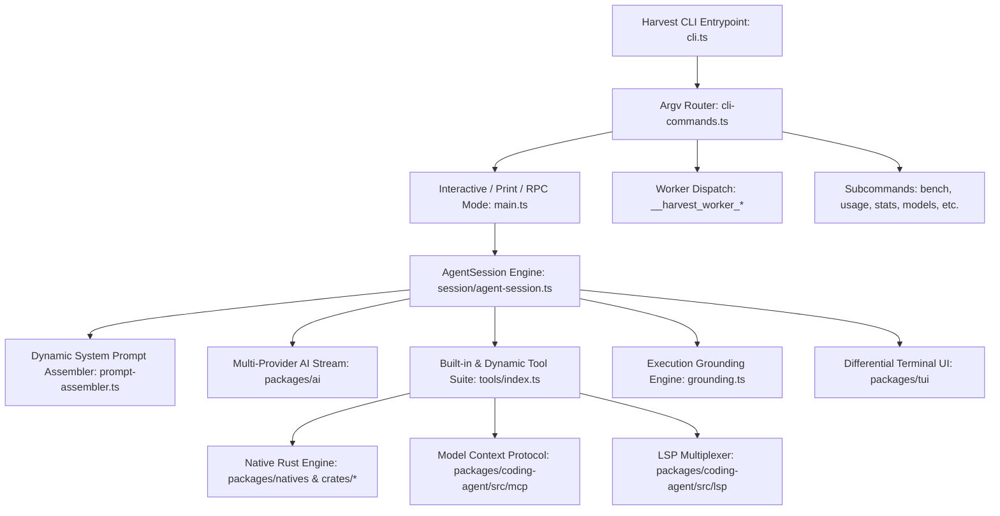
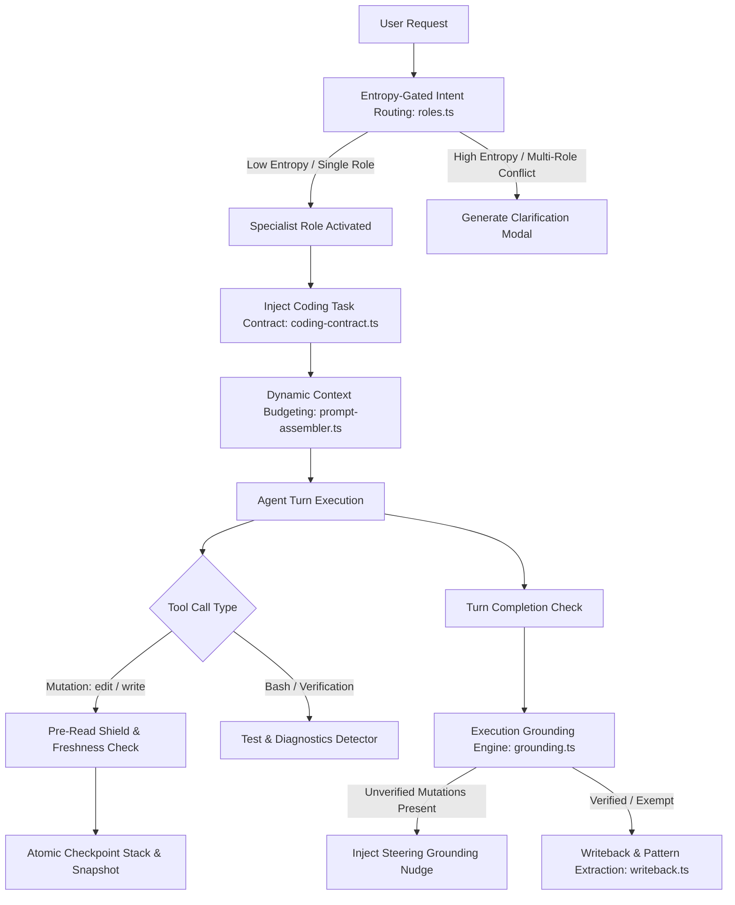
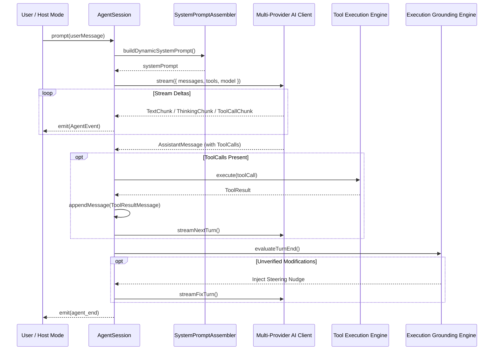

# Harvest Harness: Complete Architectural, Codebase & Functional Reference

> **Comprehensive Systematic Reference Guide to the Harvest Agent Harness Architecture, Core Subsystems, Packages, Crates, Tools, and Runtime Functions.**

---

## Table of Contents

1. [Executive Summary & Architectural Overview](#1-executive-summary--architectural-overview)
2. [Repository Topology & Monorepo Structure](#2-repository-topology--monorepo-structure)
3. [The CLI Lifecycle & Process Topology](#3-the-cli-lifecycle--process-topology)
4. [Harvest Core Subsystems (`packages/coding-agent/src/core/harvest`)](#4-harvest-core-subsystems)
   - 4.1 [Entropy-Gated Intent Routing & Specialist Roles (`roles.ts`)](#41-entropy-gated-intent-routing--specialist-roles)
   - 4.2 [The Grounded Coding Task Contract (`coding-contract.ts`)](#42-the-grounded-coding-task-contract)
   - 4.3 [Pre-Read Enforcement & Blind Overwrite Shield (`session/`)](#43-pre-read-enforcement--blind-overwrite-shield)
   - 4.4 [File Freshness Tracking & Checkpoint Rollback Stack (`session/`)](#44-file-freshness-tracking--checkpoint-rollback-stack)
   - 4.5 [Multi-Disjoint 3-Tier Edit Matcher & Atomic Mutator (`edit/`)](#45-multi-disjoint-3-tier-edit-matcher--atomic-mutator)
   - 4.6 [Local Execution Grounding & Verify-Before-Done Nudging (`grounding.ts`, `verification.ts`)](#46-local-execution-grounding--verify-before-done-nudging)
   - 4.7 [Vectorless Dual-Stage Section Retrieval & BM25 Code Index (`retrieval.ts`, `code-index.ts`)](#47-vectorless-dual-stage-section-retrieval--bm25-code-index)
   - 4.8 [Institutional Memory, Writeback & Contradiction Detection (`memory.ts`, `writeback.ts`, `graph.ts`)](#48-institutional-memory-writeback--contradiction-detection)
   - 4.9 [Automatic Tool-Call Sequence Mining & Skill Automation (`skill-automation.ts`, `skill-context.ts`)](#49-automatic-tool-call-sequence-mining--skill-automation)
   - 4.10 [Subagent Delegation & Git Claim Anti-Hallucination (`subagent.ts`)](#410-subagent-delegation--git-claim-anti-hallucination)
   - 4.11 [Context-Tiered Dynamic Prompt Budgeting (`model-tier.ts`, `prompt-assembler.ts`)](#411-context-tiered-dynamic-prompt-budgeting)
   - 4.12 [Deterministic Compaction with Verification Preservation (`compaction.ts`)](#412-deterministic-compaction-with-verification-preservation)
   - 4.13 [Enterprise Sandbox & AST-Level Security Auditing (`security.ts`)](#413-enterprise-sandbox--ast-level-security-auditing)
   - 4.14 [Resilient Provider Normalization & Streaming JSON Repair](#414-resilient-provider-normalization--streaming-json-repair)
   - 4.15 [Laya Local Decision Layer (`laya-client.ts`, `laya-gating.ts`, `laya-routing.ts`, `laya-completion.ts`, `laya-service.ts`)](#415-laya-local-decision-layer)
5. [Agent Session Engine (`packages/coding-agent/src/session`)](#5-agent-session-engine)
   - 5.1 [`AgentSession` Class Architecture](#51-agentsession-class-architecture)
   - 5.2 [Session State & Turn Execution Loop](#52-session-state--turn-execution-loop)
   - 5.3 [Session Persistence, Forking & Tree Navigation](#53-session-persistence-forking--tree-navigation)
   - 5.4 [Time-Traveling Stream Rules (TTSR)](#54-time-traveling-stream-rules-ttsr)
6. [Programmatic SDK (`packages/coding-agent/src/sdk.ts`)](#6-programmatic-sdk)
   - 6.1 [`createAgentSession()` API & Contract](#61-createagentsession-api--contract)
   - 6.2 [Custom Tool Registration & Hook Subsystem](#62-custom-tool-registration--hook-subsystem)
7. [Comprehensive Built-in Tool Suite (`packages/coding-agent/src/tools`)](#7-comprehensive-built-in-tool-suite)
   - 7.1 [`read`: Multi-Range & Formatted Document Reader](#71-read-multi-range--formatted-document-reader)
   - 7.2 [`bash`: Interactive PTY & Headless Shell Executor](#72-bash-interactive-pty--headless-shell-executor)
   - 7.3 [`edit`: Precise & Resilient Source File Mutator](#73-edit-precise--resilient-source-file-mutator)
   - 7.4 [`write`: Atomic Freshness-Verified Writer](#74-write-atomic-freshness-verified-writer)
   - 7.5 [`grep` & `glob`: High-Speed Search Primitives](#75-grep--glob-high-speed-search-primitives)
   - 7.6 [`lsp`: Language Server Protocol Client & Daemon Multiplexer](#76-lsp-language-server-protocol-client--daemon-multiplexer)
   - 7.7 [`dap`: Debug Adapter Protocol Client](#77-dap-debug-adapter-protocol-client)
   - 7.8 [`browser`: Chrome CDP Relay & Web Automation](#78-browser-chrome-cdp-relay--web-automation)
   - 7.9 [`computer`: Native Host Desktop Capture & Input](#79-computer-native-host-desktop-capture--input)
   - 7.10 [`task`: Hierarchical Subagent Orchestration](#710-task-hierarchical-subagent-orchestration)
   - 7.11 [`todo`: Persistent Task & Blocker Manager](#711-todo-persistent-task--blocker-manager)
   - 7.12 [`web_search`: Multi-Engine Search Client](#712-web_search-multi-engine-search-client)
   - 7.13 [`ask`: Interactive User Modal Dialogue](#713-ask-interactive-user-modal-dialogue)
   - 7.14 [`ast_edit` & `ast_grep`: Syntax-Aware AST Operations](#714-ast_edit--ast_grep-syntax-aware-ast-operations)
   - 7.15 Specialized Internal Tools (`checkpoint`, `rewind`, `think`, `yield`, `eval`)](#715-specialized-internal-tools)
8. [Multi-Provider AI Client (`packages/ai`)](#8-multi-provider-ai-client)
   - 8.1 [Stream & Completion Architecture](#81-stream--completion-architecture)
   - 8.2 [Supported Providers & Endpoint Routing](#82-supported-providers--endpoint-routing)
   - 8.3 [Authentication, Rotation & Usage Monitoring](#83-authentication-rotation--usage-monitoring)
9. [Model Catalog & Compat Rules (`packages/catalog`)](#9-model-catalog--compat-rules)
   - 9.1 [KDL Rule Engine Architecture](#91-kdl-rule-engine-architecture)
   - 9.2 [Model Classification & Capability Ladders](#92-model-classification--capability-ladders)
10. [Terminal UI Engine (`packages/tui`)](#10-terminal-ui-engine)
    - 10.1 [Differential Virtual Terminal Rendering](#101-differential-virtual-terminal-rendering)
    - 10.2 [Component Architecture & Event Pipeline](#102-component-architecture--event-pipeline)
11. [Native Rust Acceleration Layer (`crates/` & `packages/natives`)](#11-native-rust-acceleration-layer)
    - 11.1 [Crate Breakdown & Responsibilities](#111-crate-breakdown--responsibilities)
    - 11.2 [N-API Bridge Contracts (`pi-natives`)](#112-n-api-bridge-contracts)
12. [Observability & Analytics (`packages/stats`)](#12-observability--analytics)
13. [Utility Ecosystem (`packages/utils`, `packages/omptype`, `packages/wire`)](#13-utility-ecosystem)
14. [Cross-Cutting Architectural Invariants](#14-cross-cutting-architectural-invariants)

---

## 1. Executive Summary & Architectural Overview

The **Harvest Agent Harness** is an enterprise-grade, high-performance runtime and pair-programming autonomous agent system. Designed originally as an advanced coding CLI and extensible SDK, Harvest orchestrates large language models (LLMs) to perform complex multi-turn file edits, multi-process command execution, debugging, web research, desktop automation, and hierarchical multi-agent delegation.

### Key Architectural Tenets
1. **Multi-Tier Execution Safety**: Changes are guarded by pre-read verification, atomic file snapshot stacks, AST-level validation, and verify-before-done execution grounding.
2. **Deterministic Context Compaction**: Maintains conversation continuity over massive token trajectories without losing critical evidence, tests, or modified file paths.
3. **High-Performance Hybrid Architecture**: TypeScript and Bun handle dynamic orchestration and CLI ergonomics, while native Rust crates (`pi-ast`, `pi-edit`, `pi-walker`, `pi-diff`, `pi-natives`) provide zero-cost abstractions for Levenshtein fuzzy matching, AST parsing, multithreaded directory traversal, and SGR terminal rendering.
4. **Single-Binary Process Re-Entry**: Background workers (TTS, STT, JS evaluation, stats syncing, tiny models) spawn by re-entering the primary CLI entrypoint using hidden argv selector flags (`__harvest_worker_*`), eliminating external bundle drift.



---

## 2. Repository Topology & Monorepo Structure

The repository is organized as a Bun and Cargo monorepo:

| Path | Language | Purpose |
| :--- | :--- | :--- |
| `packages/coding-agent/` | TypeScript | Core CLI application, `AgentSession` runtime, tools, modes, and programmatic SDK. |
| `packages/ai/` | TypeScript | Multi-provider streaming LLM client, token usage trackers, SSE parser, and JSON stream repair. |
| `packages/catalog/` | TypeScript / KDL | Machine-generated model catalog (`models.json`), KDL compatibility rules, thinking ladders. |
| `packages/tui/` | TypeScript | Differential terminal UI library with double-buffering, ANSI/SGR optimizer, and widget tree. |
| `packages/natives/` | TypeScript / N-API | Node-API bindings connecting TypeScript code to Rust native libraries. |
| `packages/stats/` | TypeScript / React | Local observability web dashboard and metrics analyzer (`harvest stats`). |
| `packages/omptype/` | TypeScript | Ultra-fast ArkType-compatible lazy JIT runtime schema validation. |
| `packages/snapcompact/` | TypeScript | Token compaction and message tree pruning algorithms. |
| `packages/mnemopi/` | TypeScript | Semantic memory and local vector embedding worker client. |
| `packages/collab-web/` | TypeScript / Vite | Web-based collaborative terminal session viewer and replay interface. |
| `packages/utils/` | TypeScript | Shared runtime utilities: logger, streams, process tree, temp files, file locks. |
| `packages/wire/` | TypeScript | Wire format protocol contracts and message definitions. |
| `crates/pi-ast/` | Rust | Concrete syntax tree parser and structural block extractor. |
| `crates/pi-edit/` | Rust | Myers diff and Levenshtein fuzzy string distance algorithms. |
| `crates/pi-walker/` | Rust | High-speed multithreaded directory crawler respecting ignore patterns. |
| `crates/pi-diff/` | Rust | Unified diff computation, chunk formatting, and patch inspection. |
| `crates/pi-shell/` | Rust | Cross-platform PTY abstraction and command spawning engine. |
| `crates/pi-vcs/` | Rust | Fast VCS status querying (Git and Jujutsu/`jj`). |
| `crates/pi-natives/` | Rust | Master `cdylib` exposing native functions to Node.js/Bun via `napi-rs`. |
| `python/robomp/` | Python | Robotic process automation, web driver bridge, and headless execution helpers. |
| `scripts/` | TypeScript / Bash | CI/CD build scripts, binary packaging, version sync, and release automation. |

---

## 3. The CLI Lifecycle & Process Topology

### 3.1 Entrypoint & Process Name Initialization (`cli.ts`)
When `harvest` executes:
1. `setProcessName(APP_NAME)` immediately establishes the process identity (`harvest`).
2. `declareWorkerHostEntry()` records `Bun.main` as the host script for all spawned worker threads.
3. **Hidden Worker Dispatch Table**: Before loading the heavyweight command registry or TUI graph, `cli.ts` inspects `process.argv[2]` for worker triggers:
   - `__harvest_worker_tiny_inference`: Tiny model inference worker (session titling & memory distillation).
   - `__harvest_worker_stats_sync`: Background telemetry and stats activity writer.
   - `__harvest_worker_tab`: Autocomplete and tab-completion computation worker.
   - `__harvest_worker_js_eval`: Sandboxed JavaScript evaluation subprocess.
   - `__harvest_worker_stt` & `__harvest_worker_tts`: Local speech-to-text and text-to-speech audio engines.
   - `__harvest_worker_mnemopi_embed`: FastEmbed vector embeddings worker.
4. **Global Proxy Bootstrap**: `installGlobalProxyFetch()` wraps native `fetch` to ensure all provider traffic respects corporate or regional gateways (`PI_PROXY`, `HTTPS_PROXY`).
5. **Startup Composer**: If interactive TTY is detected, `beginStartupComposer()` starts rendering the animated splash screen concurrently while the heavy command and profile graph loads.

### 3.2 Command Routing (`cli-commands.ts`)
The CLI command parser (`resolveCliArgv`) provides non-leaking argument dispatch:
- Matches top-level registered subcommands (`bench`, `token`, `usage`, `install`, `plugin`, `stats`, `models`, `say`, `ttsr`, `worktree`, `cleanse`, `acp`, etc.).
- **Unregistered Verb Interceptor**: If a user runs a bare reserved command like `harvest list`, `harvest remove`, or `harvest marketplace`, the router halts execution and provides an actionable redirect (e.g. `Use harvest plugin list`) instead of accidentally treating the keyword as a prompt sent to the LLM.
- Defaults unrecognized non-flag arguments to `launch <prompt>` for immediate agent session execution.

---

## 4. Harvest Core Subsystems

Located in [`packages/coding-agent/src/core/harvest/`](file:///c:/Users/sanid/Desktop/harvest-2.0/harvest/packages/coding-agent/src/core/harvest), these modules constitute the runtime safety and intelligence contract of the Harvest agent harness.



### 4.1 Entropy-Gated Intent Routing & Specialist Roles
- **Module**: `roles.ts`
- **Key Functions**:
  - `classifyIntent(input: string): IntentClassification`
  - `calculateRoleEntropy(scores: Record<Role, number>): number`
  - `selectSpecialistRole(input: string): SpecialistRole`
- **Mechanism**: Analyzes user prompt semantics against specialist role lexicons (Frontend, Backend, DevOps, Architecture, Security, Performance). Computes Shannon entropy $H = -\sum p_i \log_2(p_i)$ over role affinities. When multiple domains conflict strongly without a dominant intent, Harvest pauses before execution to trigger a targeted clarification question rather than making conflicting architectural assumptions.

### 4.2 The Grounded Coding Task Contract
- **Module**: `coding-contract.ts`
- **Key Function**: `formatCodingTaskContract(context: ContractContext): string`
- **Contract Enforcement**: Wraps complex coding and refactoring tasks with an explicit 5-point contract injected directly into the LLM context:
  1. *Discovery & Pre-Read*: Every file must be read before being modified.
  2. *Surgical Precision*: Target minimum contiguous changes; avoid mass overwrites.
  3. *Checkpointing*: Preserve working states.
  4. *Execution Grounding*: Run relevant tests or validation scripts before claiming completion.
  5. *Commit Veracity*: Never assert git commits without actual HEAD progression.

### 4.3 Pre-Read Enforcement & Blind Overwrite Shield
- **Module**: `packages/coding-agent/src/session/file-session.ts` & `core/harvest/`
- **Key Functions**:
  - `assertFileReadInSession(filePath: string): void`
  - `recordFileRead(filePath: string, content: string, stats: FileStats): void`
- **Mechanism**: Intercepts all mutation tools (`edit`, `write`, `ast_edit`). If an agent attempts to overwrite or modify an existing workspace file that has not been read in the current session, the tool execution immediately rejects with a `BlindOverwriteShieldError`, instructing the agent to examine current content first.

### 4.4 File Freshness Tracking & Checkpoint Rollback Stack
- **Module**: `packages/coding-agent/src/session/file-session.ts`
- **Key Classes & Functions**:
  - `FileSession`: Manages the session-scoped checkpoint stack.
  - `atomicWriteFile(target: string, content: string): Promise<void>`
  - `createTurnSnapshot(turnId: string): CheckpointSnapshot`
  - `rollbackTurn(turnId: string): Promise<void>`
- **Mechanism**:
  - Maintains a map of file paths to `mtimeMs`, `size`, and SHA-256 hashes.
  - Detects external modifications made out-of-band.
  - On `/undo` or turn rewind, restores all modified files to their exact pre-turn binary state atomically.

### 4.5 Multi-Disjoint 3-Tier Edit Matcher & Atomic Mutator
- **Module**: `packages/coding-agent/src/edit/` & `crates/pi-edit`
- **Key Classes**: `EditMutator`, `TieredMatcher`
- **Matching Tiers**:
  1. **Tier 1 (Exact Match)**: Direct byte-for-byte and newline-normalized (`\r\n` vs `\n`) match.
  2. **Tier 2 (Whitespace-Flexible Match)**: Trims line-end whitespace and normalizes indentation levels while preserving block structure.
  3. **Tier 3 (Fuzzy Line-Window Levenshtein Match)**: Employs a sliding window Levenshtein distance algorithm with acceptance and margin gates. Identifies intended target regions despite minor upstream edits.
- **Diagnostics**: When all tiers fail, emits near-miss line number candidates with contextual diff snippets, teaching the LLM why the match failed and what the active code looks like.

### 4.6 Local Execution Grounding & Verify-Before-Done Nudging
- **Module**: `grounding.ts` & `verification.ts`
- **Key Classes**:
  - `ExecutionGroundingEngine`
  - `detectVerificationRunners(cwd: string): Promise<RunnerDescriptor[]>`
  - `parseTestFailures(output: string): StructuredTestDiagnostic[]`
- **Mechanism**:
  - Monitors the state of modified files. If the agent makes source mutations and attempts to complete the turn without running automated tests, `ExecutionGroundingEngine` intercepts `onTurnEnd` and injects a steering grounding nudge.
  - Automatically exempts read-only queries, documentation changes, or frontend-only tasks where test runners do not apply.
  - Capped at 2 sequential nudges to prevent infinite loops if tests are unavailable.

### 4.7 Vectorless Dual-Stage Section Retrieval & BM25 Code Index
- **Module**: `retrieval.ts` & `code-index.ts`
- **Key Classes**:
  - `DualStageRetriever`
  - `Bm25CodeIndex`
- **Mechanism**:
  - Splits markdown documentation and codebases into semantic sections while preserving code fences.
  - Extracts column-0 symbols and breaks camelCase/snake_case identifiers into normalized subwords.
  - Performs rapid BM25 keyword and symbol scoring locally without requiring heavy external embedding models or API calls.

### 4.8 Institutional Memory, Writeback & Contradiction Detection
- **Module**: `memory.ts`, `writeback.ts`, `graph.ts`
- **Key Classes**:
  - `InstitutionalMemoryStore`
  - `KnowledgeGraph`
- **Features**:
  - Extracts durable patterns and anti-patterns with provenance frontmatter.
  - Computes semantic similarity; supersedes patterns with similarity between 0.50 and 0.85 without losing historical context.
  - Detects semantic contradictions when a proposed pattern shares keywords with an existing anti-pattern.
  - Represents relationships in an in-memory directed graph with BFS traversal capabilities.

### 4.9 Automatic Tool-Call Sequence Mining & Skill Automation
- **Module**: `skill-automation.ts` & `skill-context.ts`
- **Mechanism**:
  - Tracks frequent tool-call sequences (e.g. `grep` -> `read` -> `edit` -> `bash(test)`).
  - Automatically identifies repeatable developer workflows and stages them as proposed skills under `.harvest/skills/`.
  - Staged skills require human confirmation before activation.

### 4.10 Subagent Delegation & Git Claim Anti-Hallucination
- **Module**: `subagent.ts`
- **Mechanism**:
  - Intercepts subagent and main agent completion summaries claiming git commits.
  - Inspects `git rev-parse HEAD`. If a commit was claimed but `git HEAD` did not advance, the task is marked failed and sent back for re-execution.

### 4.11 Context-Tiered Dynamic Prompt Budgeting
- **Module**: `model-tier.ts` & `prompt-assembler.ts`
- **Key Function**: `assembleHarvestSystemPrompt(config: BudgetConfig): string`
- **Mechanism**:
  - Evaluates hardware capabilities, model context window limits (e.g. 8K vs 128K vs 1M), and token cost tiers.
  - Dynamically trims non-essential XML blocks, rules, and examples to ensure small models operate with dense prompts while flagship models receive rich contextual instructions.

### 4.12 Deterministic Compaction with Verification Preservation
- **Module**: `compaction.ts`
- **Key Class**: `DeterministicCompactor`
- **Mechanism**:
  - Compresses lengthy message histories when context budgets reach high-water marks (e.g. 80%).
  - Retains all accessed files, active diffs, pending todo items, and test results.
  - Explicitly marks test pass records as `STALE` if a relevant file was touched after the test ran.

### 4.13 Enterprise Sandbox & AST-Level Security Auditing
- **Module**: `security.ts`
- **Key Functions**:
  - `assertPathJailed(filePath: string, rootDir: string): void`
  - `DestructiveCommandBarrier.validate(command: string): boolean`
  - `auditCodeSecurity(code: string, lang: string): SecurityAuditResult`
- **Protections**:
  - Blocks path traversal attacks (`../..`) escaping the project directory.
  - Blocks dangerous destructive commands (`rm -rf /`, raw disk formatting, unvetted `curl | bash`).
  - AST-audits proposed code for plain-text credential leaks, arbitrary `eval`, and SQL injection.

### 4.14 Resilient Provider Normalization & Streaming JSON Repair
- **Module**: `packages/ai/src/utils/`
- **Key Functions**:
  - `repairJson(raw: string): string`
  - `parseStreamingJson(partial: string): unknown`
- **Mechanism**: Handles half-streamed tool arguments, missing closing braces, unescaped newlines in string literals, and malformed model outputs in real time without crashing the agent event loop.

### 4.15 Laya Local Decision Layer
- **Modules**:
  - `packages/coding-agent/src/core/harvest/laya-client.ts`: Low-overhead local HTTP client (300ms timeout, non-English upstream filter, batched `/v1/decide` requests).
  - `packages/coding-agent/src/core/harvest/laya-gating.ts`: Tool-call gating for high-risk tools (`bash`, `write`, `edit`, `ast-edit`, `patch`) evaluating irreversibility via `noul` question; fails CLOSED to require human approval.
  - `packages/coding-agent/src/core/harvest/laya-routing.ts`: Evaluates prompt complexity via `choice` question to assign `smol`, `slow`, or `default` model tier; fails OPEN to default tier.
  - `packages/coding-agent/src/core/harvest/laya-completion.ts`: Evaluates execution outputs and stop classifications with batched `noul` checks before invoking heavy cloud LLMs; fails OPEN.
  - `packages/coding-agent/src/core/harvest/laya-service.ts`: Local daemon lifecycle manager (Python 3.9+ discovery, single checkpoint caching, daemon auto-start, and Harvest settings configuration).
  - `packages/coding-agent/src/modes/setup-wizard/scenes/laya.ts`: Interactive TUI onboarding scene ("Configure Laya") in `harvest setup`.
  - `decision-sidecar/`: Standalone Python microservice (`server.py`, `calibration.py`) running on `127.0.0.1:8177`.
- **Model**: Exclusively `convaiinnovations/laya-typed-decisions` (ModernBERT-large 421M, single-model mode, no Router).
- **Temperature Calibration**: Evaluates Expected Calibration Error (ECE) and fits temperature parameters ($T$) per call site to eliminate raw model overconfidence.

---

## 5. Agent Session Engine

The agent session engine in [`packages/coding-agent/src/session/`](file:///c:/Users/sanid/Desktop/harvest-2.0/harvest/packages/coding-agent/src/session) orchestrates the turn lifecycle, tool execution, context injection, and state transitions.

### 5.1 `AgentSession` Class Architecture (`agent-session.ts`)
`AgentSession` is the central coordinator for all operational modes. It encapsulates:
- `AgentState`: Active messages, pending tool calls, current model, and thinking budget.
- `SessionManager`: Reads and writes JSONL session histories atomically.
- `ToolSession`: Manages the active tool roster, argument validation, and execution hooks.
- `FileSession`: Coordinates file freshness, checkpoints, and rollback snapshots.
- `EventBus`: Dispatches strongly-typed lifecycle events (`agent_start`, `turn_start`, `tool_call_start`, `tool_call_end`, `compaction_start`, `agent_end`).

### 5.2 Session State & Turn Execution Loop


### 5.3 Session Persistence, Forking & Tree Navigation
- **Atomic JSONL Storage**: All turns, messages, and model responses are appended directly to `~/.harvest/agent/sessions/<session-id>.jsonl` using atomic file locks.
- **Forking**: `forkSession(sessionId, messageId)` clones history up to a specified turn, branching the timeline into a new isolated session file.
- **Tree Navigation**: Allows navigating back to arbitrary turns (`/rewind`), restoring files to that turn's checkpoint snapshot while retaining tree metadata.

### 5.4 Time-Traveling Stream Rules (TTSR)
- **Module**: `packages/coding-agent/src/session/ttsr.ts`
- **Mechanism**:
  - Evaluates streaming tokens in real time against a rule engine.
  - Allows interrupting a misaligned or hallucinating model mid-token before it wastes time completing an invalid tool call, injecting immediate steering directions into the stream.

---

## 6. Programmatic SDK

Located at [`packages/coding-agent/src/sdk.ts`](file:///c:/Users/sanid/Desktop/harvest-2.0/harvest/packages/coding-agent/src/sdk.ts), the SDK enables headless embedding of the Harvest agent inside other applications, CI/CD pipelines, or autonomous servers.

### 6.1 `createAgentSession()` API & Contract
```typescript
import { createAgentSession, AgentSessionOptions } from "@harvest/pi-coding-agent";

const session = await createAgentSession({
  cwd: "/workspace/my-project",
  model: "claude-sonnet",
  approvalMode: "yolo",       // "strict" | "prompt" | "yolo"
  tools: ["read", "edit", "write", "bash", "lsp"],
  rules: ["Follow strict TypeScript standards", "Do not modify package.json"],
  onEvent: (event) => {
    console.log("Agent event:", event.type);
  }
});

const result = await session.prompt("Refactor the auth controller to use JWT");
```

### 6.2 Custom Tool Registration & Hook Subsystem
Extensions and plugins register custom tools through the SDK interface:
```typescript
session.registerTool({
  name: "deploy_staging",
  description: "Deploys current branch to staging cluster",
  parameters: schema,
  execute: async (args, context) => {
    // Custom tool execution with access to session context
    return { ok: true, url: "https://staging.example.com" };
  }
});
```

---

## 7. Comprehensive Built-in Tool Suite

All tools are located in [`packages/coding-agent/src/tools/`](file:///c:/Users/sanid/Desktop/harvest-2.0/harvest/packages/coding-agent/src/tools).

| Tool | Export Class | Key Responsibilities |
| :--- | :--- | :--- |
| `read` | `ReadTool` | Reads files, line ranges, internal URIs, PDF/DOCX previews. |
| `bash` | `BashTool` | Runs commands via interactive PTY or headless subshell with Sixel graphics. |
| `edit` | `EditTool` | Executes surgical multi-disjoint fuzzy text edits using 3-tier matcher. |
| `write` | `WriteTool` | Atomically creates or replaces files with freshness checks. |
| `grep` | `GrepTool` | High-speed ripgrep-compatible regex search over workspace files. |
| `glob` | `GlobTool` | Multi-threaded file path searching matching glob patterns. |
| `lsp` | `LspTool` | Interacts with language servers for definitions, references, diagnostics. |
| `dap` | `DapTool` | Controls debuggers for breakpoints, stack traces, variable inspection. |
| `browser` | `BrowserTool` | Automates Chrome via CDP relay: screenshots, clicks, form input. |
| `computer` | `ComputerTool` | Captures native desktop screens and injects mouse/keyboard inputs. |
| `task` | `TaskTool` | Dispatches autonomous subagents with isolated context trees. |
| `todo` | `TodoTool` | Manages persistent task lists and prevents forgotten tasks. |
| `web_search` | `WebSearchTool` | Queries external web search APIs (Exa, Brave, Tavily, Perplexity). |
| `ask` | `AskTool` | Prompts human operator with multi-choice or open-ended questions. |
| `ast_edit` | `AstEditTool` | Structural syntax tree edits powered by `pi-ast`. |
| `ast_grep` | `AstGrepTool` | Structural code search matching syntax tree patterns. |
| `checkpoint` | `CheckpointTool` | Creates explicit named snapshot points in the session. |
| `rewind` | `RewindTool` | Rewinds file and session state to a previous turn or checkpoint. |
| `think` | `ThinkTool` | External scratchpad for deep chain-of-thought analysis. |
| `yield` | `YieldTool` | Returns partial progress in autonomous multi-agent pipelines. |
| `eval` | `EvalTool` | Executes code inside isolated JavaScript or Python kernels. |

### 7.1 `read`: Multi-Range & Formatted Document Reader
- **File**: `read.ts`
- **Capabilities**:
  - Supports `StartLine` and `EndLine` slicing to conserve context tokens.
  - Automatically renders PDFs and DOCX files to clean GitHub-flavored Markdown.
  - Intercepts internal URIs (e.g. `session://logs`, `diagnostics://active`).
  - Formats previews with syntax highlighting and line numbers for the TUI.

### 7.2 `bash`: Interactive PTY & Headless Shell Executor
- **File**: `bash.ts`
- **Capabilities**:
  - Native PTY allocation using Rust `pi-shell` bindings.
  - Configurable timeouts, background daemonization (`isDaemon: true`), and output truncation guards.
  - Supports inline image protocols: SIXEL and Kitty graphics are rendered directly in compatible terminal emulators.

### 7.3 `edit`: Precise & Resilient Source File Mutator
- **File**: `../edit/index.ts`
- **Capabilities**:
  - Accepts `ReplacementChunks` specifying `TargetContent` and `ReplacementContent`.
  - Executes edits in reverse file offset order to ensure line number shifts in chunk $N$ do not invalidate coordinates for chunk $N+1$.
  - Enforces pre-read validation and generates detailed near-miss diagnostics upon match failures.

### 7.4 `write`: Atomic Freshness-Verified Writer
- **File**: `write.ts`
- **Capabilities**:
  - Enforces blind-overwrite protection.
  - Writes data to a temporary sibling file (`.target.tmp.<id>`) before atomic rename, preventing file corruption on process abort.
  - Verifies file freshness against session-tracked timestamps and SHA-256 hashes.

### 7.5 `grep` & `glob`: High-Speed Search Primitives
- **Files**: `grep.ts`, `glob.ts`
- **Capabilities**:
  - Powered by multithreaded native Rust bindings (`pi-walker` and `pi-natives`).
  - Automatically respects `.gitignore`, `.ignore`, and `.harvestignore`.
  - Bounded result outputs prevent context window overflow on generic searches.

### 7.6 `lsp`: Language Server Protocol Client & Daemon Multiplexer
- **File**: `packages/coding-agent/src/lsp/`
- **Capabilities**:
  - Automatically discovers and manages LSP server processes for TypeScript, Rust, Python, Go, C/C++, and others.
  - The `LspMux` daemon multiplexes multiple client sessions against shared language server processes to avoid CPU and memory exhaustion.
  - Exposes actions: `goToDefinition`, `findReferences`, `documentSymbol`, `hover`, `diagnostics`, `formatFile`.

### 7.7 `dap`: Debug Adapter Protocol Client
- **File**: `packages/coding-agent/src/dap/`
- **Capabilities**:
  - Launches or attaches to standard DAP servers (Node inspector, `lldb-dap`, `debugpy`).
  - Supports setting breakpoints, stepping (`stepIn`, `stepOver`, `stepOut`), continuing execution, inspecting call stacks, and evaluating expressions in stack frames.

### 7.8 `browser`: Chrome CDP Relay & Web Automation
- **File**: `browser.ts` & `browser-relay/`
- **Capabilities**:
  - Connects to existing user Chrome browser sessions via a lightweight Chrome DevTools Protocol (CDP) relay or launches isolated headless instances.
  - Actions: `navigate`, `click`, `type`, `scroll`, `screenshot`, `extractDom`, `evaluateJs`.
  - Captures viewport images as base64 PNGs and injects them directly into the multimodal context.

### 7.9 `computer`: Native Host Desktop Capture & Input
- **File**: `tools/computer/`
- **Capabilities**:
  - Native OS screen capture, mouse positioning, clicks, and keyboard strokes via `pi-natives` desktop module.
  - Enables full desktop UI automation and testing outside of web browsers.

### 7.10 `task`: Hierarchical Subagent Orchestration
- **File**: `packages/coding-agent/src/task/`
- **Capabilities**:
  - Spawns child `AgentSession` instances with bounded turn limits, specialized system prompts, and filtered tool rosters.
  - Subagents run autonomously, writing their own history and checkpoints.
  - The parent agent receives an executive summary and structured deliverable artifacts.

### 7.11 `todo`: Persistent Task & Blocker Manager
- **File**: `todo.ts`
- **Capabilities**:
  - Maintains a structured todo list with status indicators (`pending`, `in_progress`, `completed`, `blocked`).
  - Tracks inter-task dependencies and blockers.
  - Agent event loop inspects the todo registry on turn completion to remind the agent of unfinished objectives.

### 7.12 `web_search`: Multi-Engine Search Client
- **File**: `packages/coding-agent/src/web/search.ts`
- **Capabilities**:
  - Dispatches queries across configured search providers: Exa, Brave Search, Tavily, Perplexity, and Firecrawl.
  - Formats search snippets with source URLs and titles into structured context.

### 7.13 `ask`: Interactive User Modal Dialogue
- **File**: `ask.ts`
- **Capabilities**:
  - Pauses the agent turn loop and presents an interactive questionnaire to the human operator.
  - Supports multiple-choice options, write-in responses, and multi-select checkboxes in the terminal UI.

---

## 8. Multi-Provider AI Client

Located in [`packages/ai/src/`](file:///c:/Users/sanid/Desktop/harvest-2.0/harvest/packages/ai/src), the AI package provides a normalized, streaming interface across all major LLM APIs.

### 8.1 Stream & Completion Architecture (`stream.ts`)
- `stream(options: StreamOptions): Promise<AgentEventStream>`
- Normalizes provider-specific SSE streams into a unified event pipeline:
  - `text-delta`: Incremental model response text.
  - `reasoning-delta`: Thinking and internal chain-of-thought tokens.
  - `tool-call-start`, `tool-call-delta`, `tool-call-end`: Streamed tool invocations and argument buffers.
  - `usage`: Input tokens, cached tokens read/written, output tokens, and reasoning tokens.

### 8.2 Supported Providers
- **Anthropic**: Direct Claude API, Foundry gateway with mTLS, Bedrock/Vertex routing, prompt caching.
- **OpenAI**: GPT-4o, o1, o3-mini via Chat Completions and Responses API.
- **Google Gemini**: Gemini 2.0 / 1.5 via Google AI Studio, Vertex AI, and Gemini CLI OAuth.
- **AWS Bedrock**: IAM authentication, cross-region inference profiles.
- **GCP Vertex AI**: Service account authentication.
- **Open-Source & Aggregated**: Groq, Cerebras, Mistral, xAI, Kimi, OpenRouter, Ollama, DeepSeek, Zai.

### 8.3 Authentication, Rotation & Usage Monitoring
- **OAuth Vault**: `packages/coding-agent/src/auth-broker/` manages refresh tokens securely on disk with master key encryption.
- **Account Balancing**: Automatically distributes requests across multiple authenticated accounts to maximize throughput and avoid individual rate limits.
- **Usage Probers**: Real-time quota and tier inspection modules for Claude, Cursor, GitHub Copilot, Gemini, OpenAI Codex, and others.

---

## 9. Model Catalog & Compat Rules

Located in [`packages/catalog/`](file:///c:/Users/sanid/Desktop/harvest-2.0/harvest/packages/catalog).

### 9.1 KDL Rule Engine Architecture
Model definitions and provider deployment contracts are governed strictly by KDL rules in `src/compat/rules/`:
- `taxonomy/*.kdl`: Defines model families, lineages, and naming regexes.
- `classes/*.kdl`: Lineage behaviors (e.g. thinking capability, tool format preferences).
- `providers/*.kdl`: Deployment-specific quirks (e.g. Azure max tokens caps, Bedrock header constraints).
- `runtime/behavior.kdl`: Pre-routing rules and default fallbacks.
- The rulebook is compiled into `rules.json` via `bun run gen:compat`.

### 9.2 Model Classification & Capability Ladders
`classifyModel(model: Model)` extracts structured capability facts:
- Effort and thinking levels (e.g. Anthropic budget tokens, OpenAI reasoning effort).
- Modality support (text, images, audio, video).
- Context window floors and maximum output token ceilings.

---

## 10. Terminal UI Engine

Located in [`packages/tui/`](file:///c:/Users/sanid/Desktop/harvest-2.0/harvest/packages/tui).

### 10.1 Differential Virtual Terminal Rendering
- **Double-Buffered Screen**: Renders the UI into an off-screen virtual grid, computes minimal character-cell diffs, and flushes only changed cells to stdout.
- **SGR Coalescing**: Groups contiguous ANSI styling codes (colors, bold, dim) to minimize escape sequence overhead over high-latency SSH connections.
- **Jamo & East Asian Width**: Accurately measures multi-width Unicode characters, emojis, and nerd-font symbols using native Rust text width algorithms.

### 10.2 Component Architecture & Event Pipeline
- **Base Components**: `Container`, `Text`, `Spacer`, `Input`, `SelectList`, `SettingsList`, `ScrollView`, `Markdown`.
- **Modes**:
  - `InteractiveMode`: Fullscreen TUI with chat stream, status line, interactive composer, and keyboard navigation.
  - `PrintMode`: Headless stdout streaming mode designed for CI/CD, piping, and automated batch runs.
  - `PlanMode`: Specialized interactive plan drafting and interactive review workflow.
  - `VibeMode`: Streamlined distraction-free coding experience with ambient status indicators.

---

## 11. Native Rust Acceleration Layer

Located in [`crates/`](file:///c:/Users/sanid/Desktop/harvest-2.0/harvest/crates) and bridged via [`packages/natives`](file:///c:/Users/sanid/Desktop/harvest-2.0/harvest/packages/natives).

### 11.1 Crate Breakdown
- `pi-ast`: Tree-sitter powered abstract syntax tree analysis and structural block edits.
- `pi-edit`: High-speed Myers diff and Levenshtein string matching algorithms.
- `pi-walker`: Parallel file crawler matching glob patterns and respecting ignore files.
- `pi-shell`: Cross-platform pseudo-terminal (PTY) interface for Windows, Linux, and macOS.
- `pi-vcs`: Native bindings for high-speed Git and Jujutsu status and diff retrieval.
- `pi-diff`: High-performance patch formatting and inspection.
- `pi-natives`: N-API glue layer compiling the native crates into a single shared library.

### 11.2 N-API Bridge Contracts
Exported functions include:
- `fast_levenshtein(a: string, b: string): number`
- `crawl_directory(path: string, options: CrawlOptions): string[]`
- `pty_spawn(command: string[], env: Record<string, string>): PtyHandle`
- `parse_ast_blocks(code: string, language: string): AstBlock[]`
- `render_sixel(imageBuffer: Uint8Array): string`

---

## 12. Observability & Analytics

Located in [`packages/stats/`](file:///c:/Users/sanid/Desktop/harvest-2.0/harvest/packages/stats).

- **`harvest stats`**: Launches a local SQLite-backed observability dashboard.
- **Tracked Metrics**:
  - Total tokens consumed per model, provider, and session.
  - Financial expenditure calculated from precise token pricing ladders.
  - Tool call frequency, latency distributions, and error rates.
  - Turn durations and test pass/fail ratios over time.

---

## 13. Utility Ecosystem

### 13.1 `packages/utils`
- `logger`: Centralized, asynchronous, rotating logger writing to `~/.harvest/logs/harvest.YYYY-MM-DD.log`.
- `env`: Environment variable helpers (`$env`, `$flag`) with profile isolation.
- `file-lock`: Cross-platform file locking protecting shared session files from race conditions.
- `stream`: High-throughput async stream utilities (`readStream`, `readLines`).

### 13.2 `packages/omptype`
A high-performance runtime type-checking engine compatible with ArkType syntax. Uses lazy JIT compilation for schema evaluation, providing schema validation for tool parameters and configuration files with zero cold-start overhead.

### 13.3 `packages/wire`
Standardizes cross-process JSON-RPC and message serialization contracts across CLI, ACP servers, and collaborative web frontends.

---

## 14. Cross-Cutting Architectural Invariants

When developing or extending the Harvest agent harness, maintain the following invariants:

1. **No Dogmatic Coding Barriers**: Standard TypeScript practices are embraced. Standard `private`/`protected` access modifiers and explicit types are preferred.
2. **Never Hand-Craft Prompts in Code**: Prompts must be maintained in static `.md` files with Handlebars interpolation and imported via `with { type: "text" }`.
3. **No Unsanitized Terminal Output**: All rendered text must pass through sanitization helpers (`replaceTabs()`, `truncateToWidth()`, `shortenPath()`) to prevent visual corruption and home directory leaks.
4. **Always Single-Binary Re-Entry**: Background workers must re-enter the CLI entrypoint via hidden argv flags (`__harvest_worker_*`) and never spawn independent worker script paths.
5. **KDL Governs Model Policy**: Never write model-specific conditional branches (`if (id.includes("claude"))`) in TypeScript. All model quirks, token caps, thinking levels, and pricing rules belong in the KDL rule tree under `packages/catalog/src/compat/rules/`.
6. **Execution Grounding Precedes Completion**: The agent must always verify modified code with available test runners or diagnostics before concluding a coding task.
