<p align="center">
  
</p>

<p align="center">
  <strong>Harvest — a coding agent with the IDE wired in.</strong><br>
  Sessions, subagents, LSP, DAP, eval kernels, memory, and collab — in one terminal binary.
</p>

<p align="center">
  <a href="packages/coding-agent/CHANGELOG.md"></a>
  <a href="LICENSE"></a>
  <a href="https://www.typescriptlang.org"></a>
  <a href="https://www.rust-lang.org"></a>
  <a href="https://bun.sh"></a>
</p>

<p align="center">
  Fork of <a href="https://github.com/badlogic/pi-mono">Pi</a> by <a href="https://github.com/mariozechner">@mariozechner</a> · rewritten as a coding-first surface
</p>

The Rust agent in [`rust-agent`](rust-agent/README.md) builds `omp` with Cargo. Its checks and releases follow the Quinjet workflow set. The TypeScript tree remains while the rest of the product moves over.

> **30** built-in tools · **60+** providers · **23** search backends · **~80k** lines of Rust core · macOS / Linux / Windows

> [!NOTE]
> Pull requests are **temporarily open to everyone** as a trial. We previously
> required a vouch before accepting PRs; that requirement is lifted for now
> while we evaluate how open contributions go. See [CONTRIBUTING.md](CONTRIBUTING.md).

## Contents

- [TUI tour](#tui-tour)
- [What's in the box](#whats-in-the-box)
- [Install](#install)
- [Quick start](#quick-start)
- [Workspace UI](#workspace-ui)
- [Agent capabilities](#agent-capabilities)
- [Tools](#tools)
- [Providers & models](#providers--models)
- [Web search & reading](#web-search--reading)
- [Memory](#memory)
- [Sessions, tabs & branching](#sessions-tabs--branching)
- [Review, commit & worktrees](#review-commit--worktrees)
- [Collab, RPC, ACP & SDK](#collab-rpc-acp--sdk)
- [Native core](#native-core)
- [Configuration & extensibility](#configuration--extensibility)
- [Development](#development)
- [Monorepo packages](#monorepo-packages)
- [Contributing](#contributing)
- [License](#license)

## TUI tour

The fastest way to understand Harvest is to see it. All screenshots below are
checked in under [`assets/`](assets/) from real sessions.

| | | |
|---|---|---|
| 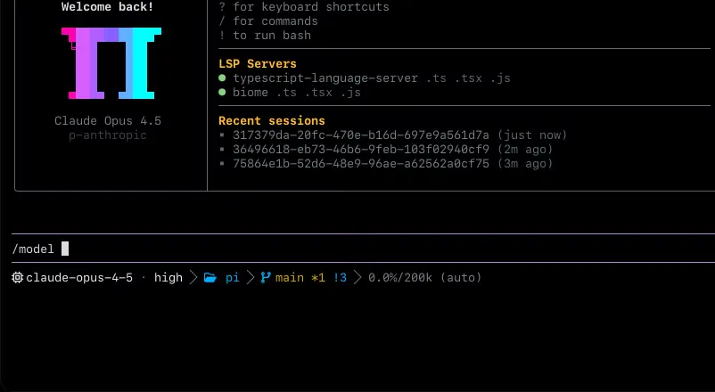<br>**Home + `/model`** — LSP status, recent sessions, per-role model picker | 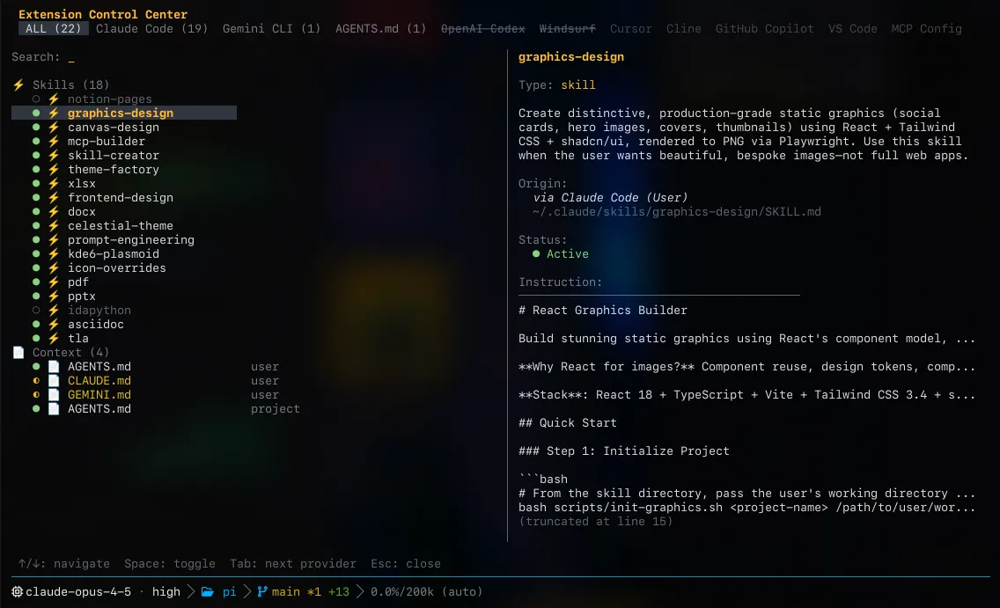<br>**Discovery** — skills, rules, and MCP servers inherited from disk, no migration | 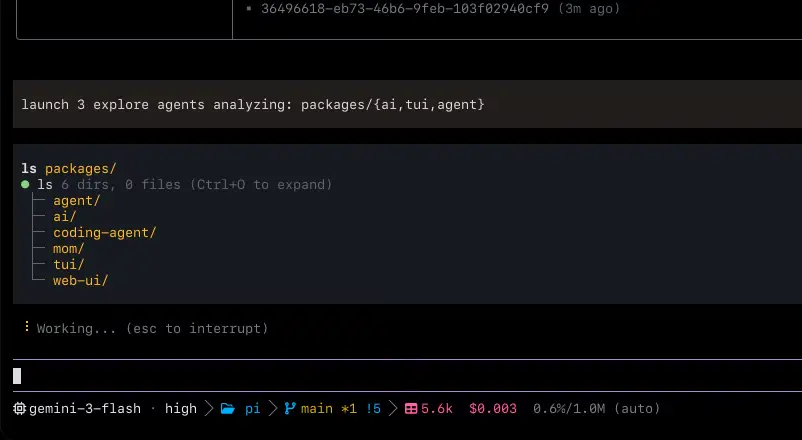<br>**Subagents** — `task` fans out isolated workers with typed results |
| 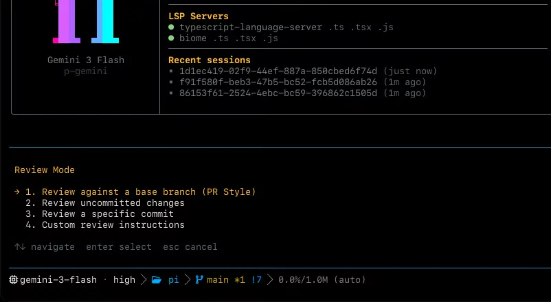<br>**`/review`** — prioritized P0–P3 verdicts over branches, commits, or dirty trees | 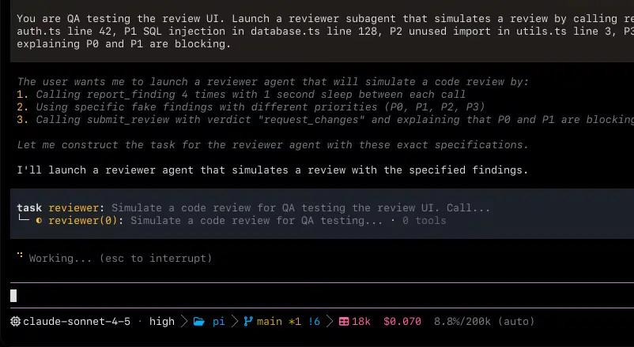<br>**Reviewer workers** — parallel reviewer subagents with structured findings | 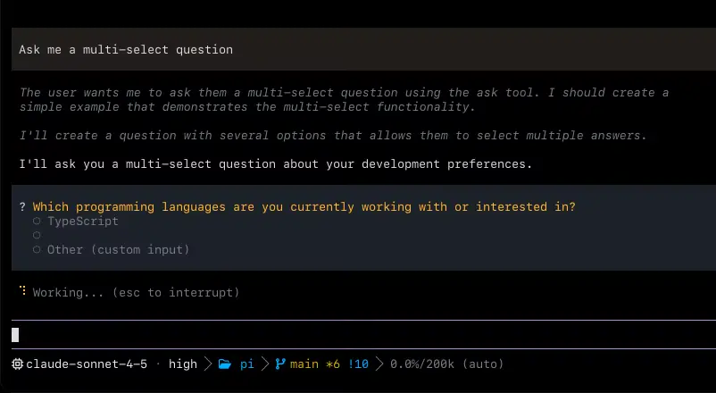<br>**`ask`** — structured questions instead of guessing |
| 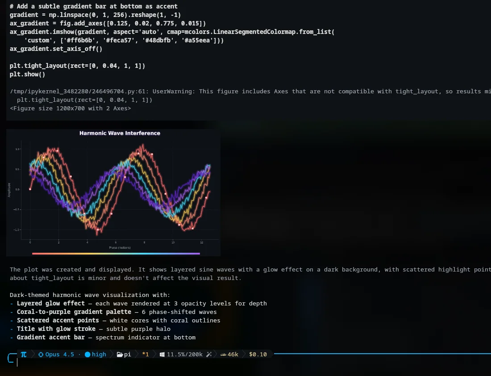<br>**`eval`** — persistent Python/JS kernels that plot, then explain the chart | 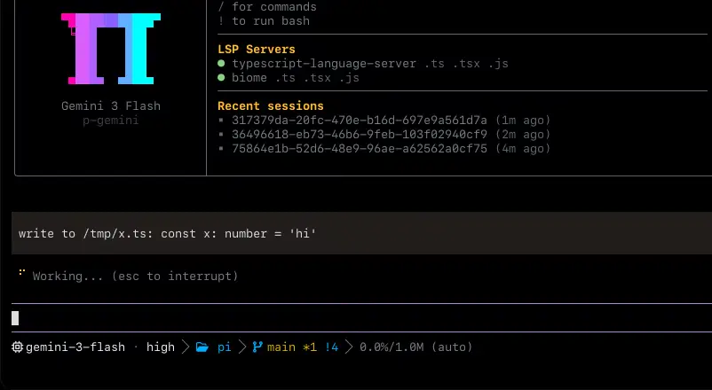<br>**LSP wired in** — renames, diagnostics, and navigation the IDE would do | 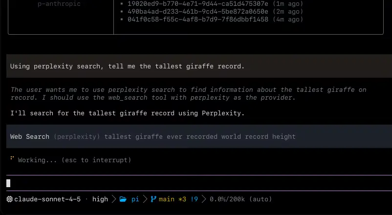<br>**`web_search`** — 23 backends, one tool the agent already knows |

Two more worth opening full-size:

- [`assets/arxiv.webp`](assets/arxiv.webp) — `read` on an arXiv URL returns structured markdown with anchors intact.
- [`assets/ttsr.webp`](assets/ttsr.webp) — branching keeps the old path reachable while the new session continues.

## What's in the box

- **Code execution with tool-calling** — persistent Python + Bun kernels. Either kernel can call back into `read`, `grep`, `task`, … over a loopback bridge.
- **LSP wired into every write** — renames flow through `workspace/willRenameFiles`; diagnostics, symbols, code actions, and raw requests via `lsp`.
- **A real debugger** — `debug` drives DAP sessions (lldb, dlv, debugpy): breakpoints, stepping, threads, variables.
- **First-class subagents** — `task` with isolated worktrees, typed `yield`, Agent Hub supervision (`Alt+A`), steering, revive, and kill.
- **Advisor role** — a second model watches every turn and injects asides, concerns, or blockers inline.
- **Live collab** — `/collab` shares the session over a relay (`harvest join`, browser link, QR). Frames are sealed client-side.
- **Memory the agent curates** — `retain` / `recall` / `reflect` / `learn`, project-scoped, with `local`, Hindsight, and Mnemopi backends.
- **Atomic commits** — `harvest commit` splits the tree into dependency-ordered commits with validated messages.
- **Editor-drivable** — `harvest acp` speaks Agent Client Protocol; `harvest --mode rpc` drives NDJSON over stdio; the Node SDK embeds the session.
- **Native everywhere** — ripgrep, glob, shell builtins, AST, PTY, and image handling compiled in. Same binary on macOS, Linux, Windows — no WSL bridge.

## Install

### Quick install

One command on macOS, Linux, and Windows (requires [Bun](https://bun.sh)):

```sh
bun install -g @harvest/pi-coding-agent
```

Run `omp` (or `harvest`) to start. Re-run to update.

**Prebuilt binaries (no Bun required)**

Installs the latest [GitHub release](https://github.com/Sanidhya14321/harvest/releases/latest) for your OS/CPU, verifies SHA-256, and checks the binary starts before replacing an existing install. Re-run to update.

**macOS**

```sh
curl -fsSL https://raw.githubusercontent.com/Sanidhya14321/harvest/main/scripts/install.sh | sh
```

Installs `omp` (plus a `harvest` symlink) into `~/.local/bin`. If that dir isn't on `PATH`:

```sh
echo 'export PATH="$HOME/.local/bin:$PATH"' >> ~/.zshrc && source ~/.zshrc
```

> **Gatekeeper:** the `curl` installer sets no quarantine attribute. If you download binaries manually via a browser, clear it: `xattr -d com.apple.quarantine ~/.local/bin/omp`.

**Homebrew (macOS)**

```sh
brew install harvest/tap/harvest
```

**Linux**

```sh
curl -fsSL https://raw.githubusercontent.com/Sanidhya14321/harvest/main/scripts/install.sh | sh
```

> **Alpine / musl:** install `apk add libstdc++ libgcc` first — the musl binary links them dynamically.

**Windows (PowerShell)**

```powershell
& ([scriptblock]::Create((irm https://raw.githubusercontent.com/Sanidhya14321/harvest/main/scripts/install.ps1)))
```

Installs `omp.exe` into `%LOCALAPPDATA%\omp` and adds it to your user `PATH` for the current session too.

**Source (developer install)**

```sh
bun install -g @harvest/pi-coding-agent
```

**Nix**

```sh
nix run github:Sanidhya14321/harvest
nix profile install github:Sanidhya14321/harvest
```

Flake consumers get `packages.<system>.harvest`, `overlays.default`, `nixosModules.default`, and `homeManagerModules.default`.

**Pinned versions (mise)**

```sh
mise use -g github:Sanidhya14321/harvest
```

**Manual downloads:** [GitHub Releases](https://github.com/Sanidhya14321/harvest/releases) ships Windows, macOS, and Linux (x64 + ARM64, incl. musl) with `SHA256SUMS.txt`, [MIT license](LICENSE), and [third-party notices](THIRD-PARTY-NOTICES.txt).

### Shell completions

Generated from live command/flag metadata, so they never drift. Model names complete from the bundled catalog; `--resume` completes on-disk sessions.

```sh
eval "$(harvest completions zsh)"    # zsh — add to ~/.zshrc
eval "$(harvest completions bash)"   # bash — add to ~/.bashrc
harvest completions fish > ~/.config/fish/completions/harvest.fish  # fish
```

> [!NOTE]
> The Laya decision sidecar has been **removed** (runtime, setup, packaging,
> docs). `laya.*` settings are inert, `LAYA_*` env vars are ignored with one
> deprecation warning, and `/laya` reports the removal. High-risk tools still
> fail closed to human approval; local tiny-model inference (titles, memory,
> auto-thinking) is intact.

## Quick start

```sh
omp                                  # interactive TUI
omp "List all .ts files in src/"     # start with an initial prompt
omp -p "List all .ts files in src/"  # one-shot: answer and exit
omp --continue "What did we discuss?"# resume the previous session
omp --resume                         # pick a session to reopen
```

- `@path` attaches files/images to the initial message: `omp @prompt.md @image.png "What color is the sky?"`
- Piped stdin becomes the prompt automatically (no `-` marker needed).
- `harvest` and `omp` are the same binary.

Prompt controls (prose only — never inside code spans, fences, or paths):

- `ultrathink` — careful multi-step reasoning at the highest automatic thinking effort.
- `orchestrate` — run independent work through parallel subagents and verify each phase.
- `workflowz` — build a deterministic multi-subagent workflow with `task`.

Session controls: `/vibe` (director over persistent `fast`/`good` workers), `/fresh` (reset stale provider stream state), `/branch` + `/rewind`, `/sessions`, `/timeline`, `/tab`, `/model`, `/switch`, `/review`, `/collab`, `/copy`, `/open`, `/trace`, `/diagnostics`, `/debug`. See [Magic keywords](docs/magic-keywords.md) and [Session operations](docs/session-operations-export-share-fork-resume.md).

## Workspace UI

Harvest opens in a full-screen workspace: clickable session tabs, a centered
new-session composer, mouse + PageUp/PageDown transcript navigation, and a
responsive right sidebar.

- **Sidebar** (`Alt+Shift+B`, `/sidebar`, `tui.sidebar: auto | show | hide`) — session title, context/cost, MCP/LSP status, Todo/Agents, Workspace Changes, version footer. Docked past 120 cols, overlay on narrow terminals.
- **Command palette** (`Alt+K`, `/commands`) — builtins plus extension, skill, file, and template commands. Commands that take arguments prepare an editable `/name ` draft instead of firing immediately.
- **Themes** — `harvest` (dark) and `harvest-light` ship as defaults with screen/panel/raised/composer/modal surfaces and legacy-theme fallbacks.
- **Home screen** — pixel-block wordmark, ghost prompt text, `key action` hints that follow keybinding remaps, animated working row with `esc interrupt` trailer.
- **Extension Control Center** — browse/search inherited skills, rules, and MCP servers per source (Claude Code, Gemini CLI, Cursor, Cline, Copilot, VS Code, AGENTS.md, MCP config) and toggle them live. Pictured above in [`assets/discovery.webp`](assets/discovery.webp).

## Agent capabilities

### 01 · Code execution with tool-calling

Persistent Python and Bun kernels share a prelude, and either kernel can call
back into the agent's tools. Load a CSV with `tool.read` from inside Python,
chart it from JavaScript, never leave the cell. Kitty/Sixel graphics from
foreground, failed, and background runs arrive as image results.


### 02 · LSP wired into every write

Renames go through `workspace/willRenameFiles` so barrels and aliased imports
update before the file moves. Diagnostics, go-to-definition, symbols, code
actions, and raw LSP requests are all one `lsp` tool away.


_[LSP config](docs/lsp-config.md)_ · _[lsp tool](docs/tools/lsp.md)_

### 03 · A real debugger

`debug` attaches lldb / dlv / debugpy to the wedged process: breakpoints,
stepping, threads, stack frames, variable inspection, and evaluation. No more
sprinkling print statements.

### 04 · Time-traveling stream rules

Rules sit dormant until the model goes off-script. A regex match aborts the
stream mid-token, injects the rule as a system reminder, and retries from the
same point — no context tax on well-behaved turns. Injections survive
compaction. Inspect with `omp ttsr list`, test with `omp ttsr test --agent`.

### 05 · First-class subagents

`task` fans out into isolated worktrees with their own tool surface; results
come back as schema-validated objects via `yield` (or `agent://<id>/…` paths),
not prose to parse. `Alt+A` opens Agent Hub: roster, live transcripts,
steering messages, revive/kill, and background-job supervision via `hub`.


### 06 · A second model, watching every turn

Pair a reviewer model to the `advisor` role and it reads every turn on its own
context, injecting quiet asides, concerns, or hard blockers. The doer
course-corrects or explains why not. Advisors get memory context plus `recall`
when the backend supports it. See [advisor watchdog](docs/advisor-watchdog.md).

### 07 · Hand someone the link, they're in

`/collab` puts the live session on a relay and prints a join command, a
browser link, and a QR. Teammates join from another terminal (`harvest join`)
or a browser guest client; `/collab view` is read-only. See [collab](docs/collab.md).

### 08 · Read a PDF on arXiv, why not?

`web_search` chains 23 providers and `read` fetches whatever URLs come back —
arXiv PDFs, GitHub pages, Stack Overflow threads — as structured markdown with
anchors intact. Same tool surface as local files.

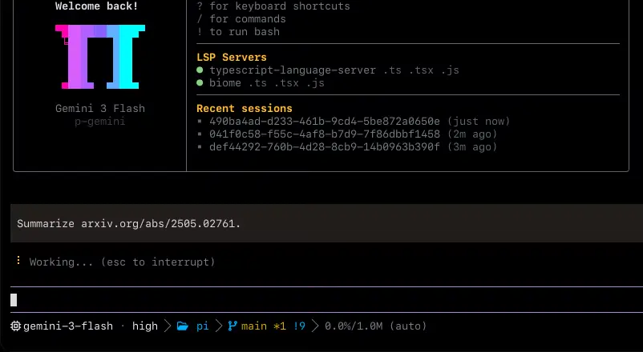


### 09 · Unapologetically native. Even on Windows.

ripgrep, glob, find, and 60+ coreutils (plus `jq`, `sed`, `diff`, …) run
in-process via the Rust core — zero fork/exec on the hot path. `bash` sessions
persist across calls with optional PTY and background-job dispatch.

### 10 · Code review with priorities and a verdict

`/review` spawns reviewer subagents over a base branch, uncommitted changes,
or a single commit — in parallel — then ranks every finding P0–P3 with
confidence and a ship/block verdict.


### 11 · Hashline: edit by content hash

The model points at anchors instead of retyping lines, so whitespace battles
and string-not-found loops stop happening. Stale anchors are rejected before
they corrupt anything. Muse-Code sessions send a compact hashline variant (~3 KB
lighter per request).

### 12 · GitHub is just another filesystem

`read pr://1428` returns the same shape as `read src/foo.ts`. `grep` walks a
diff like a directory. `agent://<id>/findings.0.path` pulls a field out of a
subagent's output by path. Sixteen internal schemes (`pr://`, `issue://`,
`agent://`, `skill://`, `ssh://`, `rule://`, `docs://`, `conflict://`, …)
resolve inside every FS-shaped tool.

### 13 · Conflict resolution, made easy

Each merge conflict becomes one URL: write `@theirs`, `@ours`, or `@base` to
`conflict://N` (bulk: `conflict://*`) and the file resolves cleanly.

### 14 · Preview, then accept

`ast_edit` stages structural rewrites as _(proposed)_ cards with replacement
counts; writing the one-line reason to `xd://resolve` turns the TUI into an
**Accept** card and the move lands atomically.

### 15 · Browser + desktop, through `eval`

Since v18.1.9, browser and desktop automation live in the `eval` JS/Python
prelude instead of standalone tools: `browser.open(…)` + `tab.run(…)` over
headless Chromium / CDP / your own Chrome via the relay; `computer.*` helpers
for windows, screenshots, native input, AX tree, and clipboard.

## Tools

30 built-ins in the same namespace as `read` and `bash`, plus 3 hidden
(`yield`, `goal`, `think`). Pin the set with `--tools read,edit,bash,…`;
rarely used devices stay behind `xd://` (`read xd://` lists them).

**Files & search**

- `read` — files, dirs, archives, SQLite, PDFs, notebooks, URLs, `ssh://`, and internal `://` schemes. Selectors like `:raw`, `:-60` (last N lines), `:412`, `:1h5m42s` (video frames via ffmpeg).
- `write` — create/overwrite files, archive entries, SQLite rows.
- `edit` — hashline patches with content-hash anchors + stale-anchor recovery.
- `ast_edit` / `ast_grep` — structural rewrites (previewed) and queries over 50+ tree-sitter grammars.
- `grep` — in-process regex over files, globs, and internal URLs.
- `glob` / `search_code` — path lookup and indexed code search.
- `security_scan` — native security reviews incl. Codex Security cloud scans.

**Runtime**

- `bash` — workspace shell, 60+ in-process coreutils, PTY, background jobs.
- `eval` — persistent Python/JS cells, shared prelude, tool re-entry, workpools, custom `@tool` definitions.

**Code intelligence**

- `lsp` — diagnostics, navigation, symbols, renames, code actions, raw requests.
- `debug` — DAP: breakpoints, stepping, threads, stack, variables.

**Coordination**

- `task` — parallel subagents, workspace-isolated, typed results.
- `hub` — message live agents, wait/cancel jobs, supervise processes.
- `todo` — ordered session todo list with phase tracking.
- `ask` — structured follow-up questions (single/multi-select, custom answers).


**Memory & skills**

- `checkpoint` / `rewind` — mark state; prune exploratory context with a report.
- `retain` / `recall` / `reflect` / `memory_edit` — durable facts (gated by `memory.backend`).
- `learn` / `manage_skill` — capture reusable lessons; manage versioned skills with revisions, evaluation, promotion, rollback.
- `sessions` / `presets` — background sessions and agent presets as tools.

Setting-gated, off by default: `github`, `security_scan`, `checkpoint`, `rewind`, memory tools, `learn`/`manage_skill` (per backend flags).

[Full tool reference →](https://omp.sh/docs/tools) · local: [`docs/tools/`](docs/tools/)

## Providers & models

Nine roles route work by intent: `default`, `smol` (cheap fan-out), `slow`
(deep reasoning), `plan`, `commit`, `vision`, `task`, `advisor`, `tiny`.
Override at launch with `--model`, `--smol`, `--slow`, `--plan`; cycle the
active role's models with `Ctrl+P`; swap mid-session with `/model` or
`/switch` (session-only).


Auth tags: `oauth` signs in with your provider account, `plan` routes through
a coding-plan subscription, `local` hits a local server with the key optional.

**Frontier APIs** — Anthropic `oauth` · OpenAI · OpenAI Codex `oauth` · Google
Gemini · Google Vertex · Google Antigravity `oauth` · xAI · SuperGrok `oauth` ·
DeepSeek · Mistral · Groq · Cerebras · Fireworks · Together · Baseten ·
DeepInfra · Hugging Face · NVIDIA · Meta · Amazon Bedrock · Azure OpenAI ·
SiliconFlow · GMI Cloud · CoreWeave · Sakana AI · OpenRouter · Synthetic ·
Vercel AI Gateway · Cloudflare AI Gateway · Wafer Serverless

**Coding plans** (`/login` attaches the session) — Cursor `oauth` · GitHub
Copilot `oauth` · GitLab Duo · Devin `oauth` · Kimi Code `plan` · Moonshot ·
MiniMax Coding Plan `plan` (+CN) · Alibaba Coding Plan `plan` · Qwen Portal
`oauth` · Z.AI / GLM `plan` · Zhipu `plan` · Xiaomi MiMo · Qianfan · Umans
`plan` · NanoGPT · Novita · Venice · Kilo · ZenMux · OpenCode Go · OpenCode Zen

**Run it yourself** (OpenAI-compatible `/v1/models`, key optional locally) —
Ollama `local` · Ollama Cloud · LM Studio `local` · llama.cpp `local` · vLLM
`local` · LiteLLM

Four knobs that make routing useful:

- **Custom providers** in `~/.harvest/agent/models.yml` (`openai-completions`, `openai-responses`, `anthropic-messages`, `bedrock-converse-stream`, `google-generative-ai`, …).
- **Fallback chains** (`retry.fallbackChains`) — 429/quota hands the rest of the turn to the next entry, restored on cooldown.
- **Path-scoped models** — pin `enabledModels`/`disabledProviders` under a `path:` prefix per repo.
- **Round-robin credentials** — stack keys per provider with session affinity + per-credential backoff.

```yaml
# ~/.harvest/agent/models.yml — anything OpenAI-compatible
providers:
  spark:
    baseUrl: http://192.168.10.223:8000/v1
    api: openai-completions
    apiKey: dummy
    models:
      - id: minimax-m3
        name: MiniMax M3
        contextWindow: 100000
        maxTokens: 32000
```

Full reference: [providers](docs/providers.md) · [models](docs/models.md) · [adding a provider](docs/adding-a-provider.md).

## Web search & reading

`web_search` is built in: `auto` walks the 23-provider chain, or pin one by
name. Site-aware extraction keeps code hosts, registries, research, forums,
docs, and vuln DBs structured.

| provider | auth |
|---|---|
| `auto` | chain |
| `perplexity` | `PERPLEXITY_API_KEY` (anonymous fallback) |
| `gemini` / `anthropic` / `codex` / `xai` | oauth (or key) |
| `zai` / `exa` / `tinyfish` / `jina` / `kagi` / `tavily` | `*_API_KEY` |
| `firecrawl` | `FIRECRAWL_API_KEY` (keyless fallback) |
| `brave` / `kimi` / `parallel` / `synthetic` | key or `/login` |
| `searxng` | self-hosted |
| `duckduckgo` / `startpage` / `google` / `ecosia` / `mojeek` / `public` | no key |

Specialized handlers: GitHub/GitLab, npm/PyPI/crates.io/Hex/Hackage/NuGet/Maven/RubyGems/Packagist/pub.dev/Go, arXiv/semantic scholar, Stack Overflow/Reddit/HN, MDN/readthedocs/docs.rs, plus NVD/OSV/CISA KEV for vulns.

## Memory

The agent remembers the codebase between sessions: `retain` writes facts
mid-run, `learn` captures reusable lessons (optionally promoted to a managed
skill), `recall`/`reflect` pull them back, and each session compresses into a
mental model that loads on the first turn of the next one.

Pick the engine with `memory.backend` — `local`, Hindsight, or Mnemopi (local
SQLite). Project-scoped by default. Managed skills carry revision history with
evaluate/promote/rollback. See [memory](docs/memory.md).

## Sessions, tabs & branching

- **Tabs** — every open/closed tab records its real session UUID; background tabs keep running; closing hides without stopping (stop first to delete); `+ New session` preserves drafts and attachments.
- **Branching** — double-Esc / `/branch` (alias `/rewind`) branches in place; the old path stays reachable in `/tree` and `/timeline`.
- **Tree & export** — `/timeline` opens the session tree; `harvest --export` renders HTML; `/copy` and `/open` handle blocks and links.
- **Resume anywhere** — `omp --resume`, `--continue`, `--fork`, `--session-dir`, `--from-claude` / `--from-codex` importers.

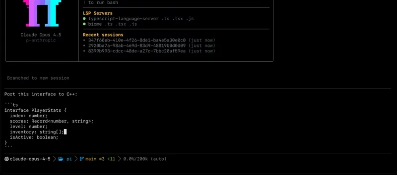

## Review, commit & worktrees

- **`harvest commit`** — `git_overview` + hunk analysis splits unrelated changes into atomic, dependency-ordered commits; cycles rejected; lockfiles excluded from analysis.
- **`/review`** — P0–P3 findings with confidence + ship/block verdict (see screenshots above).
- **Worktrees** — `/wt` (`/worktree`), `omp worktree add`, and `git worktree add` interceptions create linked worktrees with uncommitted changes, optional `worktree.clone` / `worktree.cleanSource`, and move the session without touching the original checkout.

## Collab, RPC, ACP & SDK

Same engine, four wrappers. `harvest` runs the TUI. `harvest -p` answers once
and exits. The Node SDK embeds the session. `--mode rpc` and `acp` hand the
wheel to another program over stdio.

**Interactive** — tool calls render as cards, edits preview before landing,
ambiguity routes through `ask`. Prompt cards also surface over ACP.

**SDK — embed in Node** (`@harvest/pi-coding-agent`):

```ts
import {
  ModelRegistry,
  SessionManager,
  createAgentSession,
  discoverAuthStorage,
} from "@harvest/pi-coding-agent";

const auth = await discoverAuthStorage();
const models = new ModelRegistry(auth);
await models.refresh();

const { session } = await createAgentSession({
  sessionManager: SessionManager.inMemory(),
  authStorage: auth,
  modelRegistry: models,
});
await session.prompt("list .ts files");
```

**RPC — drive over stdio** (`harvest --mode rpc`, `--mode rpc-ui` adds cards/selectors/dialogs as `extension_ui_request` frames):

```
$ harvest --mode rpc --no-session
> {"id":"r1","type":"prompt","message":"list .ts files"}
< {"id":"r1","type":"response", ...}
> {"id":"r2","type":"set_model","provider":"anthropic","modelId":"sonnet-4.5"}
> {"id":"r3","type":"abort"}
```

**ACP — speak to editors** (`harvest acp`, [Agent Client Protocol](https://github.com/zed-industries/agent-client-protocol)):

| Harvest tool | ACP route |
|---|---|
| `bash` | `terminal/create + terminal/output` |
| `read` | `fs/read_text_file` |
| `write` | `fs/write_text_file` |
| `edit, bash` | `session/request_permission` |

References: [SDK](docs/sdk.md) · [RPC](docs/rpc.md) · [collab](docs/collab.md).

## Native core

Six crates + one platform-tagged N-API addon. Search, shell, AST, highlight,
PTY, desktop control, image decode, BPE counting — all in-process on the
libuv pool. Another ~80k lines ride along vendored: the brush bash fork plus
60+ CLI utilities (coreutils, findutils, sed, jq, ripgrep-backed grep, fd,
diff, moreutils) compiled into the shell.

- Crates: `pi-natives`, `pi-shell`, `pi-ast`, `pi-iso`, `pi-voice`, `pi-walker`
- Platforms: `linux-x64/arm64`, `darwin-x64/arm64`, `win32-x64/arm64` (x64 ships dual AVX2 + baseline)

| Crate | What it does | ~LoC |
|---|---|---:|
| pi-shell | Embedded bash · persistent sessions · in-process coreutils · minimizer | 38,000 |
| pi-natives | N-API surface (table below) | 25,000 |
| pi-walker | Parallel ignore-aware walker + scan cache | 5,200 |
| pi-iso | Isolation: apfs/btrfs/zfs reflink, overlayfs, projfs, rcopy | 3,300 |
| pi-ast | tree-sitter + ast-grep matching, summaries | 2,900 |
| pi-voice | Audio capture/playback · Opus · WebRTC | 1,000 |

Inside `pi-natives` (glue/tests omitted): desktop (10.6k), grep (3.3k), text
(2.1k), snapcompact (1.8k), keys (1.7k), ast (1.5k), diff (1k), pty, crash
handler, highlight, appearance, task, glob, fd, clipboard, workspace, power,
prof, file lock, ps, tokens, html, sixel. See [natives architecture](docs/natives-architecture.md).

## Configuration & extensibility

An extension is a TypeScript module with the same tool API, slash-command
registry, hotkey table, and TUI primitives the built-ins use. Nothing is
reserved.

- **Discovery** — first run inherits rules, skills, and MCP servers from `.claude`, `.cursor`, `.windsurf`, `.gemini`, `.codex`, `.cline`, `.github/copilot`, `.vscode`. No migration script. Foreign user-level sources are opt-in via `enabledProviders`; project-level CWD/`.agents` load by default.
- **Ship it** — keep it local, ship it in a `marketplace`, or publish to npm; `/reload-plugins` picks up the piece you just asked Harvest to write.
- **Hooks, skills, MCP** — [hooks](docs/hooks.md) · [skills](docs/skills.md) · [MCP config](docs/mcp-config.md) · [marketplace](docs/marketplace.md) · [custom tools](docs/custom-tools.md) · [settings](docs/settings.md).

## Development

Fresh clones need workspace deps + the local Rust/N-API addon before the
source CLI starts. macOS: install Xcode Command Line Tools first
(`xcode-select --install`).

```sh
bun setup
bun dev
```

- `bun setup` → installs workspaces + builds `@harvest/pi-natives`. Re-run `bun run build:native` after touching Rust crates or `packages/natives`.
- Non-interactive smoke: `bun dev -- --version`
- Gate: `bun --cwd=packages/coding-agent run check` (oxlint + oxfmt + `tsgo --noEmit`). Never `tsc`/`npx tsc` directly.
- Focused: `run check:types`, `run lint`, `bun test <path>`. Full TS suites via `bun scripts/ci-test-ts.ts <suite>` — never bare root `bun test`.
- Rust tests: `bun run test:rs` (nextest + doctest pass).
- Codegen: `bun run gen:compat` (KDL → `rules.json`), `bun run gen:models` (catalog → `models.json`). Never edit generated JSON by hand.
- `/debug` opens debugging/reporting/profiling tools in-session.

Architecture map: [packages/coding-agent/DEVELOPMENT.md](packages/coding-agent/DEVELOPMENT.md) (each `src/` dir → its authoritative doc under `docs/`).

Nix users:

```sh
nix develop
bun setup
bun dev
```

## Monorepo packages

| Package | Description |
|---|---|
| **[@harvest/pi-coding-agent](packages/coding-agent)** | Interactive coding agent CLI + SDK |
| **[@harvest/pi-agent-core](packages/agent)** | Agent runtime with tool calling and state management |
| **[@harvest/pi-ai](packages/ai)** | Multi-provider LLM client with streaming |
| **[@harvest/pi-catalog](packages/catalog)** | Bundled model DB, provider descriptors, identity |
| **[@harvest/pi-tui](packages/tui)** | Terminal UI library with differential rendering |
| **[@harvest/pi-natives](packages/natives)** | N-API bindings (grep, shell, image, text, highlight, …) |
| **[@harvest/omp-stats](packages/stats)** | Local observability dashboard (`harvest stats`) |
| **[@harvest/omptype](packages/omptype)** | ArkType-compatible schema validation with lazy JIT |
| **[@harvest/pi-utils](packages/utils)** | Shared utilities (logging, streams, dirs/env/process) |
| **[@harvest/pi-wire](packages/wire)** | Collab live-session protocol types + relay constants |
| **[@harvest/collab-web](packages/collab-web)** | Browser guest client, mock host, local relay |
| **[@harvest/pi-mnemopi](packages/mnemopi)** | Local SQLite memory engine |
| **[@harvest/snapcompact](packages/snapcompact)** | Bitmap-frame context compression + SQuAD eval |
| **[@harvest/browser-relay](packages/browser-relay)** | Chrome extension driving your tabs via Eval |
| **[@harvest/pi-metaharness](packages/metaharness)** | Benchmark runners, Harbor storage, REST/SSE API, dashboard |
| **[@harvest/typescript-edit-benchmark](packages/typescript-edit-benchmark)** | Edit benchmark on TypeScript source mutations |

### Rust crates

| Crate | Description |
|---|---|
| **[pi-natives](crates/pi-natives)** | Core N-API `cdylib`; aggregates the crates below |
| **[pi-shell](crates/pi-shell)** | Embedded shell / PTY / process mgmt (wraps `brush-*`) |
| **[pi-ast](crates/pi-ast)** | tree-sitter summarizer + AST utilities (50+ grammars) |
| **[pi-iso](crates/pi-iso)** | Isolation backends: APFS/btrfs/zfs, overlayfs, projfs, rcopy |
| **[pi-voice](crates/pi-voice)** | Audio capture/playback, Opus, live WebRTC |
| **[pi-walker](crates/pi-walker)** | Parallel ignore-aware walker + shared scan cache |
| **[brush-core](crates/vendor/brush-core)** | Vendored [brush-shell](https://github.com/reubeno/brush) fork |
| **[pi-builtins](crates/pi-builtins)** | Bash builtins + 60+ in-process CLI utilities |

## Contributing

Issues and pull requests are open to everyone (currently a trial — the old
vouch requirement is lifted while we evaluate). See
**[CONTRIBUTING.md](CONTRIBUTING.md)**. One logical change per PR, verify the
changed path yourself, and report the scenario + result.

---

## License

Harvest is licensed under the [MIT License](LICENSE).

Third-party and vendored code, including `crates/vendor/brush-core` and the
third-party portions in `crates/pi-builtins/LICENSE`, remains under its
upstream license. See `THIRD-PARTY-NOTICES.txt` and component-local notices.

© 2025 Mario Zechner
© 2025-2026 Can Bölük
© 2026 Stencil Labs, Inc.

_made for terminals that stay open_

- [Changelog](packages/coding-agent/CHANGELOG.md)
- [MIT](LICENSE)
